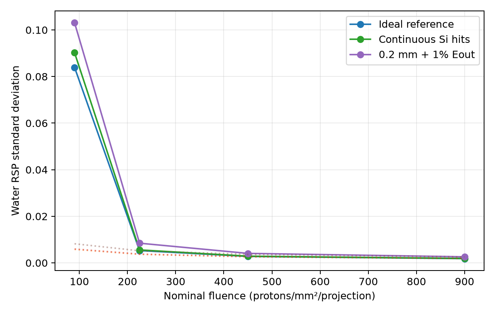
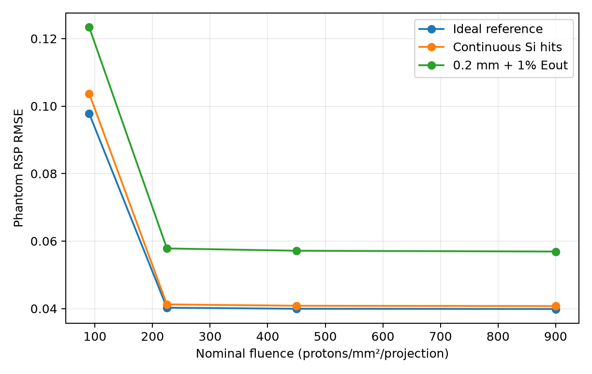
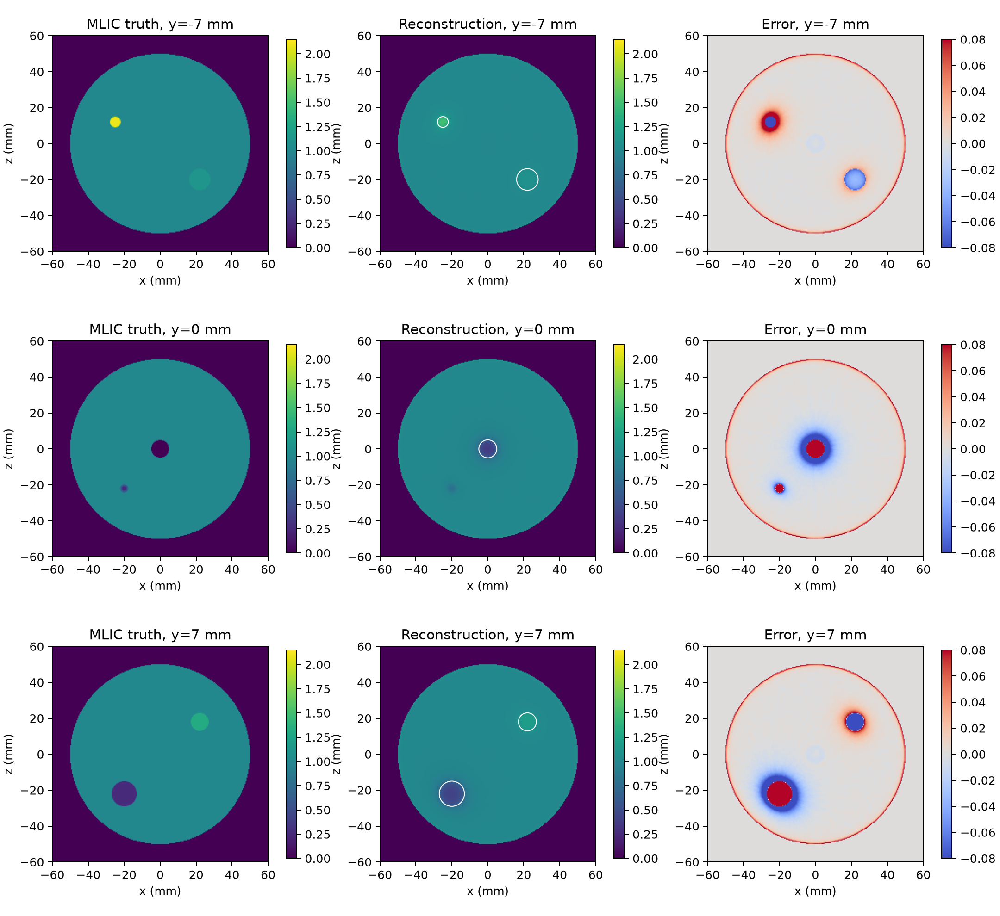
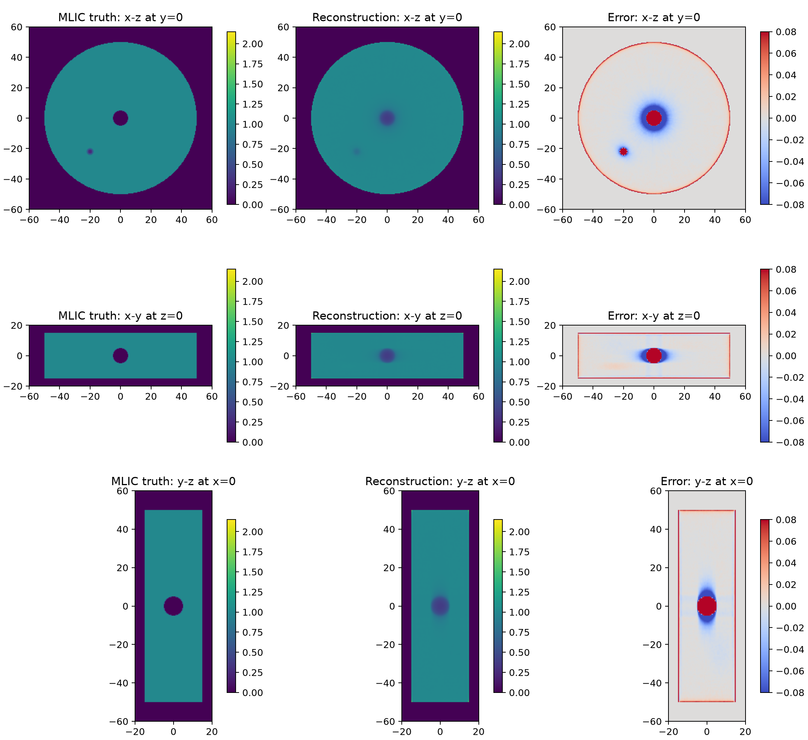

# 质子CT当前研究总结

**版本日期：2026-08-03**

**覆盖范围：S1--S6、真实轨迹pilot、Stage 0--7C及Stage 8首轮三维重建**

**当前正式二维方法：G4水标定WEPL + Schulte水MLP + GPU OS-SART + Huber-TV**

## 摘要

本项目已经建立从OpenGATE相空间ROOT、单质子配对、异常历史过滤、WEPL计算、
Schulte最可能路径，到二维解析和GPU list-mode迭代重建的完整链条；随后又用诊断
模体、真实轨迹、虚拟多层电离室、独立水板标定、四层硅跟踪器和通量抽样逐项
检验误差来源。Stage 8进一步把数据链扩展到三维体素重建。

目前最重要的结论有六点：

1. 早期约`+1.4%`的水平台偏差来自BB78水射程LUT与当前Geant4输运的标定口径，
   不是OS-SART或Schulte MLP代码错误；独立水板标定已将其消除。
2. 当前二维数据上，局部3σ、等权quadratic、Schulte水MLP和固定Huber-TV的综合
   结果最好；稳健过滤、逆方差权重、Huber数据损失、非均匀MLP和高级先验均未
   通过预注册晋升门槛。
3. Stage 6B后，S4的15 mm大材料柱MLIC-MAPE达到`0.2551%`，S5平均
   fMTF10达到`1.1733 lp/mm`；这些是高通量二维仿真结果，不能直接等同于临床
   pCT性能。
4. 四层连续硅hit本身只带来温和退化；0.2 mm位置误差与1%出射能量噪声组合
   使图像RMSE增加`42.73%`，当前逆方差和Huber方法没有降低这项退化。
5. 三种D1测量条件在冻结算法下的推荐最低有效通量均为25%，即
   `225 protons/mm²/projection`；降到10%后出现明显非线性失稳。
6. Stage 8三维链和严格伴随算子通过，但首轮大材料球MAPE为`37.03%`，因此
   状态是**PIPELINE PASS / PERFORMANCE FAIL**，不能直接进入3D Gaussian。


---

## 1. 研究问题、证据边界与评价纪律

### 1.1 研究问题

本项目不是只比较几张重建图，而是依次回答：

- 单质子能量如何转换为与当前输运一致的WEPL；
- 水MLP是否足以描述当前200 MeV、小尺度模体中的质子路径；
- 过滤、权重、数据损失、迭代调度和图像先验中，哪些真正改善独立评价；
- 材料RSP真值应如何独立获得，避免用重建结果校准自身；
- Air、硅跟踪器、位置/能量噪声和通量降低分别造成多大退化；
- 二维方法扩展到出平面散射和有限轴向结构后是否仍然成立。

### 1.2 三种结果等级

| 等级 | 含义 | 可支持的结论 |
|---|---|---|
| 理想二维仿真 | 理想参考面、高统计、参数化噪声可控 | 验证算法、标定和分辨率上限 |
| 详细探测器仿真 | Air、物理硅层、hit拟合和离线数字化 | 评估跟踪器及测量误差敏感性 |
| 三维pilot | 出平面散射、有限轴向模体和三线性体素算子 | 验证三维链，不能自动代表临床系统 |

数值比较必须同时标明：真值口径、材料集合、ROI尺寸、通量、是否包含真实探测器、
是否二维以及使用解析还是迭代方法。不同论文的MAPE和MTF不能脱离这些条件直接
排序。

### 1.3 数据划分和真值口径

- `results0716`是在全量重建后划出固定10%子集，只称为固定评估子集。
- S1--S5、D1和compact-3D在算法选择前按稳定质子身份执行80%训练、10%验证、
  10%锁定测试。
- 单质子WEPL使用Stage 6B的`g4_water_calibrated`模型。
- 材料平台以Stage 6A高统计200 MeV虚拟MLIC的R80射程移动为主参考。
- 固定200 MeV理论RSP仍保留，用于历史比较和能量依赖解释。
- 没有DoseActor的实验只报告质子通量，不换算为mGy。

---

## 2. 仿真体系

### 2.1 二维CT公共设置

S1--S5使用200 MeV单能质子、720个角度、0.5°间隔和`QGSP_BIC_EMZ`。模体为
半径100 mm水圆柱，入口/出口状态外推到固定`z=-110/+110 mm`平面。论文通量
配置为450,000质子/角度，约900 protons/mm²/projection；部分诊断pilot使用
100,000质子/角度。

| 数据集 | 场景 | 主要目的 | 当前结论 |
|---|---|---|---|
| S1 | Air、水圆柱、25根5 mm铝柱 | 小目标恢复、径向一致性 | Stage 6B正式复算完成 |
| S2 | Vacuum均匀水圆柱 | 水平台、边界、FOV和滤波 | 建立无Air边界基线 |
| S3 | Air均匀水圆柱 | 外部Air WEPL与边界效应 | Air不是外围圆环主因 |
| S4 | Air、多材料三半径、中心5 mm铝柱 | 材料定量、径向趋势、部分容积 | 大柱MAPE 0.2551% |
| S5 | 铝线对、五个SpineBone斜边 | fMTF和方向依赖 | fMTF10 1.1733 lp/mm |
| S6 | Water/Al/Air薄板，多个能量和厚度 | 能量相关RSP与Air WEPL | 暴露统一尺度失配 |

S5的五个斜边使用SpineBone材料，放置在不同位置并采用不同边缘方向，用于测量
空间分辨率是否随半径和方向变化；它们不是五种不同骨材料。

### 2.2 独立标定实验

| 实验 | 输入 | 输出 | 与CT重建的关系 |
|---|---|---|---|
| 虚拟MLIC | 样品前后水中深度剂量 | 由R80射程移动得到材料RSP | 提供图像评价真值 |
| 独立水板WEPL标定 | 30--230 MeV、84个能量/厚度工况 | 单调Geant4一致射程函数 | 把每条质子的能量转换为WEPL |

两者相互独立：水板标定定义测量模型，MLIC定义材料参考值，均不使用CT重建图像
反向拟合。

### 2.3 D1探测器实验

D1把世界材料改为Air，并加入四层200 μm硅跟踪器。上游和下游各两层硅hit用于
拟合入口与出口直线；理想参考面仍记录出口能量，因此D1不是完整物理能量探测器。
Stage 7又离线加入位置分辨率和出射能量高斯噪声，分离跟踪器材料、hit拟合与
数字化误差。

### 2.4 compact-3D pilot

三维pilot使用360角度、每角度2,000,000个质子、半径50 mm且轴向长度30 mm的
有限水圆柱。内部包含Air、Aluminium、SpineBone、Lung和A150球体，推荐网格为
`240×80×240 @ 0.5 mm`。该实验有真实出平面散射，但仍使用理想入口/出口相空间，
不包含硅层和物理能量探测器。

---

## 3. 数据处理与重建方法

### 3.1 ROOT到单质子pairs

入口和出口ROOT按`RunID/EventID`匹配，只保留唯一`TrackID=1`主质子。记录位置、
方向和能量被外推到固定参考面。局部3σ过滤在二维位置网格中联合检查能损和两个
有符号散射分量，用于去除核反应、异常散射和离群能损历史。

阶段3曾比较median/MAD和联合稳健马氏距离。它们能改变尾部分布，但没有在验证
WEPL、材料保留和最终图像之间形成更好的综合结果，因此正式链仍使用局部3σ。

### 3.2 WEPL与Schulte MLP

单质子WEPL定义为

\[
b_p=R_w(E_{\mathrm{in}})-R_w(E_{\mathrm{out}}).
\]

早期(R_w(E))来自`I=78 eV`的简化Bethe--Bloch LUT。Stage 6B使用独立水板
数据拟合严格单调的(R_{\mathrm{G4}}(E))，锁定测试平均/最大绝对相对偏差为
`0.0461%/0.1657%`，随后晋升为正式模型。

Schulte MLP用入口/出口位置和方向，以及均匀水多重散射协方差，计算物体内部的
最大后验中心路径。真实轨迹pilot表明，在当前200 MeV和模体尺度下，即使使用真值
材料RScP更新散射统计，路径改善也不足以通过门槛，因此正式链保留水MLP。

### 3.3 解析重建

解析链把单质子WEPL按角度、横向坐标(u)和MLP深度(d)写入DDB：

\[
N_{\mathrm p}\times\text{state}
\longrightarrow N_\theta\times N_u\times N_d
\longrightarrow N_x\times N_z.
\]

DDB经几何加权、no-Hann Ramp滤波后，对每个图像像素计算对应的((u,v,d))，
插值读取滤波投影并累加720个角度。该方法是快速解析基线和迭代初值，不是把DDB
当成普通二维X射线sinogram直接调用直线FBP。

### 3.4 list-mode迭代重建

迭代算法直接读取pairs，每个batch重新计算MLP并沿路径采样：

\[
\hat b_p=(A x)_p=\sum_j a_{pj}x_j,
\qquad r_p=b_p-\hat b_p.
\]

二维使用四邻域双线性权重，三维使用8邻域三线性权重；正投影和转置反投影严格
复用同一权重。当前二维最优更新为18子集OS-SART，初始松弛0.25、衰减0.2、
5 epoch，子集后施加非负和支撑域，每轮后执行`β=0.0125`的Huber-TV近端处理。


---

## 4. Stage 0--8执行结果

### 4.1 总体决策表

| 阶段 | 研究因素 | 状态 | 最终决定 |
|---|---|---|---|
| 0 | 基线、固定划分、统一评价 | PASS | 冻结results0716历史基线 |
| 1 | 材料能量、有效RSP、Air WEPL | PASS | 找到能量/口径问题，保留历史BB78 |
| 2 | 边界、材料和MTF诊断模体 | PASS | 建立S2--S5评价体系 |
| 3 | 稳健过滤、噪声模型和权重 | PASS / NO PROMOTION | 保留局部3σ和等权 |
| 4 | 松弛、损失、TV、子集和epoch | PASS / PROMOTED | 冻结当前二维最优配置 |
| 5 | 真值材料非均匀MLP | PASS / NEGATIVE | 保留Schulte水MLP |
| 6 | TGV、自适应TV、方向TV | PASS / NEGATIVE | 保留固定Huber-TV |
| 6A | 虚拟MLIC材料真值 | PASS | 冻结200 MeV高统计MLIC-RSP |
| 6B | 独立水板WEPL标定 | PASS / PROMOTED | 晋升`g4_water_calibrated` |
| 7 | Air、硅hit和参数化数字化 | PASS | 连续hit稳定，组合噪声明显退化 |
| 7B | 噪声条件下加权和Huber | PASS / NO PROMOTION | 保留等权quadratic |
| 7C | 100%到10%有效通量 | PASS | 推荐最低有效通量25% |
| 8 | 三维体素链 | PIPELINE PASS / PERFORMANCE FAIL | 暂缓Stage 9并诊断三维系统 |


### 4.2 Stage 0--2：建立可比较的证据体系

Stage 0冻结results0716的代码、数据哈希、MHD网格、固定评估子集和统一RSP/WEPL
指标。Stage 1用S6分离固定200 MeV RSP、沿降能路径的有效RSP和Air WEPL，发现
水与铝存在共同尺度偏移。Stage 2用S2/S3证明外围圆环并非主要由Air造成，并用
S4/S5建立材料MAPE、部分容积和fMTF评价。

这一阶段的关键贡献不是提高图像，而是避免把边界伪影、真值口径、材料偏差和
空间分辨率混成一个RMSE数字。

### 4.3 Stage 3--4：筛选数据项并冻结迭代参数

Stage 3在过滤前固定80/10/10划分，比较局部3σ、median/MAD、稳健马氏过滤，
以及等权、WEPL逆方差、稳健置信和组合权重。没有候选同时改善残差尾部和材料
定量，最终保留局部3σ与等权。

Stage 4依次筛选松弛调度、quadratic/Huber数据损失、Huber-TV权重、停止epoch和
18/36子集。最终配置为`λ0=0.25`、衰减0.2、quadratic、固定
`β=0.0125`、18子集和5 epoch。S2/S3水区标准差平均降低`42.58%`，满足实质
改善门槛；36子集收益只有约`0.054%`，没有晋升。

### 4.4 Stage 5--6：复杂路径和高级先验没有胜出

真实轨迹pilot得到222,901条可用Geant4逐step路径。真值材料图驱动的非均匀MLP
相对水MLP，对全部/强异质路径的平均改善仅`0.006%/0.074%`，bootstrap 95%
下限跨过零。由于连“真值材料上限”都没有稳定收益，图像驱动固定非均匀MLP和
交替更新MLP没有继续执行。

Stage 6比较TGV、自适应TV和方向TV。部分候选提高局部分辨率，但水噪声、RMSE
或材料指标恶化，没有通过验证门槛。当前负结果说明在本数据上继续增加先验复杂度
不是主要突破口。


### 4.5 Stage 6A--6B：重新建立真值和测量标定

虚拟MLIC通过样品导致的R80射程移动定义材料RSP。200 MeV高统计参考中，Water
和Aluminium分别为`0.999746`和`2.094511`。随后独立水板实验建立
Geant4一致射程曲线。S2门控通过后，S1/S4/S5从WEPL开始完整复算，而不是把旧
重建图统一除以常数。

标定前后最明显的变化是：S4的15 mm大材料柱MAPE由约`1.1987%`降至
`0.2551%`；S5 fMTF没有下降。由此确认旧统一偏差主要在能量到WEPL的测量模型，
而不是通过图像经验缩放可以严谨解决的问题。

### 4.6 Stage 7--7B：探测器和噪声鲁棒性

连续硅hit相对理想参考面使水标准差增加`3.41%`、图像RMSE增加`2.21%`、铝
平台变化约`0.047%`，说明物理硅散射和四层直线拟合没有使算法失效。0.2 mm
位置误差与1%出射能量噪声组合则使RMSE增加`42.73%`、CNR降低`32.54%`。

Stage 7B把位置噪声和能量噪声拆开，并比较解析/经验逆方差、Huber 1.5/2.5及
组合方法。组合噪声下等权quadratic验证WEPL RMSE为`3.73757 mm`，全部候选
均更差，因此按预注册规则不打开测试集，也不运行无意义的80%双重建。


### 4.7 Stage 7C：通量工作下限

Stage 7C在过滤后按EventID生成100%、50%、25%和10%的严格嵌套子集，720个
角度全部保留。理想参考面、连续硅hit和组合噪声三种条件的推荐最低有效通量均为
25%，即`225 protons/mm²/projection`。组合噪声25%用三个随机种子复核，均
通过；10%在三种条件下均失败。

25%时水绝对偏差小于0.1%、水标准差低于1%、CNR高于100；10%时水标准差升至
约`8.4%--10.6%`。这表明当前5轮冻结算法在25%和10%之间存在工作下限，不能
简单用(1/\sqrt N)外推。





### 4.8 Stage 8：三维链通过，材料性能失败

Stage 8共配对`684,197,294`条primary，过滤并命中有限圆柱后保留
`443,653,707`条；训练、验证和测试分别为`354,946,229`、`44,344,246`和
`44,363,232`条。0°/90°伴随内积相对误差为`4.02×10⁻⁸/1.35×10⁻⁸`，
CPU/CUDA MLP最大位置差约`1.92×10⁻⁶ mm`。

正则化筛选最终选择`β=0`。第1到第3轮验证WEPL RMSE从`2.211`降至
`2.015 mm`，模体RMSE从`0.0626`降至`0.0533`，说明仍在收敛；但材料误差
过大，不能只用增加epoch解释。

| 指标 | 第3轮结果 | 判定 |
|---|---:|---|
| 测试WEPL RMSE / MAE / bias | 2.0146 / 1.5566 / 0.0075 mm | 有限、可重复 |
| 水均值 / 偏差 / 标准差 | 0.99850 / −0.1247% / 0.01100 | 水尺度通过 |
| 三维模体RMSE | 0.05330 | 未形成可靠材料基线 |
| 10--14 mm材料球MAPE | 37.03% | FAIL |
| Aluminium / SpineBone误差 | −29.71% / −10.56% | FAIL |
| Lung / A150误差 | +96.40% / −4.14% | FAIL |
| Air球重建RSP | 0.4587 | FAIL |





该结果只证明ROOT到三维报告的工程链完整，不证明三维成像性能通过。可靠体素
基线形成前，Stage 9暂停。

---

## 5. 当前最优二维算法及三种经典场景

### 5.1 冻结配置

| 项目 | 当前选择 |
|---|---|
| WEPL | `g4_water_calibrated` |
| 过滤 | 局部3σ |
| 数据权重/损失 | 等权quadratic |
| 路径 | Schulte水MLP |
| 网格/路径步长 | 0.1 mm / 0.1 mm |
| 子集/epoch | 18 / 5 |
| 松弛 | 0.25，衰减0.2 |
| 先验 | Huber-TV，`β=0.0125` |
| 约束 | 非负、100 mm圆形支撑域 |


### 5.2 S1：25根铝柱

| 指标 | 结果 |
|---|---:|
| 水区均值 / 标准差 | 0.999733 / 0.002043 |
| 水相对MLIC偏差 | −0.0013% |
| 铝平台RSP | 2.067138 |
| 铝相对MLIC误差 | −1.307% |
| 铝柱中位CNR | 519.59 |

水尺度已消除，剩余铝偏差主要集中在5 mm小目标，包含材料相关阻止本领、部分
容积和边缘响应，不再是统一水标定问题。

### 5.3 S4：多材料模体

| 指标 | 结果 |
|---|---:|
| 水区均值 / 标准差 | 0.999636 / 0.011442 |
| 15 mm大柱MLIC-MAPE | 0.2551% |
| 全部非Air MAPE | 0.4408% |
| 最大单插入物APE | 2.6693% |

最大误差来自中心5 mm铝柱，不能与15 mm材料平台直接比较。大材料柱结果说明
当前二维链的材料定量上限较好，小目标恢复仍是主要短板。

### 5.4 S5：线对与多方向斜边

| 指标 | 结果 |
|---|---:|
| 水区均值 / 标准差 | 0.999666 / 0.008356 |
| 平均fMTF50 | 0.5003 lp/mm |
| 平均fMTF10 | 1.1733 lp/mm |

独立WEPL标定和五轮迭代没有牺牲空间分辨率。0.5 mm线对接近当前可见极限，
但该结果仍来自二维理想能量测量。

### 5.5 稳定复用入口

```bash
.venv-gate/bin/python \
  pct2d_reconstruction/iterative_reconstruction/run_best_reconstruction.py \
  --run-name my_dataset \
  --pairs-dir data/preprocessing_data/my_dataset/pairs_filtered \
  --initial-image data/reconstruction_data/my_dataset/analytic/recon/recon_ddb_nohann.mhd \
  --output-dir data/reconstruction_data/my_dataset/iterative_best \
  --wepl-model g4_water_calibrated \
  --wepl-calibration pct2d_reconstruction/research_stages/stage6b_wepl_calibration/qc/g4_water_calibrated.json \
  --runs 720 --angle-step-deg 0.5 --device 0
```

Air场景需要额外指定Stage 1冻结的Air WEPL斜率；新几何可以调整角度、支撑半径、
网格和batch size，但不得悄悄改变已经冻结的科学参数。

---

## 6. 外部性能定位


| 系统/研究 | 场景 | RSP结果 | 空间分辨率 |
|---|---|---:|---:|
| 本项目Stage 6B | 高统计理想二维S4/S5 | 大柱MAPE 0.2551%；全部非Air 0.4408% | fMTF10 1.1733 lp/mm |
| Phase-II原型 | 真实探测器材料模体 | 全材料MAPE约1.14% | fMTF10约0.61 lp/mm |
| ProtonVDA原型 | 真实探测器材料模体 | 全材料MAPE约0.81% | fMTF10约0.46 lp/mm |
| 2024 pCT/DECT/PCCT对比 | 塑料及离体模体 | pCT塑料MAPE约0.28% | 约0.54 lp/mm |

本项目理想二维大材料柱MAPE数值优秀，但不构成对真实原型的直接超越：本项目
仍缺少物理能量探测器、效率、堆积、剂量和可靠三维材料恢复。Stage 7说明硅hit
本身影响较小，但位置与能量数字化能显著改变结果；Stage 8则证明二维优势尚未
成功迁移到三维。

截至当前公开文献，pCT已有多套科研或面向商业化的原型，但尚未像临床xCT一样
形成广泛部署、统一验收和常规临床工作流。商业可用的DirectSPR等产品属于
DECT到SPR的软件链，不是直接质子CT。

客观定位是：**已经形成具有独立标定、锁定测试和负结果记录的二维算法研究平台；
理想二维定量达到优秀水平，但真实能量探测器和三维定量仍未通过。**

---

## 7. 数据、代码和存储状态

### 7.1 代码职责

| 目录 | 职责 |
|---|---|
| `pct2d_reconstruction/preprocessing/` | 正式二维配对、过滤和DDB生成 |
| `analytic_reconstruction/` | no-Hann MLP-DDB-FDK |
| `iterative_reconstruction/` | 正式二维GPU list-mode迭代与最佳入口 |
| `evaluation/` | results0716冻结评价 |
| `research_stages/` | Stage 1--7C研究性代码、QC和阶段总结 |
| `pct3d_reconstruction/` | Stage 8独立三维工程 |
| `data/` | 大型活动数据和检查点，不进入Git |

### 7.2 冷归档

`results0716`、S2/S3、真实轨迹pilot和更早test数据已进入第一批冷归档。结构、
原始路径、文件数和恢复方法见
[`archive_batch1_20260730_record.md`](archive_batch1_20260730_record.md)。恢复时应
回到清单记录的原路径，不修改实验配置指向。

当前WSL虚拟磁盘位于O盘，空间有限；E盘移动硬盘目前断开。Stage 8活动数据仍需
保留用于诊断。任何再次全量重建前应同时检查：WSL内可用空间、O盘宿主可用空间、
外部ROOT挂载状态和预计检查点增量。

---

## 8. 当前结论与下一步

当前正式成果是二维链，而不是首轮三维结果。二维方面已经完成独立WEPL标定、
MLIC真值、经典三场景重建、探测器敏感性和通量下限研究；继续在同一理想数据上
微调TV、权重或MLP的优先级很低。

下一步首先诊断Stage 8：常数圆柱和单球闭环、任意角坐标、有限圆柱求交、轴向
路径覆盖、三线性列权重和收敛性。只有材料平台恢复到可解释水平后，才冻结可靠
体素基线并启动3D Gaussian。详细顺序见
[`future_research_plan.md`](future_research_plan.md)。

---

## 本地正式证据

- [Stage 0冻结基线](evaluation/baselines/results0716/baseline_summary.md)
- [Stage 1材料能量分析](research_stages/stage1_material_calibration/qc/results0717_s6_material_energy_scan/stage1_summary.md)
- [Stage 2诊断模体](research_stages/stage2_diagnostic_phantoms/qc/stage2_summary.md)
- [Stage 3稳健过滤与权重](research_stages/stage3_robust_weighting/qc/stage3_summary.md)
- [Stage 4迭代优化](research_stages/stage4_iterative_optimization/qc/stage4_summary.md)
- [Stage 5非均匀MLP](research_stages/stage5_inhomogeneous_mlp/qc/stage5_summary.md)
- [Stage 6高级先验](research_stages/stage6_advanced_priors/qc/stage6_summary.md)
- [Stage 6A虚拟MLIC](research_stages/stage6a_mlic_reference/qc/stage6a_summary.md)
- [Stage 6B独立WEPL标定](research_stages/stage6b_wepl_calibration/qc/stage6b_summary.md)
- [Stage 7探测器效应](research_stages/stage7_detector_effects/qc/stage7_summary.md)
- [Stage 7B噪声鲁棒性](research_stages/stage7b_noise_robustness/qc/stage7b_summary.md)
- [Stage 7C通量敏感性](research_stages/stage7c_fluence_sensitivity/qc/stage7c_summary.md)
- [Stage 8三维首轮结果](../pct3d_reconstruction/qc/results0718_compact_3d_pilot/stage8_summary.md)
- [重建原理](reconstruction_principles.md)
- [外部性能基准调研](pct_performance_benchmarks.md)

## 主要外部来源

1. Dedes G, et al. *Comparative accuracy and resolution assessment of two
   prototype proton computed tomography scanners*. Medical Physics, 2022.
   [DOI](https://doi.org/10.1002/mp.15657)
2. Fogazzi E, et al. *A direct comparison of multi-energy x-ray and proton CT
   for imaging and relative stopping power estimation of plastic and ex-vivo
   phantoms*. Physics in Medicine and Biology, 2024.
   [PubMed](https://pubmed.ncbi.nlm.nih.gov/39159669/)
3. Johnson RP. *Meeting the detector challenges for pre-clinical proton and
   ion CT*. Physics in Medicine and Biology, 2024.
   [DOI](https://doi.org/10.1088/1361-6560/ad42fc)
4. Schulte RW, et al. *A maximum likelihood proton path formalism for
   application in proton computed tomography*. Medical Physics, 2008.
5. Brooke M, Penfold S. *An inhomogeneous most likely path formalism for
   proton computed tomography*. Physica Medica, 2020.
   [DOI](https://doi.org/10.1016/j.ejmp.2020.01.025)
6. Rit S, et al. *Filtered backprojection proton CT reconstruction along most
   likely paths*. Medical Physics, 2013.
   [PubMed](https://pubmed.ncbi.nlm.nih.gov/23464283/)
