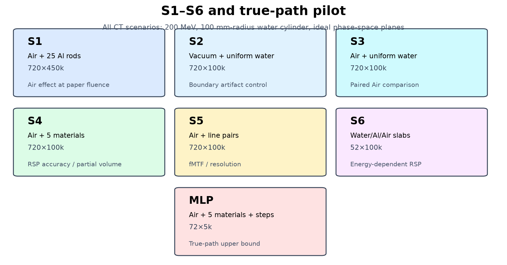
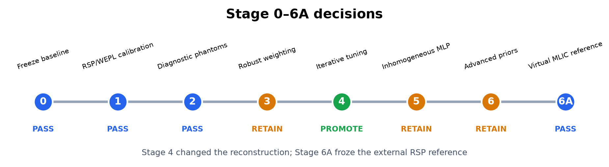
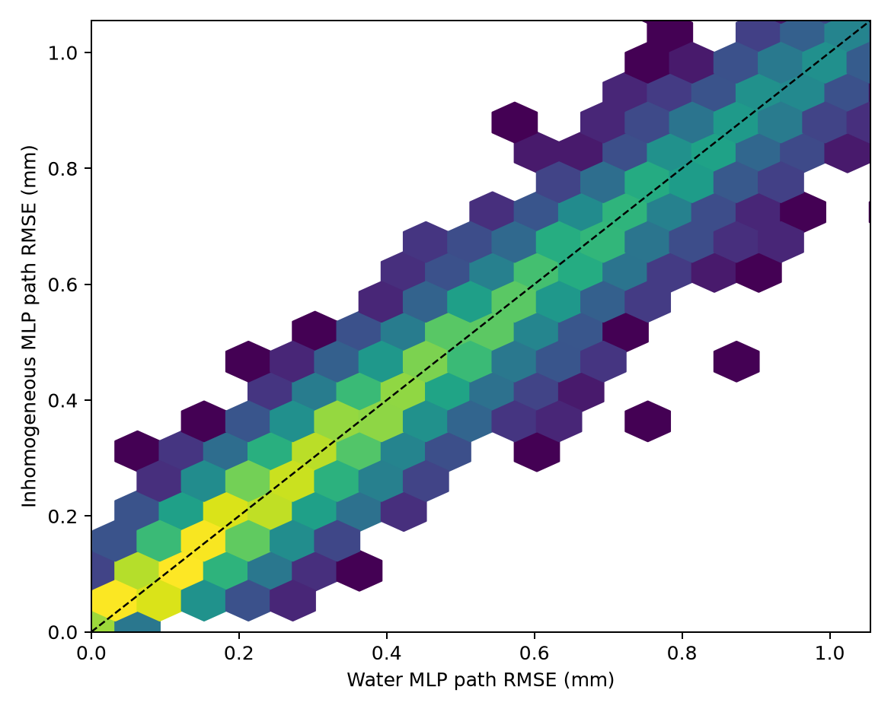
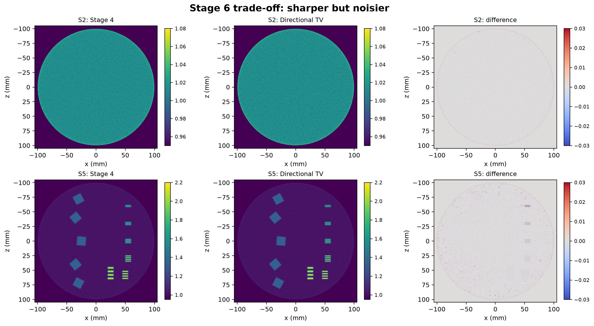
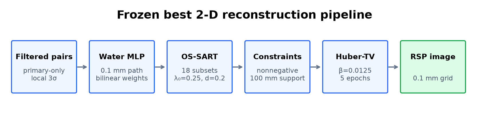
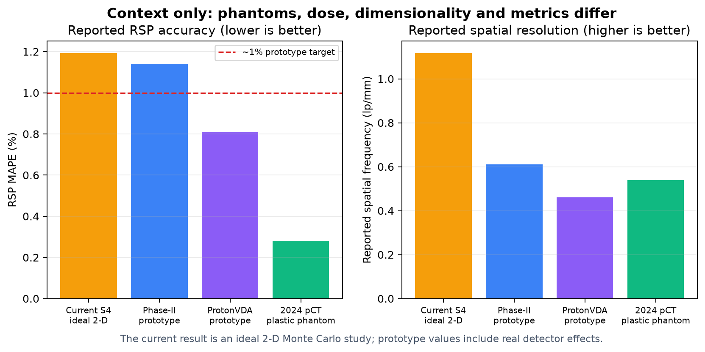

# 二维质子CT阶段性研究总览：S1–S6、真实轨迹与阶段0–7

**版本日期：2026-07-30**  
**研究范围：二维OpenGATE仿真、独立WEPL/MLIC标定、探测器效应与固定MLP迭代重建**  
**当前冻结算法：阶段4 GPU Schulte-MLP OS-SART + Huber-TV**

## 摘要

本项目从`results0716`的单一高通量仿真出发，建立了S1–S6和真实轨迹pilot组成的
诊断实验体系，并按阶段0–7依次检验评价口径、材料能量依赖、边界伪影、稳健
过滤、数据权重、迭代参数、非均匀MLP、高级图像先验、独立WEPL标定和硅
跟踪器效应。

目前最可靠的结论不是“某一个复杂算法显著胜出”，而是已经分离了若干容易混淆的
误差来源：

1. 旧BB78水平台约`+1.4%`偏差已定位到WEPL射程标定，并由独立Geant4一致水板
   标定消除；S2/S3及经典场景水均值现为约`0.9996--0.9997`；
2. 均匀水圆柱外围圆环主要与解析Ramp滤波、边界阶跃和算子响应有关，Air和扩大
   FOV均不是主因；
3. 当前理想数据中，稳健过滤、逆方差权重、Huber数据损失、非均匀MLP、TGV和
   自适应TV都没有通过预注册晋升门槛；
4. 唯一得到锁定测试支持的方法升级来自阶段4：在固定水MLP下，将算法冻结为
   5 epoch、18子集、`λ0=0.25`、衰减0.2和固定`β=0.0125` Huber-TV；
5. 独立WEPL标定后S4大材料柱MLIC-MAPE降至`0.255%`，S5 fMTF10为
   `1.173 lp/mm`；但这些仍是理想二维结果，不能据此宣称真实设备性能突破；
6. D1连续四层硅hit相对理想参考使RMSE增加`2.21%`，算法仍稳定；0.2 mm位置
   与1%参数化能量噪声组合使RMSE增加`42.73%`，说明读出精度是现实瓶颈。



---

## 1. 证据范围和比较纪律

### 1.1 当前数据能够回答什么

S1–S5使用理想入口/出口相空间面。除蒙卡输运外，它们没有像素化、有限位置
分辨率、硅跟踪器散射、能量探测器响应、电子学噪声、效率、堆积和运动，因此适合
隔离算法与物理模型，但不等价于真实扫描器。

S6不是CT扫描，而是材料—能量—厚度标定。真实轨迹pilot保存了Geant4逐step
轨迹，用于直接评价路径模型，不用于形成高质量CT图像。

### 1.2 三种结果等级

| 等级 | 含义 | 本项目实例 |
|---|---|---|
| 锁定测试结果 | 参数冻结后才读取test，可用于阶段晋升 | 阶段4 |
| 训练/验证结果 | 可选择参数，不能宣称独立泛化性能 | 阶段3、6候选 |
| 上限或诊断实验 | 回答机制问题，不直接代表最终图像性能 | S6、真实轨迹pilot |

`results0716`是在全量重建之后才划出10%固定子集，因此它只称为固定评估子集。
S1–S5则在任何重建前按稳定质子身份固定为80%训练、10%验证和10%测试。

### 1.3 为什么不能直接按一个数字排名

pCT的RSP误差、噪声、空间分辨率、剂量和扫描时间互相制约。不同论文使用的
模体、材料、ROI、通量、投影数、像素大小、能量测量方式和重建算法并不一致。
因此本报告只在相同数据和评价代码下判断项目内部晋升；外部文献数据用于定位，
不作为严格排行榜。

---

## 2. 仿真体系

### 2.1 S1–S5公共CT条件

| 参数 | 设置 |
|---|---|
| 蒙卡平台 | OpenGATE 10.1.0 / Geant4 |
| 物理列表 | `QGSP_BIC_EMZ` |
| 入射质子 | 200 MeV单能 |
| 投影 | 720个，`0,0.5,…,359.5°` |
| 水模体 | 半径100 mm、轴向长度400 mm |
| 有效源到等中心距离 | 1000 mm |
| 物理源平面/焦点 | `z=-1060/-1000 mm` |
| 源尺寸 | `15×0.12×10⁻⁶ mm³` |
| 理想参考面 | `z=-110/+110 mm` |
| 参考面尺寸 | `400×400 mm²` |
| 模体最大step | 1 mm |
| 线程 | 每个角度单线程，角度间并行 |

源的第二个方向只有`0.12 mm`，用于形成近似二维扇束；第三维厚度仅
`10⁻⁶ mm`。参考面记录质子位置、方向和能量，不模拟真实探测器读出。

### 2.2 S1：Air中的原始铝柱模体

| 项目 | 设置 |
|---|---|
| 通量 | `720×450,000` |
| 外部介质 | Air |
| 模体 | 水圆柱内25根直径5 mm铝柱 |
| 铝柱半径位置 | 0–97 mm螺旋分布 |
| 目的 | 与results0716的Vacuum高通量数据配对，单独评价Air |

参考面之间包含圆柱外Air的能损，因此预处理必须扣除已知Air WEPL，不能将其
错误写入水圆柱RSP。

### 2.3 S2与S3：均匀水边界对照

| 数据 | 外部介质 | 通量 | 目的 |
|---|---|---:|---|
| S2 | Vacuum | `720×100,000` | 隔离水—真空边界及解析圆环 |
| S3 | Air | `720×100,000` | 与S2配对，评价Air能损与散射 |

二者内部均只有均匀水，因此任何材料结构、径向条纹或圆环都不是铝柱造成。结果
显示Air校正后的S3与S2水平台几乎一致，而圆环在两者中都存在。

### 2.4 S4：多材料定量模体

| 项目 | 设置 |
|---|---|
| 通量 | `720×100,000` |
| 外部介质 | Air |
| 材料 | Air、Lung、A150、SpineBone、Aluminium |
| 大柱 | 直径15 mm，分布在30、60、85 mm三个半径 |
| 小目标 | 中心直径5 mm铝柱 |
| 目的 | 分离材料平台误差、径向趋势和部分容积效应 |


### 2.5 S5：空间分辨率模体

| 目标 | 设置 |
|---|---|
| 铝线对 | 线宽0.5、0.75、1、1.5、2、3 mm |
| 斜边 | 5个15 mm SpineBone方块，多角度、多半径 |
| 通量 | `720×100,000` |
| 目的 | 评价线对可见性、fMTF50/fMTF10及方向依赖 |


### 2.6 S6：材料—能量—厚度扫描

S6共52种配置，每种100,000个质子：

| 材料 | 厚度/mm | 能量/MeV |
|---|---|---|
| Water | 5、10、20、50、100 | 150、180、200、220 |
| Aluminium | 5、10、20、50 | 150、180、200、220 |
| Air | 20、220、1000、2000 | 150、180、200、220 |

目的不是重建图像，而是测量OpenGATE输运条件下的有效RSP和Air WEPL斜率，检查
`I=78 eV`水Bethe–Bloch LUT与固定参考RSP是否一致。

### 2.7 真实轨迹MLP pilot

| 参数 | 设置 |
|---|---|
| 角度与通量 | `72×5,000`，5°间隔 |
| 外部介质 | Air |
| 插入物 | 30 mm Air/Lung/A150/SpineBone，16 mm Aluminium |
| 特殊输出 | 入口ROOT、出口ROOT、primary逐step轨迹ROOT |
| 目的 | 将水MLP和真值材料非均匀MLP直接与Monte Carlo路径比较 |

301,991条入口/出口记录成功配对，其中222,901条具有可用真实轨迹。

---

## 3. 阶段0–7做了什么



### 3.1 阶段0：冻结基线与评价体系

完成内容：

- 冻结results0716输入、配置、代码哈希和正式检查点；
- 建立统一RSP ROI、边缘、WEPL残差和运行资源评价；
- 对后续新数据固定80/10/10划分纪律；
- 明确200 MeV固定RSP与沿降能路径有效RSP是两个不同口径。

结果：**PASS**。它没有改变重建图像，而是保证后续候选不会因ROI或数据划分变化
得到虚假提升。

### 3.2 阶段1：能量相关RSP与WEPL一致性

S6得到的主要结果：

| 指标 | 数值 |
|---|---:|
| Water 200 MeV原点约束有效RSP | 1.013518 |
| Aluminium 200 MeV、5 mm有效RSP中位数 | 2.107424 |
| Air平均WEPL斜率 | `0.00114710 mm-WEPL/mm-Air` |

这组结果说明S6有效RSP与当前WEPL重建在内部口径上自洽，但它不是独立实验真值。
阶段6A的高统计MLIC Water为`0.999746`，因此图像水平台约`+1.4%`仍是相对外部
参考的真实系统偏差，不能再用S6有效RSP将其消除。当前采用三级口径：
MLIC-RSP用于对外准确性比较，固定200 MeV理论RSP用于历史追溯，有效RSP仅用于
分析降能路径和LUT的内部机制。

结果：**PASS**，保留`I=78 eV`作为当前WEPL主口径。

### 3.3 阶段2：诊断模体处理与评价

主要结论：

- S2/S3证明Air不是水平台偏差和外围圆环的主因；
- 210–260 mm FOV变化没有消除圆环；
- 支撑域能清除圆柱外响应，但不能修复边界内侧误差；
- S4建立多材料MAPE、最大误差和小铝柱恢复评价；
- S5建立多方向fMTF与线对评价。

阶段2解析S4材料MAPE约`1.17%`，S5解析fMTF50/fMTF10约
`0.502/1.088 lp/mm`。这些诊断集成为阶段3–6的公共开发平台。

结果：**PASS**。

### 3.4 阶段3：稳健过滤、权重和噪声模型

比较了当前均值/标准差3σ、median/MAD、联合稳健马氏距离、能量相关噪声模型、
WEPL逆方差权重和稳健置信权重。

结果：

- 稳健过滤没有达到绝对残差p99改善5%的门槛；
- 出射能量噪声模型没有通过十分位校准；
- 逆方差权重使验证RMSE、材料MAPE和偏差变差；
- 锁定测试后决定保留局部3σ和等权数据。

结果：**PASS（有效负结果，保留基线）**。

### 3.5 阶段4：固定MLP下优化迭代方法

依次筛选松弛因子、衰减、quadratic/Huber数据损失、Huber-TV、停止epoch和
18/36子集。最终冻结：

| 参数 | 最优值 |
|---|---:|
| 数据 | 局部3σ、等权 |
| 路径 | 水Schulte MLP |
| 网格/路径步长 | `0.1/0.1 mm` |
| 初值 | DDB-FDK no-Hann |
| 子集/epoch | 18 / 5 |
| 初始松弛因子/衰减 | 0.25 / 0.2 |
| 数据损失 | quadratic |
| Huber-TV权重/过渡点 | 0.0125 / 0.002 |
| 约束 | 非负、100 mm圆形支撑 |

锁定测试相对阶段3：

| 指标 | 变化 |
|---|---:|
| S1–S5平均测试WEPL RMSE | 改善0.095% |
| S2/S3水区标准差平均 | 降低42.58% |
| S4名义RSP RMSE | 降低6.17% |
| S4材料MAPE | 恶化0.0073个百分点 |
| S5名义RSP RMSE | 降低2.71% |
| S5 fMTF50/fMTF10 | 提高1.13%/0.66% |

结果：**PASS（`PROMOTE_STAGE4`）**。这是阶段0–7中唯一晋升迭代求解参数的
方法；阶段6A更新评价真值，阶段6B更新WEPL物理标定，阶段7只做外部鲁棒性检验。

### 3.6 阶段5：非均匀与迭代MLP

Level 1先使用真值材料RScP图计算非均匀MLP，避免重建图噪声限制理论上限。

| 指标 | 非均匀MLP相对水MLP |
|---|---:|
| 全部验证路径平均改善 | +0.006% |
| 强异质路径平均改善 | +0.074% |
| 强异质bootstrap 95%下限 | -0.194% |



结果远低于预注册的整体3%和强异质5%门槛，因此自动跳过图像驱动固定非均匀MLP
和交替更新MLP。这个结论与Brooke和Penfold的研究方向一致：非均匀MLP在厚骨、
较低能量等条件可能改善5%–17%，但在200 MeV临床头部模型中未观察到明显收益
（[Physica Medica, 2020](https://doi.org/10.1016/j.ejmp.2020.01.025)）。

结果：**PASS（有效负结果，保留阶段4水MLP）**。

### 3.7 阶段6：TGV和自适应先验

14组TGV、自适应TV和方向TV先进行近端预筛。TGV未通过S5 fMTF10安全约束；
自适应TV和方向TV各一组进入S2/S4/S5完整重建。

| 指标 | 自适应TV相对阶段4 | 方向TV相对阶段4 |
|---|---:|---:|
| S2水区标准差 | +47.15% | +27.47% |
| S4材料MAPE | 改善0.0044个百分点 | 改善0.0024个百分点 |
| S4最大材料误差 | +2.15% | +1.50% |
| S5 RSP RMSE | +0.56% | +0.22% |
| S5 fMTF50 | +3.41% | +2.85% |
| S5 fMTF10 | +8.10% | +7.64% |



高级先验提高了MTF，但本质上是减弱平滑并增加噪声，没有形成更好的综合权衡。
没有候选满足实质改善门槛，锁定测试未打开。

结果：**PASS（有效负结果，保留阶段4 Huber-TV）**。

### 3.8 阶段6A：虚拟MLIC参考与重新评价

为与真实pCT原型论文的材料真值口径一致，阶段6A用已知厚度样品引起的水中射程
移动建立虚拟多层电离室参考。首轮覆盖四个能量的24个case；随后在200 MeV下
使用独立随机种子完成6个高统计case，每个case为100万质子。

| 材料 | 冻结MLIC-RSP | bootstrap相对SD |
|---|---:|---:|
| Water | 0.999746 | 0.075% |
| Lung | 0.258145 | 0.322% |
| A150_Tissue_Plastic | 1.124245 | 0.074% |
| SpineBone | 1.322261 | 0.067% |
| Aluminium | 2.094511 | 0.143% |

重新评价没有改变图像本身，只改变独立参考和误差解释：

- results0716第3轮迭代的铝误差由相对固定参考的`−1.289%`变为相对MLIC的
  `−0.136%`，说明原单一铝柱误差主要来自旧参考定义；
- S4阶段4多材料MAPE由`1.203%`变为`1.192%`，改善很小，说明多材料系统误差
  不能主要归因于真值选错；
- S5骨—水边缘对比恢复为`100.74%`，3 mm铝线p90恢复为`99.64%`；MTF不因
  RSP参考改变；
- MLIC Water接近1，确认约`+1.4%`水平台是当前体系相对独立参考的外部偏差。

180 MeV低统计Water的单项bootstrap 95%区间略低于1，但四个Water同时检验的
family-wise 95%区间包含1；它只保留为能量敏感性提示，不影响200 MeV主参考。

结果：**PASS（冻结MLIC参考；先完成Stage 6B，再进入Stage 7）**。

### 3.9 阶段6B：独立WEPL标定与三场景复算

专项代码审计确认约`+1.4%`水偏差在`KineticEnergy → WEPL`转换中已经存在，
并非pairs配对、3σ过滤、MLP路径、DDB或OS-SART实现造成。为避免用测试图像
经验缩放，Stage 6B新增30--230 MeV、84个独立水板工况，并在仿真前固定
训练、验证和测试能量。

锁定测试平均/最大绝对相对偏差为`0.0461%/0.1657%`，通过预注册的
`0.2%/0.5%`门槛。使用冻结模型复算后，S2/S3水区均值为
`0.999641/0.999635`，均通过`1.000±0.003`门控。

三种经典场景的主要变化为：

- S1水区均值由`1.013979`降至`0.999733`；
- S4大材料柱MLIC-MAPE由`1.1987%`降至`0.2551%`；
- S5平均fMTF50/fMTF10分别提高`1.69%/5.07%`，没有分辨率代价；
- S1的5 mm铝平台相对MLIC仍低`1.307%`，表明小目标和材料相关误差仍需单独
  研究，不能再归因于统一水尺度。

结果：**PASS（PROMOTE_G4_WATER_CALIBRATED）**。阶段7/8正式定量评价使用
冻结的新模型；`bb78`保留为历史复现接口。

### 3.10 阶段7：Air、四层硅跟踪器与参数化数字化

阶段7固定阶段4重建参数和阶段6B WEPL模型，直接处理D1的720组六平面ROOT。
8套配置先以10%质子、3 epoch筛选，再对理想参考面、四层连续硅hit和
`0.2 mm`位置加`1%`出射能量噪声执行全量5 epoch重建。

| 配置 | 水均值 | 水标准差 | 模体RMSE | 铝平台RSP | 中位CNR |
|---|---:|---:|---:|---:|---:|
| 理想参考面 | 0.999447 | 0.001826 | 0.039868 | 2.069840 | 551.14 |
| 四层连续硅hit | 0.999407 | 0.001888 | 0.040748 | 2.070807 | 516.90 |
| 0.2 mm位置 + 1%能量噪声 | 0.999739 | 0.002594 | 0.056903 | 2.044424 | 371.80 |

连续硅hit相对理想参考只使水标准差增加`3.41%`、RMSE增加`2.21%`，铝平台变化
`0.047%`，说明物理硅散射、四层直线拟合和跟踪接受率没有使当前算法失效。
参数化位置与能量噪声组合使RMSE增加`42.73%`、CNR降低`32.54%`，显示现实读出
精度会成为主要限制。

这个结果不是完整物理能量探测器结论：D1仍使用理想出口能量，所谓1%能量噪声
是离线加到出射能量的高斯扰动，而且该配置同时包含0.2 mm hit位置噪声。阶段7
因此回答了“冻结算法在物理硅hit下是否稳定”，并给出了数字化灵敏度边界，但
尚未覆盖响应非线性、效率、堆积和电子学噪声。

结果：**PASS（D1_DETECTOR_EFFECTS_CHARACTERIZED）**。阶段8可以启动；阶段7
不替换阶段4算法，也不改变阶段6B WEPL模型。

---

## 4. 当前最优算法和复用接口



### 4.1 算法定义

当前最优算法是阶段4冻结的二维list-mode重建：

\[
b_p = \sum_j a_{pj}x_j+\varepsilon_p ,
\]

其中\(b_p\)是单质子WEPL，\(a_{pj}\)由Schulte水MLP以0.1 mm步长离散并通过
四邻域双线性权重形成。每个子集采用OS-SART更新：

\[
x^{k+1}=
\mathcal P_{\Omega,+}
\left[
x^k+\lambda_k
\frac{A_s^\mathrm TD_r^{-1}(b_s-A_sx^k)}
     {A_s^\mathrm T\mathbf1}
\right],
\qquad
\lambda_k=\frac{0.25}{1+0.2k},
\]

再求解Huber-TV近端问题：

\[
\operatorname{prox}_{\beta R}(f)=
\arg\min_{u\in\Omega,u\ge0}
\frac12\|u-f\|_2^2+
0.0125\sum_j\phi_{0.002}(|\nabla u_j|).
\]

它不是阶段6的TGV，也不是非均匀MLP。

### 4.2 三种经典场景下的实际效果

下图统一展示阶段4冻结算法结合阶段6B新WEPL标定后，在三种经典二维场景中的
正式结果。S1使用与
results0716相同的25根铝柱几何，但采用Air外部介质和论文通量；S4评价多材料
定量；S5评价线对和多方向斜边。真值图已经将材料平台替换为阶段6A冻结的
200 MeV高统计MLIC-RSP，重建图为阶段6B重新计算WEPL、DDB初值并完成5轮
list-mode迭代后的输出。


三组结果使用相同的冻结重建参数：局部3σ过滤、等权数据、水Schulte MLP、
`0.1 mm`网格和路径步长、18子集、5 epoch、`λ0=0.25`、衰减0.2、
quadratic数据损失及固定`β=0.0125` Huber-TV；唯一物理变化是采用独立冻结的
`g4_water_calibrated`射程表。下列指标均来自实际重建，而非示意图估读。

#### S1：25根铝柱

| 指标 | 阶段6B标定后 |
|---|---:|
| 水区RSP均值 | 0.999733 |
| 水区RSP标准差 | 0.002043 |
| 水区相对MLIC Water偏差 | −0.0013% |
| 铝柱平台RSP | 2.067138 |
| 铝柱相对MLIC误差 | −1.307% |
| 铝柱中位CNR | 519.59 |

水平台偏差已经消除，但5 mm铝柱相对MLIC参考`2.094511`仍低约1.31%。因此
此前水与材料共同偏高的统一尺度问题已经解决，当前剩余误差更集中于材料相关
阻止本领、降能历史、部分容积和外围小柱几何。

#### S4：多材料模体

| 指标 | 阶段6B标定后 |
|---|---:|
| 水区RSP均值 | 0.999636 |
| 水区RSP标准差 | 0.011442 |
| 非Air材料MLIC-MAPE | 0.4408% |
| 仅15 mm大柱MLIC-MAPE | 0.2551% |
| 最大单插入物APE | 2.6693% |

15 mm大柱MAPE相对阶段4的`1.1987%`改善78.7%，说明旧水射程标定是此前
大平台多材料误差的主要共同来源。最大误差来自中心5 mm铝柱，其评价同时受到
部分容积影响，不能与15 mm材料平台等同解释。

#### S5：线对与多方向斜边

| 指标 | 阶段6B标定后 |
|---|---:|
| 水区RSP均值 | 0.999666 |
| 水区RSP标准差 | 0.008356 |
| 平均fMTF50 | 0.5003 lp/mm |
| 平均fMTF10 | 1.1733 lp/mm |

相对阶段4，fMTF50和fMTF10分别提高1.69%和5.07%，说明标定没有以牺牲空间
分辨率为代价。三种场景共同说明：统一水尺度偏差已解决，大材料平台达到约
0.26% MAPE；当前主要短板转为5 mm及更小目标的部分容积、材料相关残差，以及
尚未加入真实探测器效应。

固定水偏差的专项代码审计此前确认：S2原始pairs、3σ过滤后pairs、Schulte
MLP路径归一化、解析重建和阶段4迭代均得到约`1.0134--1.0143`的水比例。偏差
在进入重建器前已经存在，来源是当前简化Bethe--Bloch水射程LUT与Geant4输运的
标定失配，不是OS-SART或MLP实现错误。阶段6B的独立标定和复算已经以实验方式
验证了该诊断。完整证据见
[固定水平台偏差专项审计](research_stages/stage6a_mlic_reference/qc/reconstruction_bias_audit.md)。

### 4.3 对新数据的稳定入口

```bash
.venv-gate/bin/python \
  pct2d_reconstruction/iterative_reconstruction/run_best_reconstruction.py \
  --run-name my_dataset \
  --pairs-dir data/preprocessing_data/my_dataset/pairs_filtered \
  --initial-image data/reconstruction_data/my_dataset/analytic/recon/recon_ddb_nohann.mhd \
  --output-dir data/reconstruction_data/my_dataset/iterative_best \
  --wepl-model g4_water_calibrated \
  --wepl-calibration pct2d_reconstruction/research_stages/stage6b_wepl_calibration/qc/g4_water_calibrated.json \
  --runs 720 --angle-step-deg 0.5 --device 0
```

冻结配置位于
[`best_reconstruction_config.json`](iterative_reconstruction/best_reconstruction_config.json)。
入口允许调整新几何必需的投影数、角度间隔、支撑半径、网格和batch size，但不会
悄悄改变阶段4冻结的5 epoch、18子集、松弛调度和Huber-TV参数。

上例适用于Vacuum或已完成外部介质校正的数据。若参考面与水圆柱之间是Air，应
额外指定阶段1标定的
`--air-wepl-slope 0.00114710`；程序按入口/出口方向计算圆柱外路径长度后扣除
对应WEPL。

输入必须已经完成primary-only配对和局部3σ过滤。通用入口默认跳过实验特定真值
指标，所有质子用于最终重建；参数开发时仍应重新建立训练/验证/测试划分，不能
用这个部署入口在测试集上反复调参。

---

## 5. 与论文和产品相比处于什么水平



### 5.1 RSP准确性

| 系统/研究 | 场景 | RSP结果 | 空间分辨率 |
|---|---|---:|---:|
| 当前项目阶段6B | 理想二维S4仿真，高统计MLIC参考 | 大柱MAPE 0.2551%；全部非Air 0.4408% | S5 fMTF10 1.1733 lp/mm |
| Phase-II原型 | 真实探测器、材料模体 | 全部MAPE 1.14%；排除sinus为0.72% | fMTF10 0.61 lp/mm |
| ProtonVDA原型 | 真实探测器、材料模体 | 全部MAPE 0.81%；排除sinus为0.72% | fMTF10 0.46 lp/mm |
| 2024 pCT对比 | 塑料模体 | MAPE `0.28±0.07%` | 约0.54 lp/mm |

Phase-II和ProtonVDA的直接对比来自
[Dedes等，Medical Physics 2022](https://doi.org/10.1002/mp.15657)；2024年的
pCT/DECT/PCCT对比来自
[Phys Med Biol](https://pubmed.ncbi.nlm.nih.gov/39159669/)。

当前理想二维S4大材料柱MAPE已达到约0.26%，数值上接近2024塑料模体研究，
并优于上述真实原型的整体MAPE。但这还不能称为对真实系统的突破：当前没有
物理能量探测器、效率、剂量和完整三维散射，材料集合及ROI定义也不同。阶段7
已表明连续四层硅hit本身仅使RMSE增加约2.21%，但0.2 mm位置与1%参数化能量
噪声组合可使RMSE增加42.73%。S5分辨率仍来自二维理想测量，不能直接外推到
真实三维系统。

### 5.2 商业与临床现实

截至2024年的探测器综述指出，pCT尚未进入常规临床使用，少数原型仍普遍存在
速度、孔径和易用性限制
（[Johnson, Phys Med Biol 2024](https://doi.org/10.1088/1361-6560/ad42fc)）。
2025年的在线自适应质子治疗综述同样指出临床pCT系统尚不可用
（[Frontiers in Oncology 2025](https://doi.org/10.3389/fonc.2025.1660605)）。

当前真正商业可用的是基于双能X射线CT生成SPR图的软件，例如Siemens
[DirectSPR](https://www.siemens-healthineers.com/en-sa/radiotherapy/particle-therapy)。
它是DECT材料分解和SPR预测，不是直接质子CT。ProtonVDA在论文中称为
“commercially oriented prototype”，也不等同于已广泛临床部署的商业CT产品。

### 5.3 当前项目的客观定位

| 方面 | 当前水平 |
|---|---|
| 物理与算法正确性 | 已形成可复现、带数据划分和科学门控的二维研究平台 |
| 理想场景RSP定量 | 大材料柱约0.26% MAPE，达到优秀仿真水平；尚未在真实探测器条件验证 |
| 理想场景空间分辨率 | 数值优秀，但缺少真实探测器条件，不能外推 |
| 噪声与剂量 | 有图像标准差，无mGy剂量，不能做临床效率比较 |
| 采集真实性 | D1四层物理硅hit已验证；物理能量探测器、效率和堆积尚未覆盖 |
| 维度 | 二维；尚未验证出平面散射和三维系统矩阵 |
| 临床成熟度 | 算法研究原型，距离产品仍有明显硬件、标定和工程差距 |

因此目前最合理的表述是：**已经达到有纪律的算法研究基线，但尚未达到真实pCT
原型的综合性能证据，更不属于商业产品水平。**

---

## 6. 后续算法备忘录与阶段8冻结项

阶段6B已经晋升新WEPL模型，阶段7也已完成并通过；阶段8的物理标定和二维探测器
门控已经解除。
以下方向继续作为备忘录，排序表示当前研究价值：

| 优先级 | 方向 | 当前判断与启动条件 |
|---:|---|---|
| 1 | 可标定WEPL不确定度与能量似然 | Stage 7证明噪声组合会显著退化图像，但D1仍无物理能量探测器；等待独立响应标定后启动，不能直接复用离线高斯噪声 |
| 2 | CNN/U-Net、物理展开网络和3D Gaussian | 放在阶段8之后探索；现有数据足以做可行性研究，但若要证明跨模体和跨探测器泛化，仍需扩展训练分布 |
| 3 | 交替非均匀MLP | 阶段5的真值材料路径上限未通过门槛，当前200 MeV场景收益概率低；仅在厚骨、低能量或真实轨迹显示明显水MLP失配时重启 |
| 4 | 显式最小二乘目标与停止准则 | 有利于严格定义收敛、步长和停止条件，但预计不会显著改善当前图像指标 |
| 5 | 多分辨率与算子工程 | 主要减少三维重建时间和显存，不改变当前物理模型；在阶段8出现算力瓶颈时启动 |
| 6 | DDB分箱、边界延拓和解析伪影修正 | 只影响解析结果和迭代初值，后续list-mode迭代不使用DDB数据项，预期收益最低 |

第1项应从能量测量误差传播到单质子WEPL方差，并用独立标定数据检查标准化残差，
而不是重复阶段3未经标定的经验逆方差权重。第2项中，CNN/U-Net更适合作为
图像先验或后处理，物理展开网络可以保留投影算子约束；3D Gaussian用于pCT仍属
探索性方向，首先需要定义其与WEPL线积分和MLP路径的一致前向模型。

第4项可以复用当前GPU前投影器，构造带预条件、线搜索和验证停止的最小二乘方法。
其主要价值是收敛严谨性和可解释性，不应预设它会解决约1.2%的材料系统误差。
第5、6项分别属于工程优化和解析支线，均不得占用阶段7–8的近期关键路径。

### 6.1 阶段8之前冻结的内容

| 内容 | 决定 |
|---|---|
| 过滤 | 局部3σ |
| 数据权重 | 等权 |
| 路径 | 水Schulte MLP |
| 迭代 | 阶段4五轮配置 |
| 先验 | 固定Huber-TV |
| 真值口径 | 高统计200 MeV MLIC为外部主口径；固定RSP保留历史；有效RSP用于内部物理解释 |
| WEPL模型 | `g4_water_calibrated`用于阶段7/8正式评价；`bb78`仅用于历史复现 |
| 测试纪律 | D1和3D数据不得用于重新选择阶段3–6参数 |

Stage 6B只替换能量到WEPL的物理标定，不重新选择阶段3--6参数；Stage 7同样
没有利用D1重新调参。阶段8的首要价值不是继续调出更好看的图，而是检验这套
冻结算法遇到出平面散射和三维系统矩阵后会退化多少。

---

## 7. 结论

阶段0–7已经建立了一条包含探测器效应的二维pCT证据链：

- S1–S6把Air、边界、材料、分辨率和能量口径分开；
- 真实轨迹pilot直接检验MLP，而不是用图像好坏间接猜测；
- 所有算法候选经过训练/验证/测试纪律和预注册门槛；
- 负结果被保留，避免无限增加复杂度；
- 阶段4形成了可直接应用到新二维数据的冻结重建入口。
- 阶段7证明连续四层硅hit下算法仍稳定，并量化了位置/能量数字化的退化边界。

当前最优配置在理想二维仿真中将水均值控制到约`0.9996--0.9997`，S4大材料柱
MLIC-MAPE降至`0.255%`，同时保持约`0.50 lp/mm`的平均fMTF50。这已经显著
改善了物理定量基线，但仍不能等同于先进真实原型，因为能量记录、效率和剂量
仍未真实建模。下一步进入紧凑三维重建，而不是继续在同一
理想数据上微调TV或MLP。

## 参考与本地证据

配套图可以只读复现，不会重新运行蒙卡、预处理或GPU重建：

```bash
.venv-gate/bin/python \
  pct2d_reconstruction/report/build_current_research_assets.py
```

### 本地正式结果

- [阶段0基线](evaluation/baselines/results0716/baseline_summary.md)
- [阶段1材料能量标定](research_stages/stage1_material_calibration/qc/results0717_s6_material_energy_scan/stage1_summary.md)
- [阶段2诊断模体](research_stages/stage2_diagnostic_phantoms/qc/stage2_summary.md)
- [阶段3稳健过滤与权重](research_stages/stage3_robust_weighting/qc/stage3_summary.md)
- [阶段4迭代优化](research_stages/stage4_iterative_optimization/qc/stage4_summary.md)
- [阶段5非均匀MLP](research_stages/stage5_inhomogeneous_mlp/qc/stage5_summary.md)
- [阶段6高级先验](research_stages/stage6_advanced_priors/qc/stage6_summary.md)
- [阶段6A虚拟MLIC参考](research_stages/stage6a_mlic_reference/qc/stage6a_summary.md)
- [阶段6B独立WEPL标定](research_stages/stage6b_wepl_calibration/qc/stage6b_summary.md)
- [阶段7硅跟踪器与数字化](research_stages/stage7_detector_effects/qc/stage7_summary.md)
- [详细重建原理](reconstruction_principles.md)
- [外部性能基准调研](pct_performance_benchmarks.md)

### 主要外部来源

1. [Dedes et al., Comparative accuracy and resolution assessment of two prototype pCT scanners, Medical Physics, 2022](https://doi.org/10.1002/mp.15657)
2. [A direct comparison of multi-energy x-ray and proton CT, Phys Med Biol, 2024](https://pubmed.ncbi.nlm.nih.gov/39159669/)
3. [Johnson, Meeting the detector challenges for pre-clinical proton and ion CT, Phys Med Biol, 2024](https://doi.org/10.1088/1361-6560/ad42fc)
4. [Brooke and Penfold, An inhomogeneous MLP formalism, Physica Medica, 2020](https://doi.org/10.1016/j.ejmp.2020.01.025)
5. [Schultze et al., An Iterative Least Squares Method for Proton CT](https://arxiv.org/abs/2009.14263)
6. [Rit et al., Filtered backprojection pCT along MLPs](https://pubmed.ncbi.nlm.nih.gov/23464283/)
7. [Siemens Healthineers DirectSPR](https://www.siemens-healthineers.com/en-sa/radiotherapy/particle-therapy)
