# 质子CT项目总览：仿真、重建、结果与后续计划

**版本日期：2026-08-09**  
**覆盖范围：S1--S6、独立标定、真实轨迹pilot及Stage 0--8C完整决策**  
**当前正式二维方法：G4水标定WEPL + Schulte水MLP + GPU OS-SART + Huber-TV**  
**当前三维性能基线：0.5 mm体素 + 三维Schulte水MLP + 18子集OS-SART + 固定松弛因子0.15 + 30轮 + 无显式TV**

> **项目状态：本轮企业实践与集中研发已经结束，Stage 0--8C均已完成或形成明确决策；当前没有正在执行的正式计算任务。Stage 9及后续方向仅作为未来恢复研究时的候选计划，不属于本轮实践交付。**

## 第一部分　总体决策与未来计划

### 1.1 总体决策表

下表是当前项目最重要的状态入口。“通过”表示实验设计和验收流程完整； “晋升”表示新方法替换了此前正式方法；“保留基线”表示候选方法经过完整比较但没有形成稳定收益；“流程通过、性能未通过”表示工程链正确运行，但科学指标仍不能接受。

| 阶段 | 工作内容 | 主要结果 | 决策 |
|---|---|---|---|
| Stage 0 | 冻结results0716基线、数据划分和统一评价体系 | 冻结代码、数据哈希、固定子集和RSP/WEPL指标 | 通过 |
| Stage 1 | 使用S6薄板实验分析材料、能量和WEPL口径 | 发现有效RSP、Air WEPL及统一尺度口径问题 | 通过 |
| Stage 2 | 建立S2--S5诊断模体并完成解析和迭代评价 | 分离边界、材料平台、部分容积和空间分辨率 | 通过 |
| Stage 3 | 比较稳健过滤、噪声模型和连续数据权重 | 稳健候选未同时改善残差与材料定量 | 保留局部3σ和等权 |
| Stage 4 | 筛选松弛调度、数据损失、正则化、子集和轮数 | 冻结18子集、5轮、Huber-TV等参数 | 晋升 |
| Stage 5 | 使用Geant4真实轨迹评价非均匀介质MLP | 真值材料上限的路径改善仍不足 | 保留Schulte水MLP |
| Stage 6 | 比较TGV、自适应TV和方向TV等高级先验 | 候选未通过噪声、定量和分辨率综合门槛 | 保留固定Huber-TV |
| Stage 6A | 使用虚拟多层电离室建立独立材料RSP真值 | 冻结200 MeV高统计MLIC-RSP | 通过 |
| Stage 6B | 使用84个独立水板工况标定Geant4水射程 | 消除约1.4%的水WEPL尺度失配 | 晋升G4水标定模型 |
| Stage 7 | 仿真Air与四层硅跟踪器并加入数字化噪声 | 连续硅hit影响温和，数字化噪声明显退化 | 通过 |
| Stage 7B | 分离位置/能量噪声并比较逆方差权重与Huber损失 | 0.2 mm位置误差主导退化；1%能量高斯噪声影响不可分辨；所有加权候选均失败 | 保留等权二次损失 |
| Stage 7C | 在三种D1测量条件下研究有效通量敏感性 | 三种条件均推荐不低于25%全通量 | 通过 |
| Stage 8 | 建立compact-3D预处理、三维MLP和体素OS-SART链 | 严格伴随算子通过，但大材料球MAPE为37.03% | 流程通过、性能未通过 |
| Stage 8A | 评估是否需要深化D1物理能量测量模型 | 现有参数化实验中位置误差主导，1%能量高斯噪声影响不可分辨 | 完成阶段评估，搁置后续实施 |
| Stage 8B | 在约10%总通量下优化角度分配、初值、停止轮数和正则化，并复核能量加权 | 360角度×20%条件下，锁定测试RMSE降低4.84%、水噪声降低58.25%；逆方差加权无收益 | 晋升低通量专用配置，保留等权数据项 |
| Stage 8C | 诊断Stage 8三维材料恢复失败，完成匹配算子闭环、收敛筛选、全量复算和修正性测试复核 | 基础算子门控全部通过；固定0.15运行30轮后，大材料球MAPE为0.5969%，测试WEPL RMSE为1.8909 mm | 性能门槛通过；冻结首个可靠三维体素基线候选 |

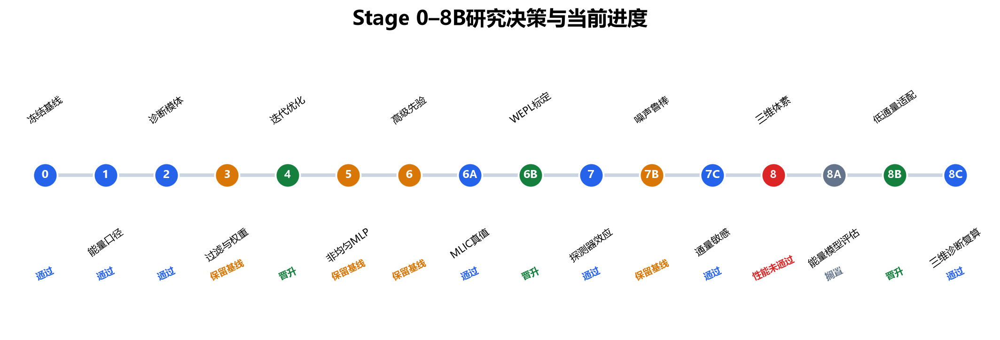

### 1.2 当前核心结论

| 已经证明 | 尚未证明 | 当前风险 |
|---|---|---|
| 建立了从OpenGATE ROOT到二维RSP图像的完整可复现链 | 真实物理能量探测器下仍能保持二维定量 | 0.2 mm位置误差是当前参数化D1模型的主要退化来源；物理能量探测器尚未建模 |
| 独立WEPL标定消除了统一水尺度偏差 | 有效通量能够直接等同于患者吸收剂量 | D1没有DoseActor；约7.1 mGy只是基于已发表扫描器的线性通量换算估计 |
| S4大材料柱MAPE达到0.2551% | 该三维结果能够跨模体、跨扫描器泛化 | Stage 8C测试属于修正性复核，不是从未查看的全新盲测 |
| Stage 8C在当前compact-3D模体上把大材料球MAPE降至0.5969% | 3D Gaussian优于体素OS-SART | 严格无噪声合成闭环的0.01 mm WEPL门槛仍未达到 |
| 多项复杂候选被锁定验证否决 | 跨模体、跨能量和跨探测器泛化 | 当前仿真场景数量仍有限 |
| 360角度×20%低通量适配后水区标准差降至0.95%、CNR升至132.6 | 该通量对应的本系统真实吸收剂量 | 低通量适配改善噪声，但铝平台相对MLIC仍低2.66% |

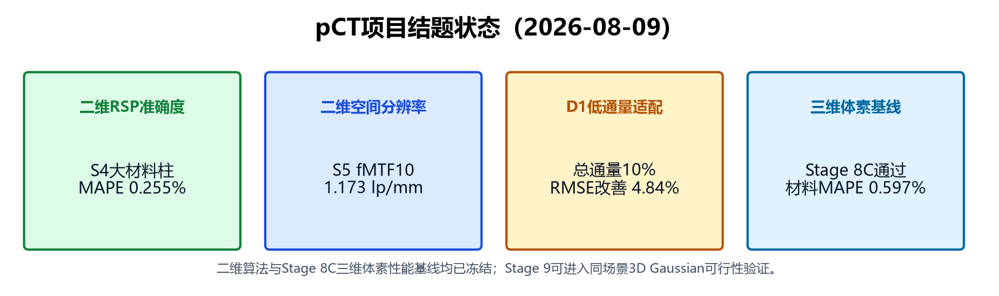

### 1.3 实践结束后的候选研究计划

下表不是当前正在执行的任务，只记录未来重新启动项目时可以继续开展的方向。

| 阶段 | 后续工作 | 优先级 | 具体内容 | 启动或完成条件 |
|---|---|---:|---|---|
| Stage 9 | 3D Gaussian | P1 | 实现可微MLP--Gaussian线积分，并在相同compact-3D数据、真值和测试质子上与Stage 8C体素基线比较 | 先完成单场景算子闭环；不得仅凭视觉效果宣称优于体素法 |
| Stage 10A | 显式最小二乘与停止准则 | P3 | 固化明确目标函数、收敛量和独立停止规则 | 需要提高迭代收敛解释的严谨性 |
| Stage 10B | 多分辨率与算子工程 | P3 | 多尺度重建、算子融合和多GPU并行 | 物理链正确且计算成本成为主要瓶颈 |

---

## 第二部分　仿真与独立标定实验

### 2.1 公共仿真平台

二维主实验使用OpenGATE 10.1.0及其Geant4输运核心，物理列表为 `QGSP_BIC_EMZ`。质子能量为200 MeV，扫描围绕模体完成一周旋转。仿真记录每条质子的`RunID`、`EventID`、`TrackID`、入口/出口位置、方向和能量；后续只保留可以唯一配对的主质子。

| 项目 | 二维S1--S5 | D1探测器实验 | compact-3D pilot |
|---|---|---|---|
| 入射能量 | 200 MeV单能 | 200 MeV单能 | 200 MeV单能 |
| 投影角度 | 720，间隔0.5° | 720，间隔0.5° | 360，间隔1° |
| 模体 | 半径100 mm水圆柱 | 同二维主模体 | 半径50 mm、轴长30 mm有限水圆柱 |
| 世界材料 | S1/S4/S5为Air；S2为Vacuum | Air | Air |
| 记录系统 | 理想入口/出口相空间面 | 理想面 + 四层200 μm硅 | 理想入口/出口相空间面 |
| 主要维度 | 二维横断面 | 二维探测器效应 | 完整三维、含出平面散射 |

### 2.2 全部仿真与标定实验表

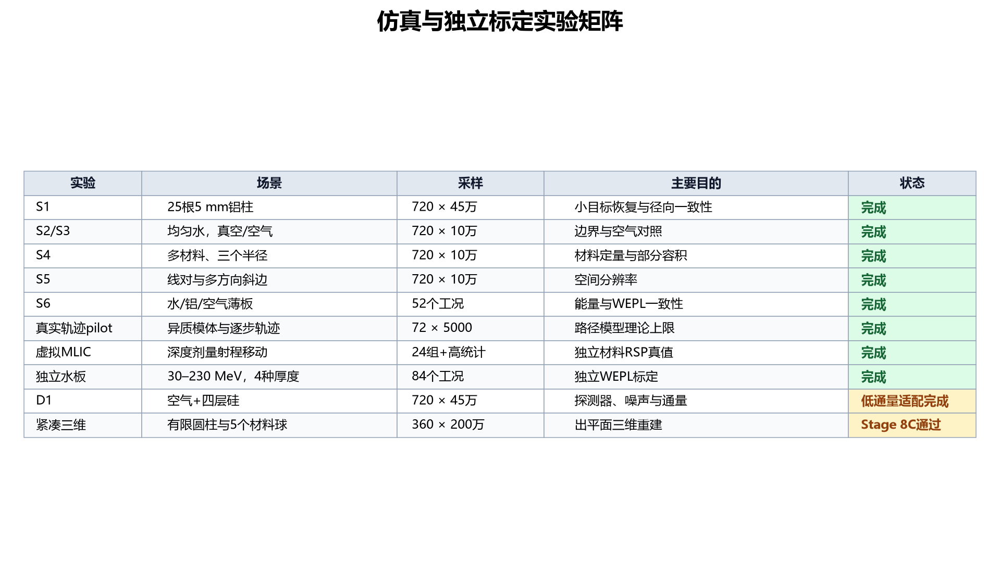

| 实验 | 场景与关键参数 | 目的 | 仿真或处理情况 |
|---|---|---|---|
| S1 | Air；100 mm水圆柱；25根直径5 mm铝柱；720×45万质子 | 小目标恢复、径向一致性、论文通量基线 | 完成；Stage 6B正式复算 |
| S2 | Vacuum；均匀水圆柱；720×10万质子 | 水平台、边界、FOV和滤波诊断 | 完成；Stage 2/4使用 |
| S3 | Air；均匀水圆柱；720×10万质子 | 与S2配对分离外部Air影响 | 完成；Air不是外围圆环主因 |
| S4 | Air；多材料柱分布于多个半径；720×10万质子 | 材料定量、径向偏差和部分容积 | 完成；15 mm大柱MAPE 0.2551% |
| S5 | Air；铝线对和五个骨斜边；720×10万质子 | fMTF、线对可见性和方向依赖 | 完成；fMTF10 1.1733 lp/mm |
| S6 | 水、铝和Air薄板；多能量、多厚度；52个工况 | 分离有效RSP、能量依赖和Air WEPL | 完成；发现统一WEPL尺度问题 |
| 真实轨迹pilot | 异质模体；72角度×5000质子；保存物体内逐step轨迹 | 比较水MLP与真值材料非均匀MLP | 完成；222,901条有效轨迹 |
| 虚拟MLIC | 样品前后水中深度剂量；200 MeV高统计 | 由R80射程移动获得独立材料RSP真值 | 完成并冻结 |
| 独立水板 | 30--230 MeV；约4种相对射程厚度；84个工况×10万质子 | 拟合Geant4一致的单调水射程函数 | 完成；测试偏差0.0461%/0.1657% |
| D1 | Air；四层200 μm硅；720×45万质子 | 跟踪器、数字化噪声、通量敏感性与低通量适配 | Stage 7/7B/7C/8B全部完成 |
| compact-3D | 50 mm半径有限水圆柱；5种材料球；360×200万质子 | 三维路径、三线性算子和材料恢复 | Stage 8首轮暴露欠收敛；Stage 8C完成诊断与复算并形成性能基线 |

### 2.3 三种经典二维场景

#### S1：25根铝柱

25根直径5 mm的铝柱分布在半径100 mm水圆柱内。它们具有相同材料和尺寸，但距旋转中心的半径、方位和邻近结构不同，因此适合同时检查小目标平台恢复、部分容积、边缘宽度和几何误差是否随半径增长。S1使用论文通量，即每角度45万质子，名义有效通量约900 protons/mm²/projection。

#### S4：多材料模体

S4包含Lung、A150组织等效塑料、SpineBone、Aluminium和Air。15 mm大材料柱位于约30、60和85 mm半径，用于检查同一材料在不同位置的定量一致性；中心另有5 mm铝柱，用于单独评价小目标部分容积。报告始终把“大材料平台MAPE”和“全部插入物MAPE”分开，避免用5 mm目标掩盖材料标定本身的准确度。

#### S5：线对与多方向斜边

S5包含0.5--3 mm尺度的铝线对，以及五个不同位置、不同方向的SpineBone斜边。线对用于直观判断可见性和调制度，斜边用于计算fMTF50与fMTF10。五个斜边使用同一种骨材料，改变的是位置和边缘方向，目的是检查空间分辨率的径向与方向依赖。

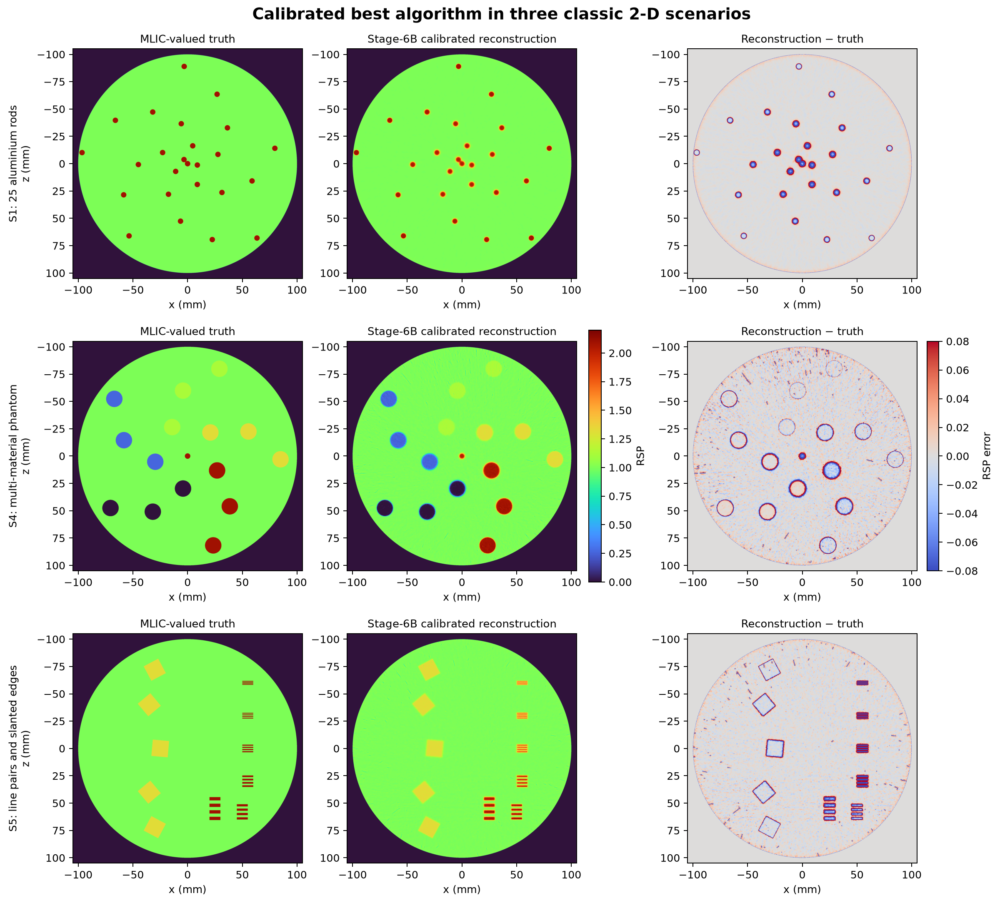

### 2.4 两条独立标定证据链

| 标定 | 已知量 | 测得或拟合量 | 用途 |
|---|---|---|---|
| 独立水板WEPL标定 | 水板物理厚度、入射与出射能量 | 单调水射程函数\(R_{\mathrm{G4}}(E)\) | 把每条质子的能量变为WEPL |
| 虚拟MLIC材料标定 | 材料厚度和加入前后的深度剂量曲线 | R80射程移动对应的材料RSP | 为重建图像提供独立真值 |

两项标定均不读取CT重建图像，因此不会用待评价结果反过来校准自身。水板标定解决“测量量如何进入重建”，MLIC解决“重建结果应当与什么比较”。

---

## 第三部分　Stage 0--8C已完成工作

### 3.1 数据处理与重建骨架

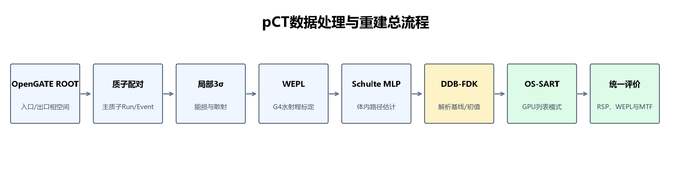

入口和出口ROOT首先按`RunID/EventID`配对，并只保留唯一`TrackID=1`主质子。局部3σ过滤联合检查能损和两个有符号散射分量。单质子WEPL由

\[
b_p=R_w(E_{\mathrm{in}})-R_w(E_{\mathrm{out}})
\]

得到；Schulte MLP根据入口/出口位置和方向估计体内弯曲路径。解析方法把质子组织成MLP深度感知DDB，完成几何加权、Ramp滤波和反投影；迭代方法直接使用list-mode质子，并计算

\[
\hat b_p=(Ax)_p=\sum_j a_{pj}x_j,\qquad r_p=b_p-\hat b_p.
\]

二维前投影使用双线性四邻域，三维使用三线性八邻域；正投影和转置反投影复用同一组权重。完整数学推导见[重建原理文档](reconstruction_principles.md)。

### 3.2 Stage 0：冻结基线与评价纪律

**目的**

Stage 0不以改善图像为目标，而是解决“后续候选是否在同一数据、真值、ROI和评价口径下比较”的问题。它以`results0716`为历史正式基线，冻结配置、源码哈希、输入输出、MHD网格和评价定义。

**实施**

历史划分使用`splitmix64_v1(RunID, filtered_row_index, 20260713) % 10`：219,790,828条质子进入训练池，24,426,971条进入固定验证池，验证集覆盖720个角度。后续S1--S5、D1和compact-3D进一步改为过滤前80%训练、10%验证和10%锁定测试，避免过滤器看到测试标签。

**结果**

| 方法 | 水区标准差 | 模体RSP RMSE | 验证WEPL RMSE/mm |
|---|---:|---:|---:|
| no-Hann DDB-FDK | 0.009720 | 0.045075 | 2.65091 |
| GPU OS-SART + Huber-TV，第3轮 | 0.002453 | 0.041956 | 2.62098 |

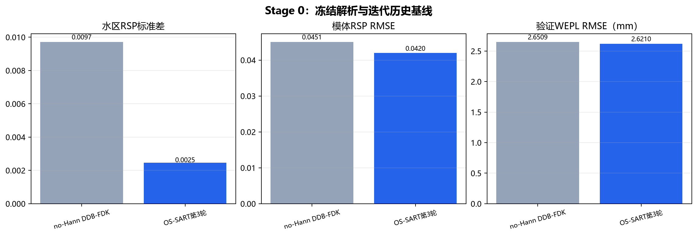

**决策与边界**

Stage 0状态为通过：它建立了锁定评价和可追溯基线，但当时水均值仍约1.014，尚未解释WEPL尺度偏差。没有DoseActor的实验只报告通量，不把质子数直接换算为mGy。

### 3.3 Stage 1：材料、能量与WEPL口径

**目的**

Stage 1使用S6薄板扫描判断results0716约1.4%的统一偏差来自固定200 MeV真值、沿降能路径的有效RSP、Air能损，还是能量到WEPL的转换口径。

**实施**

S6包含Water、Aluminium和Air的52个能量—厚度工况，共104个ROOT和5,032,273条入口/出口主质子。分析同时保留原始均值、中位数和3-MAD核心统计，并扫描水电离势的敏感性；经验最优电离势只作为诊断，不被解释为新的水物理常数。

**结果**

| 诊断量 | 结果 | 含义 |
|---|---:|---|
| 200 MeV水WEPL/厚度拟合斜率 | 1.013518 | 与results0716水均值1.014063接近 |
| 200 MeV、5 mm铝有效RSP | 2.107424 | 相对固定参考2.118976低0.545% |
| 200 MeV Air WEPL斜率 | 0.00114710 mm/mm | Air修正应按路径长度计算 |
| ITK/C++ LUT最大差异 | 0.000182 mm | 软件实现一致 |

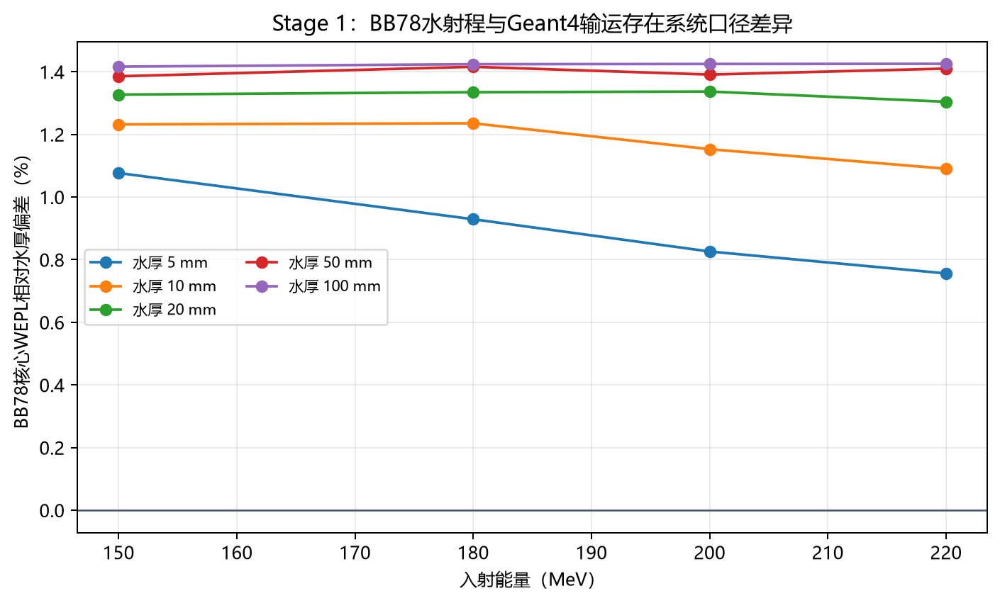

**决策与边界**

Stage 1确认统一偏差在进入重建器之前已经存在，并给出Air修正模型；但S6最长水板仅100 mm、最低能量150 MeV，不能替代完整CT路径。项目没有把经验最优电离势写回正式LUT，而是决定开展独立水射程标定。

### 3.4 Stage 2：诊断模体与误差分离

**目的**

Stage 2建立一组可以分别回答水平台、外围圆环、材料平台、小目标部分容积和空间分辨率问题的诊断模体，避免只用单一模体RMSE评价所有误差。

**实施**

- S2为Vacuum中的均匀水圆柱，用于水平台、FOV、Hann和支撑域实验。
- S3为Air中的同尺寸均匀水圆柱，用于与S2配对分离外部Air影响。
- S4包含不同半径的15 mm多材料柱和中心5 mm铝柱，用于区分材料定量、径向趋势和部分容积。
- S5包含0.5--3 mm铝线对和五个不同位置、方向的SpineBone斜边，用于调制度和fMTF。

**结果**

S2解析水均值为1.013774，S3经逐质子Air修正后为1.013761；Air修正只改变约0.000218 RSP，因此约1.38%的水平台偏高不是Air造成。扩大FOV没有改变外围响应；100 mm支撑域把100--105 mm外部RMSE由0.077054降为0，却不改变90--100 mm内侧边界RMSE 0.042764，说明它只消除物体外像素，不能修复Ramp/DDB边界响应。

| 数据集 | 方法 | 水区标准差 | 有效RSP RMSE | 测试WEPL RMSE/mm | 测试bias/mm |
|---|---|---:|---:|---:|---:|
| S2 Vacuum | DDB-FDK | 0.018174 | 0.026243 | 2.47780 | +0.30343 |
| S2 Vacuum | OS-SART第3轮 | 0.006402 | 0.013684 | 2.44496 | +0.00129 |
| S3 Air修正 | DDB-FDK | 0.021891 | 0.029531 | 2.48004 | +0.31688 |
| S3 Air修正 | OS-SART第3轮 | 0.009304 | 0.015633 | 2.44349 | +0.00245 |

S4解析非Air材料MAPE为1.17%，中心5 mm铝误差高于多数15 mm铝柱；S5五个斜边的fMTF50范围为0.367--0.745 lp/mm，证明位置和边缘方向会影响测得分辨率。

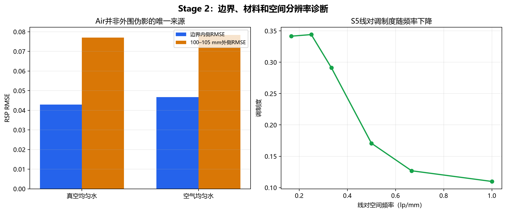

**决策与边界**

Stage 2建立了后续阶段统一的材料、边界、噪声和分辨率门槛。它证明迭代方法能显著降低方差和测试bias，却不会自动把水平台从1.0138校正到1.0；全局物理标定必须在重建之前解决。

### 3.5 Stage 3：稳健过滤、噪声模型与数据加权

**目的**

Stage 3检验核反应尾部和逐质子不确定度是否可以通过稳健过滤或连续权重转化为更低的WEPL残差和更准确的材料平台。

**实施**

过滤候选为局部3σ、median/MAD和联合稳健马氏距离；权重候选为等权、WEPL逆方差、稳健置信及两者组合。所有模型只在训练集拟合，候选必须同时控制验证WEPL、p99、S4材料MAPE、小铝柱误差和材料间保留率。

**结果**

| 过滤器 | 验证WEPL RMSE/mm | p99/mm | S4材料MAPE | 结论 |
|---|---:|---:|---:|---|
| 局部3σ | 2.48036 | 6.53416 | 1.158% | 基线 |
| median/MAD | 2.48345 | 6.46246 | 1.097% | p99仅改善1.10%，未达5%门槛 |
| 稳健马氏距离 | 2.48524 | 6.41008 | 1.147% | p99仅改善1.90%，未达5%门槛 |

| 权重 | S2/S4平均验证RMSE/mm | S4材料MAPE | 结论 |
|---|---:|---:|---|
| 等权 | 2.53992 | 1.196% | 冻结基线 |
| 逆方差 | 2.55549 | 1.301% | RMSE和材料MAPE同时恶化 |
| 稳健置信 | 2.53993 | 1.194% | 与等权等效 |
| 组合权重 | 2.55538 | 1.298% | 未通过 |

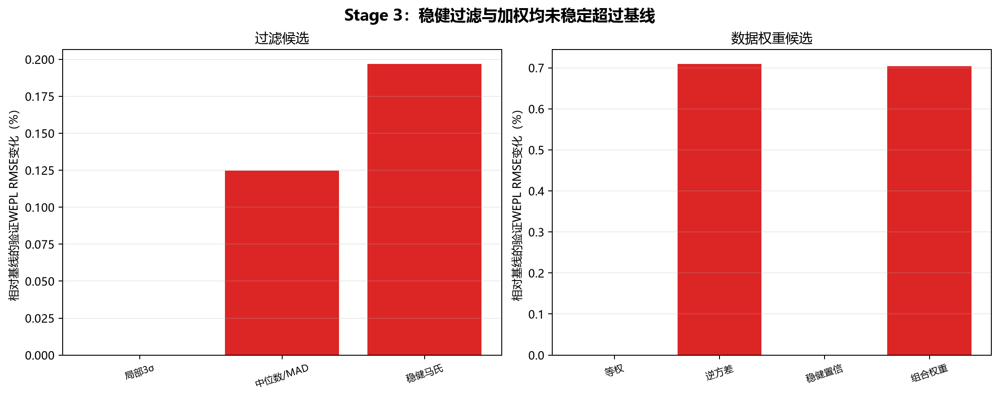

**决策与边界**

过滤和权重冻结后才打开S1、S3和S5测试集；因为胜出方案仍是原基线，独立确认验证的是基线泛化而不是新方法提升。Stage 3完整通过但没有候选晋升，正式链保留局部3σ和等权二次数据项。

### 3.6 Stage 4：固定MLP下的迭代优化

**目的**

Stage 4在固定Schulte水MLP、过滤和等权数据的前提下，寻找噪声、材料定量、空间分辨率、数据一致性和运行成本之间更好的迭代配置。

**实施**

依次筛选初始松弛因子、衰减、quadratic/Huber数据损失、Huber-TV权重、停止轮数和18/36子集，最后在S1--S5锁定测试集确认。

**结果**

| 损失 | 平均验证WEPL RMSE/mm | p99/mm | S4材料MAPE | 决策 |
|---|---:|---:|---:|---|
| quadratic | 2.544585 | 6.851392 | 1.192% | 保留 |
| Huber 3 mm | 2.545072 | 6.859775 | 1.145% | WEPL与p99未改善 |
| Huber 5 mm | 2.544681 | 6.855304 | 1.166% | 未通过 |

最终配置为初始松弛0.25、衰减0.2、quadratic数据项、固定Huber-TV `β=0.0125`、18子集和5轮。相对同轮无正则化候选，S2有效RSP RMSE和水区标准差分别改善41.5%和81.3%，S5 RSP RMSE改善9.6%；相对Stage 3三轮基线，S2/S3水区标准差平均降低42.58%。36子集只改善0.0537%验证WEPL RMSE，因此没有采用。

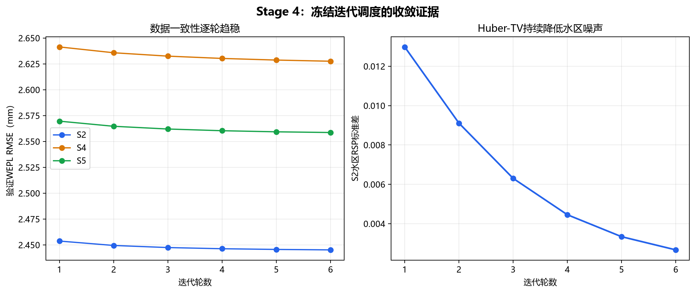

**决策与边界**

Stage 4正式晋升。五个测试集的WEPL RMSE平均只改善0.095%，晋升依据主要是保持材料和MTF安全的显著图像降噪，而不是数据残差的大幅下降；正则化不能替代物理标定。

### 3.7 Stage 5：非均匀介质MLP

**目的**

Stage 5检验均匀水散射统计是否已经成为二维结果的主要误差源，以及按材料更新MLP是否值得承担额外重建成本。

**实施**

真实轨迹pilot保存222,901条可用Geant4逐step路径。Level 1首先使用真值材料图更新散射统计，代表非均匀MLP可以达到的有利上限；只有Level 1证明稳定路径收益，才允许进入图像驱动固定MLP和交替更新MLP。

**结果**

相对Schulte水MLP，真值材料非均匀MLP在全部路径和强异质路径上的平均改善只有0.006%和0.074%，bootstrap 95%区间跨过零。

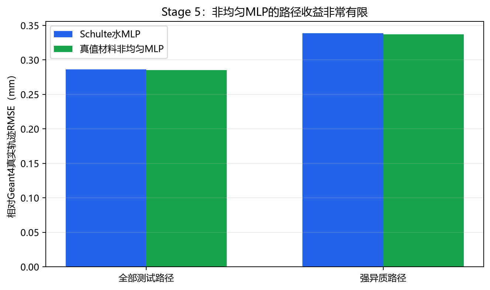

**决策与边界**

由于连“已知真值材料”的Level 1上限都没有稳定收益，程序按预注册门槛停止，没有继续进行昂贵的固定或交替非均匀MLP重建。当前200 MeV二维场景保留Schulte水MLP；该结论不等于否定更低能量、更厚或更强异质场景中的非均匀MLP。

### 3.8 Stage 6：高级图像先验

**目的**

Stage 6研究TGV、自适应TV和方向TV能否在不损害材料定量和噪声的前提下，提高边缘与线对分辨率。

**实施**

共预筛14组候选。TGV候选因S5 fMTF10安全约束失败而未进入完整重建；最佳自适应TV和方向TV在S2、S4、S5完成五轮全量训练。预筛和验证均未读取锁定测试集。

**结果**

| 指标 | Stage 4 | 自适应TV | 方向TV |
|---|---:|---:|---:|
| S2水区标准差 | 0.003336 | 0.004909（+47.15%） | 0.004252（+27.47%） |
| S4水区标准差 | 0.012404 | 0.015614（+25.88%） | 0.014582（+17.56%） |
| S5水区标准差 | 0.008004 | 0.010684（+33.48%） | 0.009785（+22.25%） |
| S4材料MAPE | 1.2035% | 1.1991% | 1.2011% |
| S5 fMTF10/lp/mm | 1.116718 | 1.207165 | 1.202002 |


**决策与边界**

高级先验提高MTF的同时使水区标准差增加17.6%--47.1%，材料MAPE改善不足0.005个百分点，且RSP RMSE回升。因此测试集没有打开，正式方法继续使用Stage 4固定Huber-TV。这是否定当前参数化候选，不是否定所有高阶或自适应先验。

### 3.9 Stage 6A：虚拟MLIC材料真值

**目的**

Stage 6A解决“重建图像应该与什么材料RSP比较”的问题，避免把固定理论RSP、沿降能路径的有效RSP和重建偏差混为一谈。

**实施**

虚拟多层电离室以加入材料前后的R80射程移动除以材料厚度定义RSP。首轮四能量扫描包含240万质子；200 MeV高统计补充包含600万质子，主参考由10个独立重复、每个材料共100万质子得到。

**结果**

| 材料 | 200 MeV MLIC-RSP | bootstrap SD | 95% CI |
|---|---:|---:|---:|
| Water | 0.999746 | 0.000747 | 0.998219--1.001181 |
| Lung | 0.258145 | 0.000832 | 0.256432--0.259707 |
| A150组织塑料 | 1.124245 | 0.000833 | 1.122580--1.125857 |
| SpineBone | 1.322261 | 0.000889 | 1.320473--1.323945 |
| Aluminium | 2.094511 | 0.002994 | 2.088576--2.100478 |

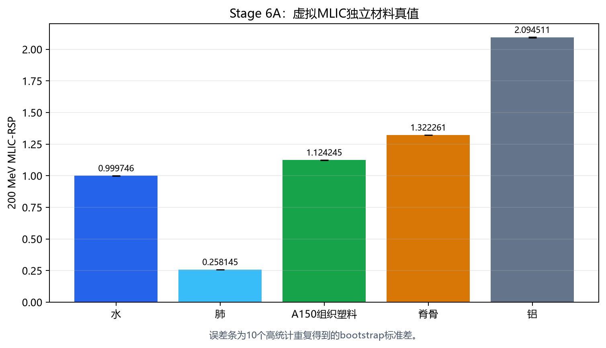

results0716第3轮迭代铝平台相对固定参考的误差约−1.289%，改用MLIC后为−0.136%，说明当时铝柱的大部分“固定误差”来自真值口径。但S4材料MAPE只由1.203%变为1.192%，证明S4的统一材料高估不能归因于真值选错。

**决策与边界**

Stage 6A冻结200 MeV MLIC-RSP作为材料评价主真值，同时保留固定理论RSP用于历史复现。它只改变评价口径，不反向调整Stage 4参数，避免测试泄漏。

### 3.10 Stage 6B：独立水板WEPL标定

**目的**

Stage 6B解决“每条质子的入口/出口能量如何转换成WEPL”的问题。它与Stage 6A的材料真值相互独立，不使用S1--S5重建图拟合经验比例。

**实施**

独立仿真覆盖30--230 MeV的21个能量和每个能量约10%、30%、50%、70%射程的四种水厚，共84个工况、840万入口质子。拟合使用420万稳健核心样本，正导数参数化保证射程函数严格单调；训练、验证和测试能量在仿真前冻结。

**结果**

| 数据划分 | 平均绝对相对偏差 |
|---|---:|
| 训练 | 0.0604% |
| 验证 | 0.0545% |
| 锁定测试 | 0.0461% |

锁定测试最大单工况偏差为0.1657%。S2 Vacuum和S3 Air复算后的水均值分别为0.999641和0.999635，均通过`1.000±0.003`门控；之后S1、S4和S5从WEPL、DDB、解析初值到五轮迭代完整复算，而不是对旧图像除以常数。

| 指标 | 标定前 | G4水标定后 |
|---|---:|---:|
| S4 15 mm大材料柱MLIC-MAPE | 1.1987% | 0.2551% |
| S4全部非Air插入物MAPE | 1.1924% | 0.4408% |
| S5 fMTF10/lp/mm | 1.1167 | 1.1733 |
| S1 5 mm铝相对MLIC误差 | +0.130% | −1.307% |

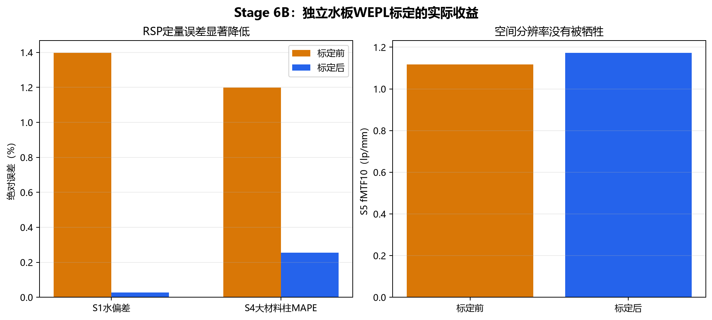

**决策与边界**

`g4_water_calibrated`正式晋升，BB78只保留为历史基线。标定消除了统一水尺度问题并使S4大柱MAPE降低78.7%，但S1小铝柱仍低1.307%，说明剩余问题已经转向材料相关阻止本领、降能历史、边缘响应和部分容积。

### 3.11 Stage 7：Air与四层硅跟踪器效应

**目的**

Stage 7从理想相空间记录迈向更真实的跟踪测量，分别评估Air、四层200 μm硅、连续hit直线拟合以及参数化位置/能量数字化对现有算法的影响。

**实施**

D1在Air世界中设置上游和下游各两层硅；连续hit拟合入口/出口直线，随后分别扫描0.1、0.2、0.5 mm位置误差，以及在0.2 mm位置误差基础上的0.5%、1%、2%出口能量高斯噪声。所有候选先用10%质子和3轮筛选，三套代表配置再做全量5轮。

**结果**

| 测量条件 | 水区标准差 | 模体RMSE | 铝平台RSP | 中位CNR |
|---|---:|---:|---:|---:|
| 理想参考面 | 0.001826 | 0.039868 | 2.069840 | 551.14 |
| 四层连续硅hit | 0.001888 | 0.040748 | 2.070807 | 516.90 |
| 0.2 mm位置 + 1%出射能量噪声 | 0.002594 | 0.056903 | 2.044424 | 371.80 |

连续hit相对理想参考面的水标准差增加3.41%、RMSE增加2.21%，说明硅散射和直线拟合只造成温和退化。组合条件的RMSE增加42.73%、CNR降低32.54%，但该配置同时包含位置和能量扰动；在10%筛选中，它相对仅0.2 mm位置误差的RMSE只增加约0.96%，不能把全部退化归因于能量噪声。

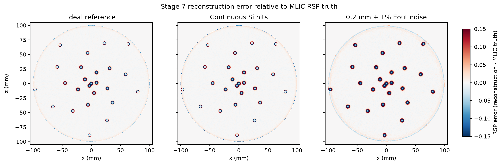

**决策与边界**

Stage 7证明当前冻结算法能够处理四层连续硅hit，但没有建立完整物理能量探测器。能量响应非线性、效率、停止层误判、死区、堆积和相关电子学噪声均不在D1中；组合数字化结果必须结合Stage 7B的噪声分离才能解释。

### 3.12 Stage 7B：位置与能量噪声鲁棒重建

**目的**

Stage 7B首先分离位置误差和能量噪声，再判断解析/经验逆方差、Huber数据损失及组合方法能否缓解组合数字化条件的退化。

**实施**

数据在过滤前按`(RunID, EventID)`固定划分80%训练、10%验证和10%测试。候选使用10%训练质子、3轮重建；只有候选通过验证门槛，才允许多随机种子复核、80%正式双重建和锁定测试。

**结果：噪声源分离**

| 条件 | 水区标准差 | 模体RMSE | 验证理想WEPL RMSE/mm |
|---|---:|---:|---:|
| 连续硅hit | 0.112916 | 0.131178 | 2.76817 |
| 仅0.2 mm位置误差 | 0.113066 | 0.132503 | 3.80307 |
| 仅1%出口能量噪声 | 0.112923 | 0.131258 | 2.76393 |
| 位置 + 能量噪声 | 0.113099 | 0.132293 | 3.73757 |

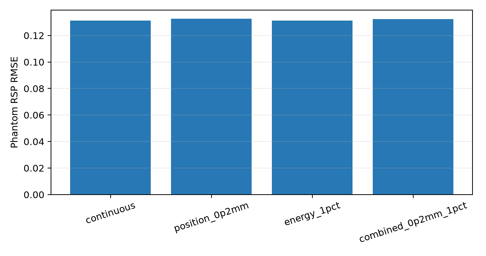

在当前参数化模型下，0.2 mm位置误差及其引起的路径估计偏差是主要退化来源；独立1%出口能量高斯噪声与连续hit的验证WEPL RMSE基本相同，没有形成可分辨影响。组合结果略低于位置单独结果属于随机抽样、过滤和重建波动，不能解释成能量噪声改善了结果。

**结果：候选数据项**

| 方法 | 验证WEPL RMSE/mm | p99/mm | 相对基线 |
|---|---:|---:|---:|
| 等权quadratic | 3.73757 | 11.52630 | 基线 |
| 解析逆方差 | 3.80745 | 12.14821 | +1.87% |
| 经验逆方差 | 3.81179 | 12.18839 | +1.99% |
| Huber 1.5 | 3.76075 | 11.75042 | +0.62% |
| Huber 2.5 | 3.74920 | 11.63070 | +0.31% |
| 经验逆方差 + Huber | 3.82484 | 12.31482 | +2.34% |

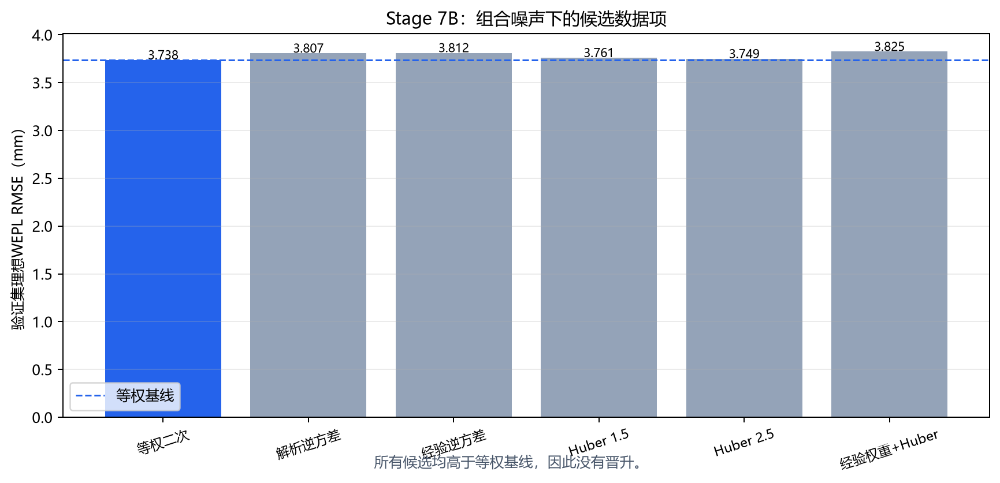

**决策与边界**

所有候选都劣于等权基线，因此程序按预注册门槛没有打开锁定测试集，也没有运行80%数据双重建。Stage 7B是有效负结果：正式链继续使用等权quadratic。它只说明当前参数化噪声和现有权重模型无收益，不证明真实物理能量探测器无关；由于能量噪声当前不是可分辨瓶颈，Stage 8A物理能量模型研究暂时搁置。

### 3.13 Stage 7C：有效通量敏感性

**目的**

Stage 7C评价同一冻结算法在有效质子通量降低时何处失稳，而不是寻找最低物理剂量。由于D1没有DoseActor，本阶段不能把通量换算成mGy。

**实施**

过滤后按EventID生成100%、50%、25%和10%的严格嵌套子集，720个角度全部保留。理想参考面、连续硅hit和组合噪声三种条件均使用同一重建参数；组合噪声25%和10%用三个种子复核，种子只用于稳定性估计，不参与参数选择。

**结果**

| 条件 | 100% | 50% | 25% | 10% | 推荐最低有效通量 |
|---|---:|---:|---:|---:|---:|
| 理想参考面 | 通过 | 通过 | 通过 | 失败 | 225质子/mm²/投影 |
| 连续硅hit | 通过 | 通过 | 通过 | 失败 | 225质子/mm²/投影 |
| 组合噪声 | 通过 | 通过 | 三种子均通过 | 失败 | 225质子/mm²/投影 |

25%时水绝对偏差低于0.1%、水标准差低于1%、CNR高于100；10%时水标准差跃升至约8.4%--10.6%，进入非线性失稳区。因此25%是冻结算法的经验工作下限，10%失败不是简单的(1/\sqrt N)统计外推。

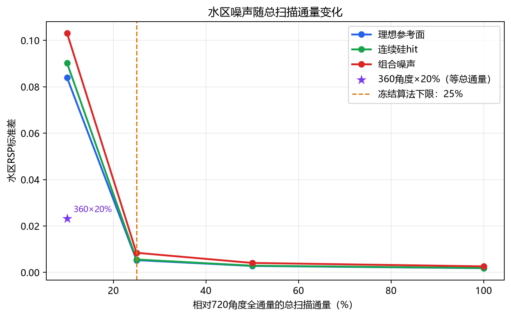

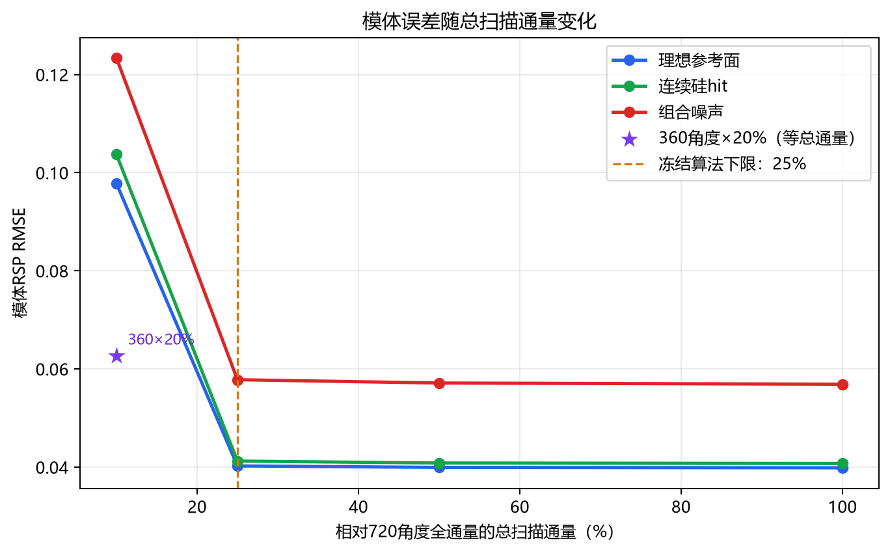

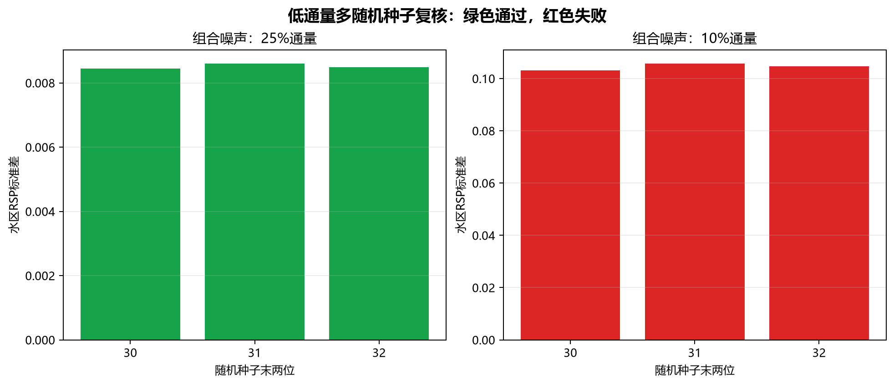

**决策与边界**

Stage 7C流程通过并冻结225质子/mm²/投影的最低推荐有效通量。它不是临床剂量阈值，也不代表10%通量无法通过重新调节轮数、松弛、正则化或多尺度初值改善；这些变化必须作为新的低通量算法重新验证。

### 3.14 Stage 8：紧凑三维体素重建

**目的**

Stage 8把二维list-mode链扩展到完整三维，验证有限圆柱求交、两个横向方向的Schulte MLP、三线性八邻域前投影/严格转置反投影、三维OS-SART和三维Huber-TV是否能够形成可靠材料体积。

**实施**

三维数组采用`(z,y,x)`，输出网格为`240×80×240 @ 0.5 mm`。首版用有限水圆柱作为初值，以避免尚未实现且未经验证的三维DDB-FDK；每条路径分别计算两个横向MLP，并通过扫描角旋转到固定物体坐标。共配对684,197,294条主质子，过滤并命中有限圆柱后保留443,653,707条，训练、验证和测试分别为354,946,229、44,344,246和44,363,232条。

**结果**

0°/90°伴随内积相对误差为`4.02×10⁻⁸/1.35×10⁻⁸`，CPU/CUDA MLP最大位置差约`1.92×10⁻⁶ mm`，局部算子通过数值门控。正则化筛选选择`β=0`，因为非零TV没有在验证WEPL、材料MAPE和三方向边缘约束下形成更好折衷。第1到第3轮验证WEPL RMSE由2.211降至2.015 mm，模体RMSE由0.0626降至0.0533，但材料恢复仍明显错误。

| 指标 | 第3轮结果 | 判定 |
|---|---:|---|
| 测试WEPL RMSE / MAE / bias | 2.0146 / 1.5566 / 0.0075 mm | 有限、可重复 |
| 水均值 / 相对偏差 / 标准差 | 0.99850 / −0.1247% / 0.01100 | 水尺度基本通过 |
| 三维模体RMSE | 0.05330 | 尚未形成可靠基线 |
| 10--14 mm材料球MAPE | 37.03% | 未通过 |
| Aluminium / SpineBone误差 | −29.71% / −10.56% | 未通过 |
| Lung / A150误差 | +96.40% / −4.14% | 未通过 |
| Air球重建RSP | 0.4587 | 未通过 |


**决策与边界**

Stage 8当时的结论为**工程流程通过、材料性能未通过**。这项负结果触发了Stage 8C对常数圆柱、单球和离轴球闭环、任意角坐标、路径覆盖、有限圆柱侧壁/端盖求交及列归一化的系统检查。后续证据表明Stage 8的基础几何和算子并无主导性错误，主要问题是3轮迭代严重不足且原松弛因子衰减过快；修正后的正式结论见Stage 8C。

### 3.15 Stage 8A：D1能量测量模型深化评估

**目的**

Stage 8A原计划进一步建立物理能量探测器响应、独立标定和非高斯WEPL似然。本阶段先利用Stage 7和Stage 7B已有证据判断它是否应列为近期任务，避免在主要误差源尚未厘清时投入新的大规模仿真与重建。

**实施与结果**

对连续硅hit、仅0.2 mm位置误差、仅1%出口能量高斯噪声以及位置与能量组合噪声进行分解比较。验证WEPL RMSE分别为2.76817、3.80307、2.76393和3.73757 mm：位置误差引起明显退化，而当前1%能量高斯噪声相对连续hit没有形成可分辨影响。Stage 8B在低通量条件下再次得到相同方向的证据，温和和中等逆方差权重还分别使模体RMSE恶化1.00%和2.79%。

**决策与边界**

Stage 8A已完成“是否近期启动”的阶段评估，结论为**搁置后续实施**，因此归入已完成阶段而不再列入近期计划。五级塑料闪烁体、独立响应标定、非高斯尾部和WEPL似然方案仍保留；当工作站恢复、获得真实探测器响应参数，或位置误差改善后能量测量成为主要瓶颈时，再恢复该方向。该决策不等于证明真实物理能量探测器不重要，只表示现有参数化数据不足以支持近期投入。

### 3.16 Stage 8B：低通量采集与重建联合适配

**目的**

Stage 7C保留全部720个角度，只降低每个角度的质子数，因此10%通量时每个角度仅剩约2.41万条过滤后质子，DDB初值进入明显稀疏和高方差区。Stage 8B首先不调参数，而是回答：在总质子数和近似剂量不变时，是否可以减少投影角度、增加每角度质子数，从而改善DDB统计并避免10%点的非线性失稳。

**剂量选择依据**

Phase-II真实pCT扫描器报告，扫描中心总通量约(10^6)质子/cm²时可达到低于1%的RSP不确定度，对应约1.1 mGy；该设备典型使用90个投影。这个结果说明实际pCT的角度数不必固定为720，并为本项目选择低总通量条件提供了外部量级参考。D1全通量的名义总通量为

\[
720\times900=648000\ \text{质子/mm}^2
=6.48\times10^7\ \text{质子/cm}^2.
\]

按上述文献比例做一阶估算，720角度×10%与360角度×20%的总通量都为\(6.48\times10^6\)质子/cm²，对应约7.1 mGy。这个数值不是D1仿真直接测得的剂量：D1没有DoseActor，而且模体尺寸、束流分布、过滤效率和探测器与文献设备不同，因此只能用于选择研究条件，不能作为正式剂量结论。

| 采集配置 | 每角度名义通量/质子·mm⁻² | 相对全扫描总通量 | 总通量/质子·cm⁻² | 文献比例估算剂量 |
|---|---:|---:|---:|---:|
| 720角度×100% | 900 | 100% | \(6.48\times10^7\) | 约71.3 mGy |
| 720角度×25% | 225 | 25% | \(1.62\times10^7\) | 约17.8 mGy |
| 720角度×20% | 180 | 20% | \(1.296\times10^7\) | 约14.3 mGy |
| 720角度×10% | 90 | 10% | \(6.48\times10^6\) | 约7.1 mGy |
| 360角度×20% | 180 | 10% | \(6.48\times10^6\) | 约7.1 mGy |

**实施**

新实验保留原始偶数RunID，即使用0°、1°、…、359°共360个投影；每个角度从相同组合噪声D1数据中确定性保留20%。`360角度×20%`实际使用17,343,126条质子，`720角度×10%`使用17,350,551条，只差0.043%。两组均使用相同的G4水标定WEPL、Schulte水MLP、no-Hann DDB-FDK初值、18子集、5轮OS-SART和Huber-TV，因此差异只来自质子在角度间的分配。

**结果**

| 配置 | 每角度过滤后质子数/约 | 水区标准差 | 模体RSP RMSE | 铝柱MLIC误差 | CNR | 边缘宽度/mm |
|---|---:|---:|---:|---:|---:|---:|
| 720角度×10% | 24,100 | 0.103110 | 0.123393 | +4.020% | 15.37 | 1.7971 |
| 360角度×20% | 48,200 | 0.023171 | 0.062659 | -0.720% | 50.97 | 1.7971 |

`360角度×20%`将水区标准差降低77.53%，将模体RMSE降低49.22%。改善在迭代开始前已经出现：DDB-FDK初值的水区标准差由0.130353降至0.046177，RMSE由0.153290降至0.084459。因此主要收益来自每角度质子数翻倍后DDB统计更稳定，固定迭代算法只是在更好的初值上继续降噪。现有图像未显示360角度产生比720角度更明显的规则角向欠采样条纹。


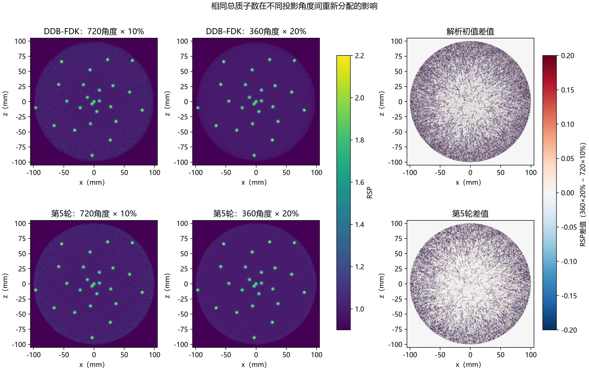

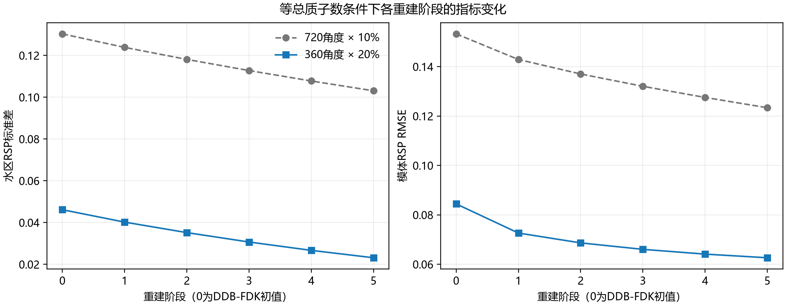

**结果：低通量参数优化**

角度—通量实验说明10%总通量下的突然恶化并非单纯由总质子不足决定，而与当前DDB初值所需的单角度统计量密切相关。`360角度×20%`相对组合噪声100%结果的模体RMSE只增加10.12%，边缘宽度增加1.66%，但使用冻结高通量参数时水区标准差仍为2.317%、CNR仅50.97，因此该配置被用作低通量参数优化的开发条件。

在固定360角度、1°间隔和每角度20%的条件下，依次筛选停止epoch、初始松弛因子、衰减、Huber-TV强度和多尺度初值。最终冻结方案为：0.5 mm低通初值上采样至0.1 mm、18子集、初始松弛因子0.25、衰减0.1、Huber-TV权重0.05，并在第2轮停止。开发、验证和锁定测试采用不同确定性随机种子，但保持完全相同的采集定义。

| 锁定测试指标 | 冻结高通量参数，第5轮 | 低通量适配参数，第2轮 | 变化 |
|---|---:|---:|---:|
| 水区RSP均值 | 0.999713 | 1.001081 | 绝对偏差仍低于0.3% |
| 水区RSP标准差 | 0.022752 | 0.009498 | −58.25% |
| 模体RSP RMSE | 0.062209 | 0.059198 | −4.84% |
| 铝柱—水CNR | 51.998 | 132.574 | +154.96% |
| 10%–90%边缘宽度/mm | 1.81714 | 1.82512 | +0.44% |
| 铝峰值相对MLIC误差 | −0.644% | −2.663% | 恶化2.019个百分点 |

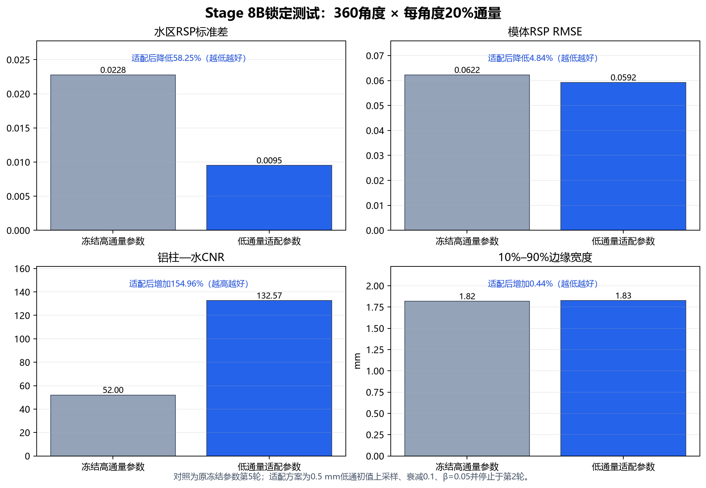

第3--5轮虽然继续降低水噪声和全模体RMSE，但铝平台误差超过预注册安全门槛，因此不能只按最低RMSE选择停止点。第2轮是噪声、材料定量、CNR和边缘宽度共同约束下唯一通过的锁定检查点。适配方案成功使水区标准差低于1%、CNR超过100，但代价是相对同通量旧参数，铝峰值误差由−0.644%扩大到−2.663%；因此它是低通量综合折衷，而不是所有指标都改善。

把同一方案向每角度17.5%通量延伸时，尽管水区标准差为0.641%、CNR为195.3，铝平台安全约束仍失败，说明当前可以冻结的最低条件仍是360角度×每角度20%，不能仅凭噪声指标继续下调。

**结果：噪声分解与能量加权**

在低通量适配参数下重新比较连续硅hit、仅0.2 mm位置误差、仅1%能量噪声和组合噪声。三个随机种子中，组合条件的模体RMSE相对仅位置条件平均低0.50%，没有证据表明1%能量噪声在位置误差之上进一步恶化模体RMSE；但是主种子下仅能量噪声使水区标准差相对连续hit增加10.08%，恰好触发预注册的能量加权筛选门槛。

| 数据项 | 有效样本比例下限 | 模体RSP RMSE | 相对等权 |
|---|---:|---:|---:|
| 等权二次损失 | 1.000 | 0.059334 | 基线 |
| 温和逆方差，γ=0.25 | 0.946 | 0.059926 | +1.00% |
| 中等逆方差，γ=0.5 | 0.838 | 0.060990 | +2.79% |
| 完整逆方差，γ=1.0 | 0.767 | 不评价 | 低于0.80门槛，淘汰 |

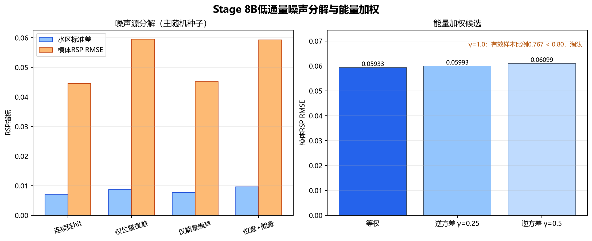

**决策与边界**

Stage 8B状态为通过并晋升低通量专用配置：在约10%名义总通量下，采用360角度×每角度20%、0.5 mm低通上采样初值、衰减0.1、Huber-TV权重0.05，并停止于第2轮。数据项继续使用等权quadratic；能量加权没有进入验证和锁定测试，因为开发结果已经劣于等权，γ=1.0还违反有效样本量门槛。

该配置不能替换高通量三种经典场景的正式参数，它只适用于当前D1组合噪声和低通量采集。约7.1 mGy仍是外部Phase-II通量—剂量关系的线性估算，不是本项目DoseActor测量。360角度优于720角度的结论还依赖当前DDB-FDK初值和最近格点分箱，不能外推为所有pCT算法或探测器的普遍规律。

### 3.17 Stage 8C：三维系统诊断与匹配算子闭环

**目的**

Stage 8已经证明三维数据链能够运行，但大材料球MAPE为37.03%，Air球也存在明显残留。Stage 8C不直接通过增加TV或继续全量迭代掩盖问题，而是先回答三个更基础的问题：三维坐标和旋转是否正确、前投影与转置反投影是否构成同一个算子、当前失败究竟来自覆盖缺失、求解器欠收敛还是实际测量模型失配。

**实施**

Stage 8C复用Stage 8已有443,653,707条过滤后质子和固定划分，不覆盖原pairs、检查点或Stage 8结果。工作分为四层证据：第一层验证坐标、旋转、有限圆柱求交、覆盖和伴随关系；第二层用当前算子生成无噪声匹配测量\(b_{\mathrm{synthetic}}=Ax_{\mathrm{truth}}\)，分别测试均匀水、中心Air球、中心高RSP球、离轴高RSP球和完整五球；第三层在固定10%筛选数据上比较松弛调度；第四层才使用完整80%训练集执行30轮无正则重建，并在参数冻结后进行测试集修正性复核。

所有三维实验保持同一数据模型：输出数组为`(z,y,x)`，网格为`240×80×240 @ 0.5 mm`，两个横向方向均采用Schulte水MLP，路径采样步长为0.5 mm，三线性八邻域正投影和严格配对转置反投影使用同一权重。求解器使用18个角度子集、quadratic数据项、非负约束和有限圆柱支撑域。为了先判断材料恢复是否正确，Stage 8C全量基线不施加三维TV，即`β=0`。

**第一批系统诊断结果**

| 检查项 | 实测结果 | 门槛 | 判定 |
|---|---:|---:|---|
| 坐标往返最大误差 | \(3.55\times10^{-15}\) mm | \(10^{-6}\) mm | 通过 |
| CPU/CUDA圆柱求交最大差异 | \(1.28\times10^{-13}\) mm | \(10^{-5}\) mm | 通过 |
| 常数体积投影最大相对误差 | \(1.14\times10^{-7}\) | \(10^{-4}\) | 通过 |
| 伴随内积最大相对误差 | \(3.97\times10^{-7}\) | \(2\times10^{-5}\) | 通过 |
| 材料球核心零覆盖体素 | 0 | 0 | 通过 |
| 正确/反向/不旋转真值投影RMSE | 2.0725 / 3.0914 / 3.0460 mm | 正确旋转应最小 | 通过 |


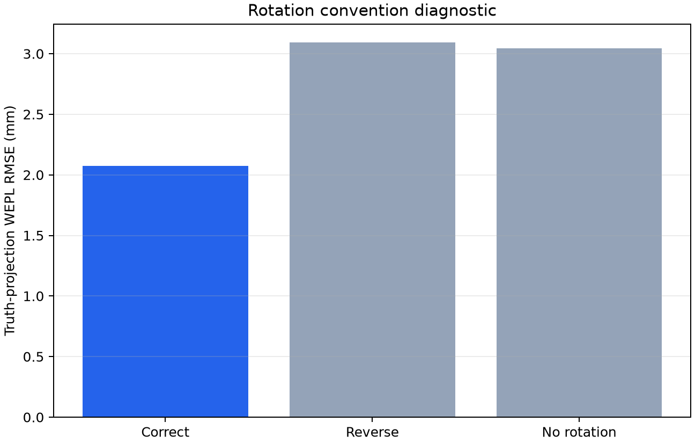

这些结果基本排除了坐标轴次序、旋转符号、圆柱求交、核心ROI零覆盖以及正反投影不配对等基础代码错误。正确旋转下实际WEPL与真值体积前投影仍有约2.07 mm残差，说明实际数据还包含MLP、WEPL、材料模型和随机输运差异，但它不能解释匹配合成数据自身的慢收敛。

**第二批20轮匹配闭环结果**

| 合成场景 | 轮数 | 匹配WEPL RMSE/mm | 大球MAPE/% | Air绝对RSP误差 | 结论 |
|---|---:|---:|---:|---:|---|
| 均匀水圆柱 | 2 | 0.0000097 | 0 | 0 | 数值闭环通过 |
| 中心Air球 | 20 | 0.14428 | 0 | 0.11133 | 持续改善，未达门槛 |
| 中心高RSP球 | 20 | 0.05490 | 2.0602 | 0 | 持续改善，未达门槛 |
| 离轴高RSP球 | 20 | 0.04888 | 1.6439 | 0 | 与中心球接近，未见明显离轴错误 |
| 完整五球 | 20 | 0.21567 | 5.7917 | 0.11122 | 持续改善，未达门槛 |

匹配闭环的严格门槛为WEPL RMSE低于0.01 mm、大球MAPE低于1%、Air绝对误差低于0.05，并要求连续两轮满足。除均匀水外，其余目标均未在20轮内通过，因此程序按设计阻止全量`confirm`。不过中心球、离轴球和完整五球的材料误差、Air残留和WEPL残差均随轮数平滑下降；中心与离轴高RSP球表现接近，也不支持“旋转或离轴坐标错误”这一解释。

实际10%数据从第3轮延长到第15轮后，训练WEPL RMSE降至1.90310 mm，大材料球MAPE降至7.933%，Air绝对误差降至0.13597；但模体RMSE在第9轮达到最低0.05004后，第15轮回升至0.05059。这说明当前问题同时包含材料平台的慢恢复以及后期噪声或模型失配，不能简单地无限增加轮数。

**松弛调度与严格合成闭环**

原调度为

\[
\lambda_k=\frac{0.25}{1+0.2(k-1)},
\]

第20轮时原调度的松弛因子已降至约0.052，材料对比恢复速度明显变慢。Stage 8C因此在完整五球合成数据上比较原策略延长至50轮、慢衰减\((0.15,0.05)\)、固定0.10和固定0.15四种调度。各候选最终结果如下：

| 候选调度 | 末轮 | 匹配WEPL RMSE/mm | 大材料球MAPE/% | Air绝对RSP误差 | 模体RMSE |
|---|---:|---:|---:|---:|---:|
| 原调度延长：0.25，衰减0.2 | 50 | 0.13991 | 1.5108 | 0.04281 | 0.01731 |
| 慢衰减：0.15，衰减0.05 | 30 | 0.15807 | 2.4300 | 0.05832 | 0.01841 |
| 固定0.10 | 30 | 0.14596 | 1.8065 | 0.04784 | 0.01768 |
| **固定0.15** | **30** | **0.09289** | **0.2940** | **0.01103** | **0.01411** |

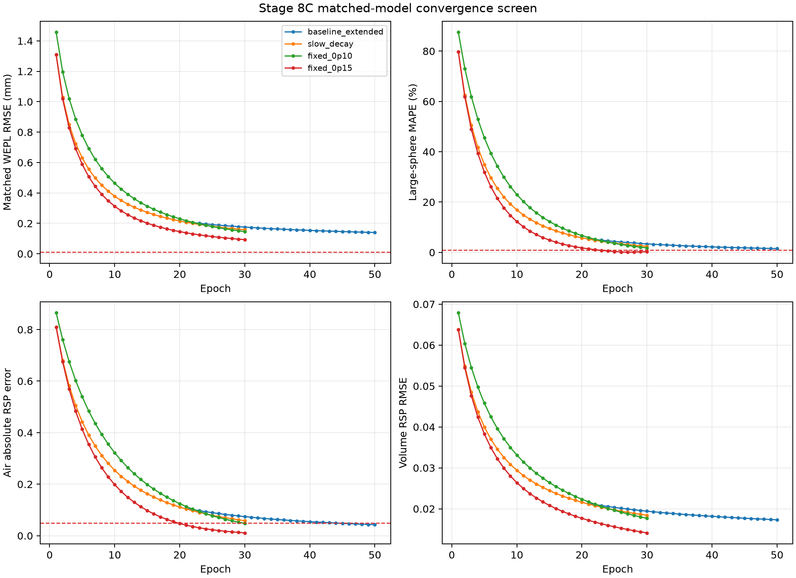

固定0.15在材料平台、Air球和模体RMSE上显著优于其他候选，说明Stage 8的主要失败原因是松弛因子过快衰减与只运行3轮造成的严重欠收敛，而不是旋转、体素索引或三线性权重符号错误。但是，四个候选都没有达到预注册的严格合成WEPL门槛0.01 mm；固定0.15的0.09289 mm仍高出该门槛约9.3倍。由此产生两个并行结论：当前配置已经能够正确恢复材料体积，但OS-SART并未达到近似机器精度的严格数值闭环，后续仍可用矩阵自由CGLS/LSQR检查系统条件数和归一化。

**80%训练集全量复算**

在合成闭环中材料性能最好的固定0.15方案被作为受控探索候选，用完整354,827,702条训练质子从均匀水圆柱初值运行30轮。验证WEPL RMSE从早期结果持续降至第30轮的1.89114 mm；材料平台的最佳轮次与体积RMSE的最佳轮次并不一致，说明三维停止准则不能只看一个指标。

| 选择依据 | 对应轮次 | 验证WEPL RMSE/mm | 大材料球MAPE/% | Air绝对RSP误差 | 模体RMSE |
|---|---:|---:|---:|---:|---:|
| 最低模体RMSE | 10 | 1.91958 | 11.9179 | 0.18790 | 0.04939 |
| 最低大材料球MAPE | 25 | 1.89264 | 0.1409 | 0.01306 | 0.05308 |
| 最低验证WEPL RMSE/最终轮 | 30 | 1.89114 | 0.5969 | 0.00325 | 0.05437 |


第10轮以后模体逐体素RMSE略有回升，但材料核心平台和Air球仍快速接近真值；第25轮材料MAPE最低，第30轮数据一致性和Air球最好。最终选择第30轮，是因为本阶段的首要目标是建立材料定量正确、Air空腔可恢复且WEPL一致的体素基线，而不是利用已知真值选择最低图像RMSE轮次。该选择也暴露了未来显式停止准则需要同时考虑验证WEPL、材料稳定性和更新幅度。

**第30轮修正性测试复核**

固定第30轮后，使用44,348,520条测试质子只评价一次。这里必须强调：同一测试分区在Stage 8历史流程中已经打开，因此本结果属于**修正性复核**，不能宣称为从未查看的全新独立盲测。尽管如此，它仍能检查修正后的配置是否在未参与当前30轮更新的质子上保持数据一致性。

| 指标 | Stage 8第3轮 | Stage 8C固定0.15第30轮 | Stage 8C预设目标 | 判定 |
|---|---:|---:|---:|---|
| 测试WEPL RMSE/mm | 2.0146 | **1.8909** | ≤2.0146 | 通过 |
| 水区RSP偏差/% | −0.1247 | **+0.0403** | 绝对值≤0.3 | 通过 |
| 水区RSP标准差/% | 1.100 | **0.6305** | ≤1.0 | 通过 |
| 三维模体RMSE | 0.05330 | 0.05437 | 监测项 | 有限；略升 |
| 10--14 mm大材料球MAPE/% | 37.03 | **0.5969** | ≤1.0 | 通过 |
| 全部非Air材料MAPE/% | 未形成可靠值 | **0.6532** | 监测项 | 良好 |
| 非Air材料最大误差/% | 96.40 | **1.6371** | ≤2.0 | 通过 |
| 6 mm铝球误差/% | −29.71 | **−0.8221** | 绝对值≤2.0 | 通过 |
| Air球绝对RSP误差 | 0.4576 | **0.00325** | ≤0.05 | 通过 |
| 平均10%--90%边缘宽度/mm | 无可靠值 | **1.2209** | 有限 | 通过 |

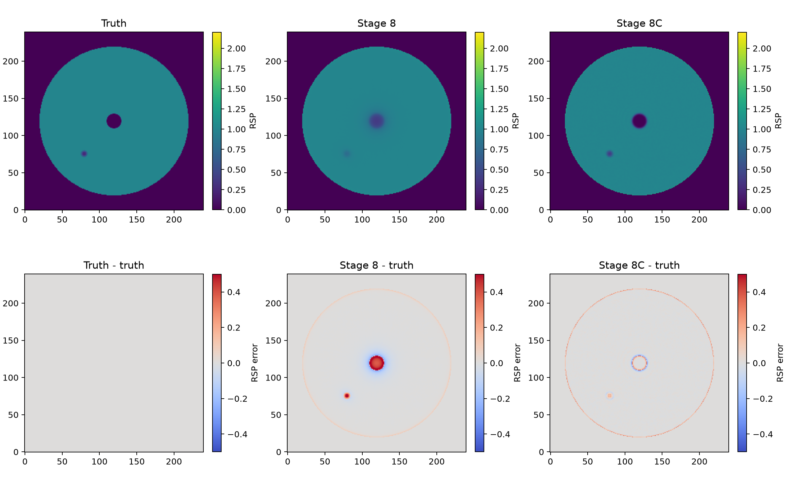


材料核心结果进一步说明恢复不是由单一平均数偶然抵消得到：SpineBone误差为−0.0136%，A150为+0.1399%，Aluminium为−0.8221%，Lung为−1.6371%；Air球重建均值为0.00440，绝对误差为0.00325。各球质心偏差均很小，其中Lung最大约0.156 mm。三方向平均边缘宽度分别为x方向1.5130 mm、y方向0.6806 mm和z方向1.4690 mm，各向异性比为2.223；这说明材料定量已经通过，但层厚方向与横断面方向的分辨率仍不均衡，是后续三维方法比较必须保留的指标。

**决策与边界**

Stage 8C的性能门槛全部通过，固定松弛因子0.15、18子集、30轮、`β=0`被冻结为当前首个**可靠三维体素性能基线候选**。Stage 8中看似严重的三维材料模型失败，主要由欠收敛和原松弛因子衰减过快造成；基础几何、旋转、覆盖、求交和伴随算子未发现能够解释该偏差的代码错误。

“性能基线通过”不等于“数值问题全部结束”。严格匹配合成WEPL RMSE仍未达到0.01 mm，测试集也不是全新盲测；因此未来论文表述应同时保留这两个限制。Stage 9已经具备进入单场景3D Gaussian可行性研究的技术前提，但本轮实践结束前没有启动。未来若恢复研究，必须使用同一compact-3D数据、相同真值、相同测试质子和本节体素结果作为对照，且不得只比较视觉效果。

---

## 第四部分　当前总结与最优配置

### 4.1 当前最优二维算法

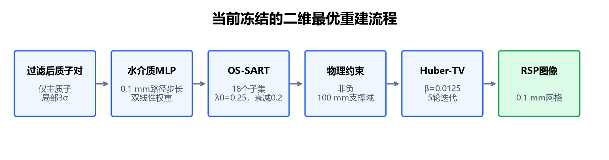

| 环节 | 当前正式选择 | 被否决或仅作辅助的方法 |
|---|---|---|
| 质子配对 | RunID/EventID唯一主质子配对 | 出口次级track不参与重建 |
| 异常过滤 | 局部能损与双散射分量3σ | median/MAD、稳健马氏未晋升 |
| WEPL | `g4_water_calibrated` | BB78仅保留为历史基线 |
| 路径 | Schulte均匀水MLP | 非均匀MLP未晋升 |
| 解析方法 | no-Hann MLP-DDB-FDK | 用作快速基线和迭代初值 |
| 迭代数据项 | 等权二次损失 | 逆方差与Huber未晋升 |
| 网格/路径步长 | 0.1 mm / 0.1 mm | 三维另用0.5 mm |
| 子集/轮数 | 18子集 / 5轮 | 36子集收益不足 |
| 松弛调度 | 初始0.25，按0.2衰减 | 其他调度未通过综合门槛 |
| 图像先验 | Huber-TV，`β=0.0125` | TGV、自适应TV和方向TV未晋升 |
| 物理约束 | 非负、100 mm圆形支撑域 | 支撑域外严格为零 |

上表是高通量三种经典场景的正式配置。Stage 8B另外冻结了一个**D1低通量专用配置**，不能与高通量配置混用：360角度、每角度20%通量、0.5 mm低通初值上采样、18子集、初始松弛因子0.25、衰减0.1、Huber-TV `β=0.05`、第2轮停止，数据项仍为等权quadratic。

### 4.2 三种经典场景的正式结果

| 场景 | 主要定量结果 | 当前解释 |
|---|---|---|
| S1铝柱 | 水均值/标准差0.999733/0.002043；铝平台2.067138；相对MLIC误差−1.307%；CNR 519.59 | 水尺度已校正；5 mm铝仍受部分容积、边缘和材料相关误差影响 |
| S4多材料 | 15 mm大柱MAPE 0.2551%；全部非Air MAPE 0.4408%；最大误差2.6693% | 大材料平台达到理想二维优秀水平；最大误差来自5 mm目标 |
| S5线对/斜边 | 水均值/标准差0.999666/0.008356；fMTF50 0.5003；fMTF10 1.1733 lp/mm | 标定和迭代没有牺牲空间分辨率；0.5 mm线对接近可见极限 |

这里的“优秀”只适用于高通量、理想出口能量和二维模体。它不能直接等同于真实患者、真实能量探测器或完整三维系统性能。

### 4.3 当前三维体素性能基线

| 环节 | Stage 8C冻结选择 | 说明 |
|---|---|---|
| 数据 | 360角度，443,653,707条过滤后质子 | 80%训练、10%验证、10%测试 |
| WEPL | `g4_water_calibrated`并扣除圆柱外Air | 内部Air球由图像恢复 |
| 路径 | x/z与y/z两个方向的Schulte水MLP | 旋转到固定物体坐标 |
| 网格 | `240×80×240 @ 0.5 mm` | 体积约120×40×120 mm³ |
| 投影算子 | 0.5 mm路径采样，三线性八邻域 | 正投影与转置反投影严格复用权重 |
| 初值 | 有限水圆柱内RSP=1，外部为0 | 尚未使用三维解析初值 |
| 迭代 | GPU OS-SART，18子集，30轮 | 固定松弛因子0.15 |
| 数据项/先验 | 等权quadratic，`β=0` | 先冻结无正则材料基线 |
| 约束 | 非负、有限圆柱支撑域 | 支撑域外严格为0 |

该配置在当前compact-3D模体上达到：测试WEPL RMSE 1.8909 mm、水区偏差+0.0403%、水区标准差0.6305%、大材料球MAPE 0.5969%、6 mm铝球误差−0.8221%、Air球绝对RSP误差0.00325。它是当前正式的三维**性能基线候选**，适用于后续算法的同场景比较；由于测试集属于修正性复核且严格合成闭环尚未达到0.01 mm，不能将其表述为已经完成独立外部验证的通用三维算法。

### 4.4 真实探测器与通量条件下的适用边界

- 四层连续硅hit本身只使模体RMSE增加2.21%，当前MLP链可稳定处理。
- 组合条件使全量RMSE增加42.73%，但Stage 7B分解实验表明主要来源是0.2 mm位置误差及路径估计偏差；独立1%能量高斯噪声没有形成可分辨影响。
- 当前逆方差和Huber候选均劣于等权基线，测试集因此未打开。
- 720角度冻结算法在三种D1条件下的推荐最低单角度有效通量都是225质子/mm²/投影，即全扫描总通量的25%。
- 360角度×每角度20%的低通量适配已完成：锁定测试水区标准差0.00950、模体RMSE 0.05920、CNR 132.6，成为当前D1约10%总通量的正式专用配置。
- 低通量适配并非所有指标同时改善：相对同通量旧参数，铝峰值误差由−0.644%扩大到−2.663%；进一步降低至每角度17.5%未通过材料安全约束。
- 能量逆方差加权未改善低通量结果，最终继续使用等权quadratic；γ=1.0因有效样本比例仅0.767而被淘汰。
- D1没有DoseActor，约7.1 mGy仅来自Phase-II扫描器通量—剂量关系的线性量级估算，不是本项目直接剂量测量。

### 4.5 与外部研究的量级比较

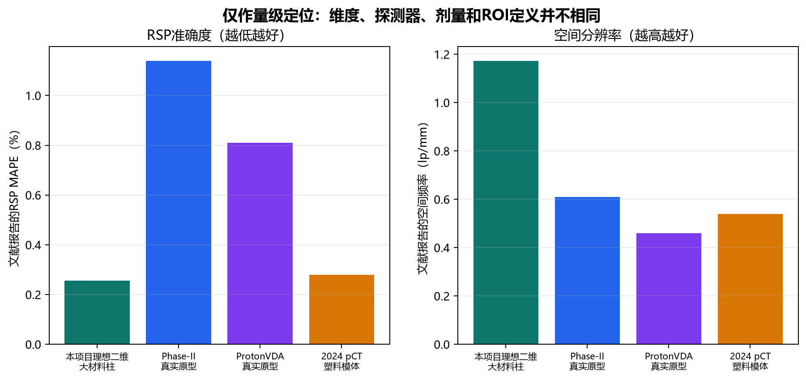

| 系统或研究 | 场景 | RSP结果 | 空间分辨率 |
|---|---|---:|---:|
| 本项目Stage 6B | 高统计理想二维S4/S5 | 大柱MAPE 0.2551%；全部非Air 0.4408% | fMTF10 1.1733 lp/mm |
| Phase-II原型 | 真实探测器材料模体 | 全材料MAPE约1.14% | fMTF10约0.61 lp/mm |
| ProtonVDA原型 | 真实探测器材料模体 | 全材料MAPE约0.81% | fMTF10约0.46 lp/mm |
| 2024 pCT对比研究 | 塑料及离体模体 | 塑料MAPE约0.28% | 约0.54 lp/mm |

不同结果的材料集合、维度、剂量、探测器和ROI定义不同，图表只用于量级定位，不能按柱高宣称直接超越。项目当前最准确的定位是：**已经形成具有独立标定、锁定测试和负结果记录的二维算法研究平台；理想二维定量达到优秀水平；Stage 8C还在单一紧凑模体上形成了通过内部性能门槛的三维体素基线，但物理能量探测器、真实剂量、全新盲测和跨模体三维泛化仍未证明。**

### 4.6 稳定复用接口

```bash
.venv-gate/bin/python \
  pct2d_reconstruction/iterative_reconstruction/run_best_reconstruction.py \
  --run-name my_dataset \
  --pairs-dir data/preprocessing_data/my_dataset/pairs_filtered \
  --initial-image data/reconstruction_data/my_dataset/analytic/recon/recon_ddb_nohann.mhd \
  --output-dir data/reconstruction_data/my_dataset/iterative_best \
  --wepl-model g4_water_calibrated \
  --wepl-calibration pct2d_reconstruction/research_stages/stage6b_wepl_calibration/qc/g4_water_calibrated.json \
  --runs 720 --angle-step-deg 0.5 --device 0
```

Air场景需要同时指定Stage 1冻结的Air WEPL斜率。新数据可以修改几何、支撑半径、网格和batch size，但如果改变过滤、WEPL、MLP、权重、TV或停止轮数，就必须作为新的算法实验重新验证，不能继续标记为当前冻结方法。

### 4.7 工程与数据状态

| 目录 | 职责 |
|---|---|
| `pct2d_reconstruction/preprocessing/` | 正式二维配对、过滤与DDB |
| `pct2d_reconstruction/analytic_reconstruction/` | no-Hann MLP-DDB-FDK |
| `pct2d_reconstruction/iterative_reconstruction/` | 正式二维GPU迭代及最优接口 |
| `pct2d_reconstruction/research_stages/` | Stage 1--8B二维研究代码、QC与总结 |
| `pct3d_reconstruction/` | Stage 8独立三维工程 |
| `data/` | 大型活动数据和检查点，不进入Git |

早期results0716、S2/S3、真实轨迹pilot等已进入冷归档，恢复方法见[第一批归档记录](archive_batch1_20260730_record.md)。WSL虚拟磁盘位于O盘；E盘移动硬盘当前断开。任何全量复算前都必须同时检查WSL内部空间、O盘宿主空间、外部ROOT挂载和预计检查点增量。

---

## 第五部分　实践结束后可继续开展的工作

本部分是结题时保留的技术路线，不表示当前仍在实施。

### 5.1 Stage 9：3D Gaussian可行性

首版3D Gaussian建议采用“每次扫描独立优化”，而不是立即训练跨患者通用网络。需要实现沿弯曲MLP对Gaussian RSP场积分的可微算子，并与同一训练/验证/测试质子上的体素OS-SART比较测试WEPL、材料MAPE、空间分辨率、速度和显存。

当前compact-3D数据足以回答“单场景表示是否可行”，但不足以证明跨模体、跨能量和跨探测器泛化。Stage 8C已经提供同数据体素性能基线；未来恢复研究时可从算子smoke test和单场景直接优化开始。只有Gaussian方法在相同测试质子上同时改善WEPL、材料MAPE或速度/显存中的至少一项，且不损害空间分辨率，才值得扩展数据规模。

### 5.2 Stage 10A--10B：算法严谨性与计算工程

| 阶段 | 方向 | 可能价值 | 当前优先级较低的原因 |
|---|---|---|---|
| Stage 10A | 显式最小二乘目标与停止准则 | 检查严格合成闭环残余、使收敛量和停止规则更严谨 | Stage 8C性能已通过，当前属于数值严谨性改进 |
| Stage 10B | 多分辨率重建 | 降低GPU时间、显存和检查点规模 | 当前优先验证新表示是否带来科学收益 |
| Stage 10B | 多GPU与算子融合 | 提高全量重建吞吐率 | 属于性能工程，不替代科学门控 |

CNN/U-Net和物理展开网络不再单列为当前正式阶段。它们可以在Stage 9之后作为学习型先验的扩展方向，但现有数据更适合做单场景可行性，尚不足以证明跨模体泛化。DDB边界延拓与解析伪影修正只影响解析基线和迭代初值，优先级低于Stage 8C的三维系统正确性。

---

## 指标与状态定义

| 指标或术语 | 本项目定义 |
|---|---|
| 水区均值与偏差 | 腐蚀后的均匀水ROI均值；相对MLIC Water报告有符号偏差 |
| 水区标准差 | 同一水ROI内RSP标准差，描述精密度而非准确度 |
| 材料MAPE | 各材料核心ROI绝对百分比误差的平均；小目标与大平台分开 |
| 模体RMSE | 支撑域内逐像素或体素相对真值的RSP均方根误差 |
| fMTF50 / fMTF10 | 斜边MTF降至50%/10%的空间频率，单位lp/mm |
| WEPL RMSE | 固定验证或测试质子上的`b−Ax`均方根；训练残差单独标记 |
| CNR | 材料与水均值差除以联合噪声尺度，必须与ROI同时说明 |
| 通过 | 预注册流程和对应验收完成，不一定表示候选方法晋升 |
| 保留基线 | 候选完成比较但没有超过正式基线 |
| 流程通过、性能未通过 | 工程和数值门控通过，但科学性能指标未通过 |

## 本地正式证据

- [Stage 0冻结基线](evaluation/baselines/results0716/baseline_summary.md)
- [Stage 1材料能量分析](research_stages/stage1_material_calibration/qc/results0717_s6_material_energy_scan/stage1_summary.md)
- [Stage 2诊断模体](research_stages/stage2_diagnostic_phantoms/qc/stage2_summary.md)
- [Stage 3稳健过滤与权重](research_stages/stage3_robust_weighting/qc/stage3_summary.md)
- [Stage 4迭代优化](research_stages/stage4_iterative_optimization/qc/stage4_summary.md)
- [Stage 5非均匀MLP](research_stages/stage5_inhomogeneous_mlp/qc/stage5_summary.md)
- [Stage 6高级先验](research_stages/stage6_advanced_priors/qc/stage6_summary.md)
- [Stage 6A虚拟MLIC](research_stages/stage6a_mlic_reference/qc/stage6a_summary.md)
- [Stage 6B独立WEPL标定](research_stages/stage6b_wepl_calibration/qc/stage6b_summary.md)
- [Stage 7探测器效应](research_stages/stage7_detector_effects/qc/stage7_summary.md)
- [Stage 7B噪声鲁棒性](research_stages/stage7b_noise_robustness/qc/stage7b_summary.md)
- [Stage 7C通量敏感性](research_stages/stage7c_fluence_sensitivity/qc/stage7c_summary.md)
- [Stage 8B等总质子数角度—通量对照](research_stages/stage8b_low_fluence_adaptation/qc/angular_fluence_360x20/comparison_summary.md)
- [Stage 8B低通量适配最终总结](research_stages/stage8b_low_fluence_adaptation/qc/stage8b_summary.md)
- [Stage 8B最终机器可读决策](research_stages/stage8b_low_fluence_adaptation/qc/stage8b_decision.json)
- [Stage 8三维首轮结果](../pct3d_reconstruction/qc/results0718_compact_3d_pilot/stage8_summary.md)
- [Stage 8C系统诊断决策](../pct3d_reconstruction/qc/results0718_compact_3d_pilot/stage8c/diagnostic_decision.json)
- [Stage 8C初始匹配闭环决策](../pct3d_reconstruction/qc/results0718_compact_3d_pilot/stage8c/closure_decision.json)
- [Stage 8C收敛调度筛选决策](../pct3d_reconstruction/qc/results0718_compact_3d_pilot/stage8c/convergence_decision.json)
- [Stage 8C固定0.15全量复算决策](../pct3d_reconstruction/qc/results0718_compact_3d_pilot/stage8c/exploratory_full_fixed015_decision.json)
- [Stage 8C修正性测试总结](../pct3d_reconstruction/qc/results0718_compact_3d_pilot/stage8c/fixed015_test_summary.md)
- [Stage 8C修正性测试机器可读决策](../pct3d_reconstruction/qc/results0718_compact_3d_pilot/stage8c/fixed015_test_decision.json)
- [重建原理](reconstruction_principles.md)
- [外部性能基准调研](pct_performance_benchmarks.md)

## 主要外部来源

1. Dedes G, et al. *Comparative accuracy and resolution assessment of two prototype proton computed tomography scanners*. Medical Physics, 2022. [DOI](https://doi.org/10.1002/mp.15657)
2. Fogazzi E, et al. *A direct comparison of multi-energy x-ray and proton CT for imaging and relative stopping power estimation of plastic and ex-vivo phantoms*. Physics in Medicine and Biology, 2024. [PubMed](https://pubmed.ncbi.nlm.nih.gov/39159669/)
3. Johnson RP. *Meeting the detector challenges for pre-clinical proton and ion CT*. Physics in Medicine and Biology, 2024. [DOI](https://doi.org/10.1088/1361-6560/ad42fc)
4. Schulte RW, et al. *A maximum likelihood proton path formalism for application in proton computed tomography*. Medical Physics, 2008.
5. Brooke M, Penfold S. *An inhomogeneous most likely path formalism for proton computed tomography*. Physica Medica, 2020. [DOI](https://doi.org/10.1016/j.ejmp.2020.01.025)
6. Rit S, et al. *Filtered backprojection proton CT reconstruction along most likely paths*. Medical Physics, 2013. [PubMed](https://pubmed.ncbi.nlm.nih.gov/23464283/)
7. Sadrozinski HF-W, et al. *Operation of the preclinical head scanner for proton CT*. Nuclear Instruments and Methods in Physics Research Section A, 2016;831:394--399. 该文报告\(10^6\)质子/cm²约对应1.1 mGy，并在典型90投影扫描中获得低于1%的CT噪声。[全文](https://pmc.ncbi.nlm.nih.gov/articles/PMC5094456/)
