# 二维质子CT数据处理与重建原理

> 本文对应实验`results0716`，面向具有X射线CT基础的科研读者。重点解释从
> OpenGATE相空间记录到RSP图像的数学链路，以及DDB-FDK和list-mode迭代重建中
> 两套不同的离散算子。图中数据来自现有正式结果；配套脚本只读已有数据，不会
> 重新运行预处理或重建。

## 1. 全流程、问题定义与符号

### 1.1 results0716数据链

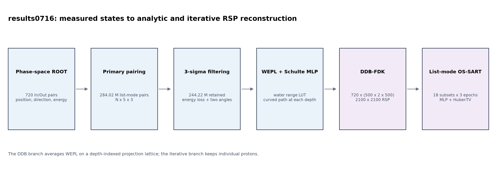

**图1　results0716全流程。** 720个角度各发射450,000个200 MeV质子；入口和出口
ROOT记录经主质子配对得到284,021,915条pairs，局部3σ过滤后保留244,217,799条，
再生成720幅`500×2×500 @ 0.5 mm`的DDB投影。解析和迭代结果均位于
`2100×2100 @ 0.1 mm`的二维网格。

一条配对后的质子记录写为

\[
q_p=\left(\mathbf p_p^{\rm in},\mathbf p_p^{\rm out},
\mathbf d_p^{\rm in},\mathbf d_p^{\rm out},
E_p^{\rm in},E_p^{\rm out}\right),
\]

其中位置和单位方向向量均为三维量。MHD文件实际布局为`5×N`个三通道向量：
前四项依次为入口位置、出口位置、入口方向、出口方向，第五项存储入口能量、
出口能量和primary标志。

待重建量为二维参考相对阻止本领（relative stopping power, RSP）图像
\(x(\mathbf r)\)。离散后记为向量\(x\in\mathbb R^J\)。第\(p\)条质子的测量量为
水等效路径长度（WEPL）\(b_p\)，路径算子为\(A\)：

\[
b_p\simeq \int_{L_p}x(\mathbf r)\,{\rm d}\ell,
\qquad \mathbf b\simeq A\mathbf x.
\]

这里\(L_p\)不是X射线的直线，而是由入口/出口状态估计的最可能路径（MLP）。
因此，pCT的关键不只是在给定投影上反演线积分，还包括由能量得到WEPL、由散射
状态估计路径，以及使正投影和反投影使用一致的路径离散。

### 1.2 本文常用符号

| 符号 | 含义 | results0716中的单位或取值 |
|---|---|---|
| \(p\) | 质子编号 | 过滤后共244,217,799条 |
| \(\mathbf p^{\rm in/out}\) | 固定入口/出口参考平面上的位置 | mm |
| \(\mathbf d^{\rm in/out}\) | 入口/出口单位方向 | 无量纲 |
| \(E^{\rm in/out}\) | 入口/出口动能 | MeV |
| \(b_p\) | 由能量差换算的WEPL | mm water |
| \(x_j\) | 第\(j\)个像素的RSP | 参考能量200 MeV |
| \(a_{pj}\) | 质子\(p\)在像素\(j\)中的离散有效长度 | mm |
| \(g_\theta(u,z_d)\) | 角度\(\theta\)的DDB平均WEPL | mm water |
| \(\Omega\) | 半径100 mm的已知圆形支撑域 | — |

## 2. 数据处理

### 2.1 测量状态外推与primary-only配对

入口和出口ROOT记录发生在探测器敏感面内的实际step位置。为了让后续算法使用统一
边界条件，程序沿记录方向把状态直线外推到\(z=-110\) mm和\(z=+110\) mm：

\[
\mathbf p(z_*)=\mathbf p+lambda\mathbf d,
\qquad \lambda=\frac{z_*-p_z}{d_z}.
\]

这一步不是假设质子在水中走直线。两个固定平面均在半径100 mm水圆柱之外，直线
外推只用于把探测器内的测量状态搬到共同参考面；圆柱内部仍由MLP描述。

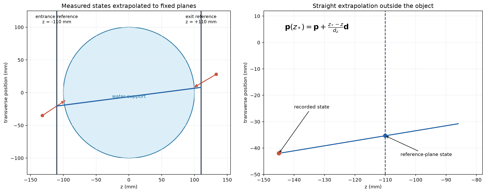

**图2　入口/出口参考平面。** 左图给出两个平面相对水圆柱的位置，右图展示从
记录step到固定平面的直线外推。

配对以`RunID/EventID`为历史标识，在同一历史中分别寻找入口和出口记录。当前正式
链路使用`pctpairprotons --stream-by-run --no-nuclear`，只保留`TrackID=1`的主质子，
避免把出口处的电子、光子或核反应次级粒子误配为入射质子的延续。工作站仿真按
角度保存为720组ROOT分片；目录编号提供全局RunID，程序无需先合并成一个巨大ROOT。

### 2.2 局部能损—散射3σ过滤

配对并不保证每条历史都适合线积分模型。核反应、极端多重散射、异常能损以及
边缘统计不足会形成长尾，因此在投影前执行局部联合过滤。

入口位置先按点源几何映射到`125×2 @ 2 mm`网格。网格原点为
\((-124,-1)\) mm，源位置为\(z_s=-1000\) mm。对于局部格点\(c\)，定义能损
\(e_p=E_p^{\rm in}-E_p^{\rm out}\)，并分别在\(x-z\)和\(y-z\)投影平面计算方向夹角
\(\theta_{x,p},\theta_{y,p}\)。格点统计为

\[
\bar e_c=\frac1{N_c}\sum_{p\in c}e_p,
\quad
\sigma_{e,c}=\sqrt{\frac1{N_c}\sum_{p\in c}e_p^2-\bar e_c^2},
\]

\[
\sigma_{\theta,c}=\sqrt{\frac1{2N_c}
\sum_{p\in c}\left(\theta_{x,p}^2+\theta_{y,p}^2\right)}.
\]

质子被保留当且仅当它位于网格内并同时满足

\[
|e_p-\bar e_c|\le3\sigma_{e,c},\qquad
\theta_{x,p}\le3\sigma_{\theta,c},\qquad
\theta_{y,p}\le3\sigma_{\theta,c}.
\]

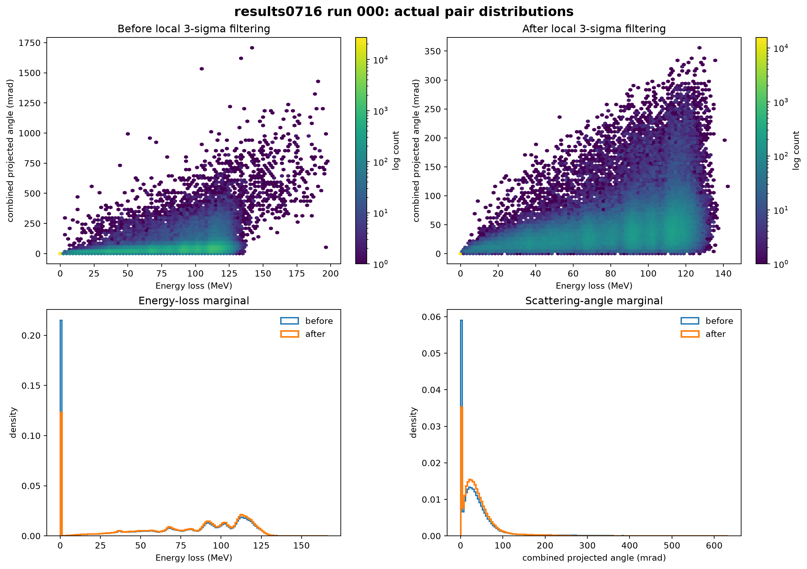

**图3　results0716真实过滤效果。** 上排是能损—合成投影散射角分布，下排给出
相应边缘分布。过滤将284,021,915条primary pairs降至244,217,799条，保留率
85.986%。该方法是局部而非全局阈值，因此不同射线路径长度具有不同能损中心。

3σ过滤的目的不是“去掉所有散射质子”——多重库仑散射正是MLP需要建模的物理
过程——而是压制与高斯多重散射和连续慢化假设明显不相容的长尾事件。

### 2.3 Bethe–Bloch、水射程与WEPL

对重粒子，当前代码使用的质量阻止本领以Bethe–Bloch关系为基础：

\[
-\frac1\rho\frac{{\rm d}E}{{\rm d}s}
=K\frac{Z}{A}\frac{z_p^2}{\beta^2}
\left[
\frac12\ln\!\left(\frac{2m_ec^2\beta^2\gamma^2T_{\max}}{I^2}\right)
-\beta^2-\frac{\delta}{2}
\right].
\]

其中\(I\)是介质平均激发（电离）势。对水取\(I=78\) eV，将阻止本领倒数积分
得到水中连续慢化射程查找表：

\[
R_w(E)=\int_0^E\frac{{\rm d}E'}{S_w(E')},
\qquad
b_p=\operatorname{WEPL}_p=R_w(E_p^{\rm in})-R_w(E_p^{\rm out}).
\]

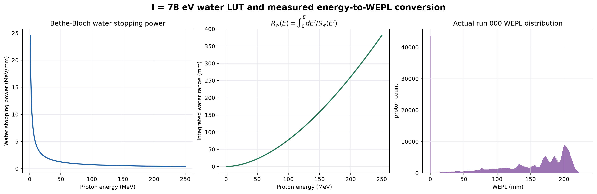

**图4　水射程LUT和实际WEPL分布。** 左图是\(I=78\) eV模型下的能量—射程关系，
右图来自results0716过滤后质子样本。

\(I=78\) eV直接影响\(S_w(E)\)、射程差和最终WEPL标尺。如果实际水模型或参考数据库
采用不同\(I\)，所有投影会出现轻微系统缩放。它与“200 MeV参考RSP真值”不是同一个
定义：前者用于把每条质子的入口/出口能量换算为沿降能过程积累的WEPL；后者则在
固定200 MeV处计算各材料相对水的阻止本领

\[
\operatorname{RSP}_{200}(m)=\frac{S_m(200\ {\rm MeV})}{S_w(200\ {\rm MeV})}.
\]

因此，重建量更严格地说是沿质子降能轨迹的有效RSP，而评价真值是固定能量的参考
RSP。二者接近但不严格相同，尤其会在铝等非水材料中形成小的物理模型偏差。

### 2.4 Schulte最可能路径

#### 2.4.1 状态传播与散射协方差

在每个横向方向分别定义位置—角度状态

\[
\mathbf y(u)=\begin{bmatrix}t(u)\\ \theta(u)\end{bmatrix},
\qquad
R(\Delta u)=\begin{bmatrix}1&\Delta u\\0&1\end{bmatrix}.
\]

无散射时有\(\mathbf y(u+\Delta u)=R(\Delta u)\mathbf y(u)\)。多重库仑散射把
传播误差写为零均值高斯量，其协方差为

\[
\Sigma(u_0,u_1)=
\begin{bmatrix}
\sigma_t^2&\sigma_{t\theta}\\
\sigma_{t\theta}&\sigma_\theta^2
\end{bmatrix},
\]

\[
\sigma_\theta^2=\int_{u_0}^{u_1}T(u)\,{\rm d}u,
\quad
\sigma_{t\theta}=\int_{u_0}^{u_1}(u_1-u)T(u)\,{\rm d}u,
\quad
\sigma_t^2=\int_{u_0}^{u_1}(u_1-u)^2T(u)\,{\rm d}u.
\]

\(T(u)\)是散射功率。当前实现与PCT C++代码一致，用水中的RIT多项式近似其能量
依赖部分：

\[
q(u)=\sum_{n=0}^{5}a_nu^n,
\]

| \(n\) | 发布系数（以cm为长度单位） |
|---:|---:|
| 0 | \(7.444724\times10^{-6}\) |
| 1 | \(5.463937\times10^{-7}\) |
| 2 | \(-9.986645\times10^{-8}\) |
| 3 | \(2.026409\times10^{-8}\) |
| 4 | \(-1.420501\times10^{-9}\) |
| 5 | \(3.899100\times10^{-11}\) |

代码内部把系数转换到mm，并乘以Highland修正形式

\[
C(u_0,u_1)=\frac{13.6^2}{X_0}
\left[1+0.038\ln\!\left(\frac{u_1-u_0}{X_0}\right)\right]^2,
\qquad X_0=361\ \mathrm{mm}.
\]

多项式使上述三个积分能够解析计算，从而避免逐路径数值积分散射功率。

#### 2.4.2 入口和出口条件的联合估计

设目标深度为\(u\)，入口到目标、目标到出口的协方差分别为\(\Sigma_1,\Sigma_2\)，
相应传播矩阵为\(R_0=R(u-u_0)\)、\(R_1=R(u_2-u)\)。入口和出口测量的联合
高斯负对数似然为

\[
\mathcal L(\mathbf y)=
\frac12(\mathbf y-R_0\mathbf y_0)^T\Sigma_1^{-1}
(\mathbf y-R_0\mathbf y_0)
+\frac12(\mathbf y_2-R_1\mathbf y)^T\Sigma_2^{-1}
(\mathbf y_2-R_1\mathbf y).
\]

令梯度为零可得等价的闭式解

\[
\mathbf y_{\rm MLP}=
\left(\Sigma_1^{-1}+R_1^T\Sigma_2^{-1}R_1\right)^{-1}
\left(\Sigma_1^{-1}R_0\mathbf y_0+R_1^T\Sigma_2^{-1}\mathbf y_2\right).
\]

实际代码采用只含2×2矩阵乘法和显式逆矩阵的代数等价形式，以同时向量化大量
质子。入口/出口斜率由\(\arctan(d_t/d_z)\)给出，\(x-z\)与\(y-z\)两个平面独立
求解。

程序先将入口和出口射线与半径100 mm的水圆柱求交。圆柱外从参考面到交点采用
测得方向的直线；只在物体内部评价上述均匀水MLP。这意味着当前路径统计知道圆柱
边界，却不知道内部25根铝柱的位置，也不会随当前重建图像更新。

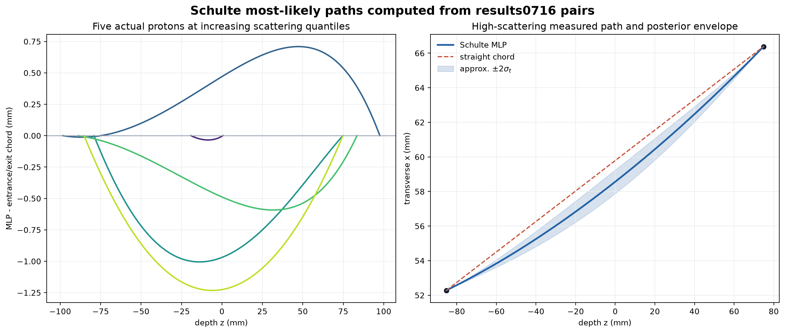

**图5　results0716真实质子的Schulte MLP。** 左图按散射程度展示五条MLP相对入口—
出口弦线的偏移；右图展示高散射质子的MLP、直线弦及由后验位置协方差近似得到的
\(\pm2\sigma_t\)包络。包络描述模型不确定度，不是真实轨迹真值。

### 2.5 距离驱动分箱（DDB）投影

#### 2.5.1 深度索引和扇束放大

每个角度建立`500×2×500`网格，间距为`0.5×1×0.5 mm`。第一维是横向投影坐标，
第二维只是两行的薄二维几何，第三维是MLP深度\(z_d\)，**不是第三个探测器维度**。

对每个深度层\(z_k\)，程序计算MLP位置\((x_p(z_k),y_p(z_k))\)，再按点源几何映射
到公共投影坐标。若源在\(z_s\)、出口平面在\(z_{\rm out}\)，放大率为

\[
m_k=\frac{z_{\rm out}-z_s}{z_k-z_s},
\qquad
u_{p,k}=m_kx_p(z_k),\quad v_{p,k}=m_ky_p(z_k).
\]

然后以ITK的最近整数规则计算格点

\[
i_{p,k}=\operatorname{round}\!\left(\frac{u_{p,k}-u_0}{\Delta u}\right),
\quad
j_{p,k}=\operatorname{round}\!\left(\frac{v_{p,k}-v_0}{\Delta v}\right).
\]

#### 2.5.2 当前实现的最近格点累加

当前C++ DDB实现不是双线性splat。每条质子在每个深度层只进入最近的一个格点，并
把该质子的**完整WEPL** \(b_p\)累加到该格点：

\[
n_{ijk}=\sum_p\mathbf1[q(p,k)=(i,j,k)],
\]

\[
g_{ijk}=\frac1{n_{ijk}}
\sum_p\mathbf1[q(p,k)=(i,j,k)]b_p.
\]

若计算方差，代码输出的是格点内WEPL样本均值的估计方差

\[
v_{ijk}=\frac{1}{n_{ijk}(n_{ijk}-1)}
\left[\sum b_p^2-\frac{(\sum b_p)^2}{n_{ijk}}\right],
\qquad n_{ijk}\ge2.
\]

注意，这里不是把WEPL沿路径按小段分配，而是让每个深度层保存“经过该深度位置的
质子，其整条路径WEPL的局部平均”。这种深度条件化的投影正是后续DDB-FDK能在
反投影时查询MLP深度坐标的原因。

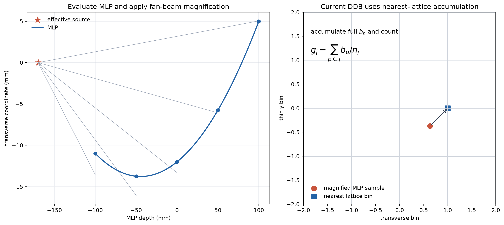

**图6　DDB逐深度分箱。** MLP在各深度层经过扇束放大后落到最近格点，完整WEPL和
count在该点累加。右侧强调该操作不同于迭代算子中的四邻域双线性权重。

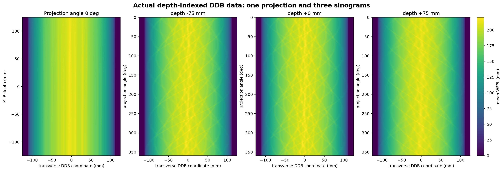

**图7　实际DDB数据。** 左图是0°投影的横向—MLP深度图；右侧是在\(-75,0,+75\) mm
三个深度固定后，按角度堆叠形成的sinogram。完整DDB可以理解为“一组由MLP深度
索引的sinogram”，而不能等同于普通二维X射线CT的一张sinogram。

results0716的720幅DDB全部为有限值，物体内零count格点数为0。正式预处理耗时为：
配对1573.47 s、过滤18.84 s、4进程DDB投影928.55 s。

## 3. 解析重建：DDB怎样变成一张二维RSP图像

本节先不从FDK公式出发，而是跟踪数组从磁盘到输出的每一次变化。最重要的结论是：

> 程序不是对500张普通sinogram分别执行500次FBP，也不是最后把500张重建图平均。
> 这500个深度层共同组成一个带有MLP深度坐标的投影场。反投影每处理一个输出像素，
> 都会根据该像素和当前角度选择其中一个连续深度位置。

### 3.1 先明确四个轴

单个角度的DDB文件为

\[
G_l[i,j,k]\in\mathbb R^{500\times2\times500},
\]

四个索引的含义为：

| 符号/轴 | results0716大小 | 物理含义 | 是否会被Ramp滤波 |
|---|---:|---|---|
| \(i\)或\(u\) | 500 | 横向探测器/DDB坐标，间距0.5 mm | **是** |
| \(j\)或\(v\) | 2 | 很薄的轴向方向，间距1 mm | 否 |
| \(k\)或\(d\) | 500 | MLP在物体内的深度坐标，间距0.5 mm | 否 |
| \(l\)或\(\theta\) | 720 | 投影角度，0至359.5°，间隔0.5° | 否 |

把720个文件堆叠起来，逻辑上的完整输入是四维数组

\[
G[i,j,k,l]\in\mathbb R^{500\times2\times500\times720}.
\]

它共有3.6亿个`float32`，约1.34 GiB。程序使用`--lowmem`，所以不需要把整个四维
数组同时读入内存，而是每次抽取

\[
G_l=G[:,:,:,l]\in\mathbb R^{500\times2\times500}
\]

处理一个角度。

#### 为什么也可以把它称为“500张sinogram”

固定深度索引\(k\)和薄层索引\(j\)，再把720个角度排在一起，可得到

\[
S_{j,k}[l,i]=G[i,j,k,l]
\in\mathbb R^{720\times500}.
\]

这是一张以角度\(\theta\)为纵轴、横向位置\(u\)为横轴的sinogram。因此，忽略只有
2格的薄层轴\(v\)后，可以直观地说输入包含**500张由MLP深度索引的sinogram**。
严格地说则是`500个深度 × 2个v层`。这只是对同一四维数据换一种查看顺序：

```text
磁盘/计算顺序（按角度看）
720 个角度 × [500 u × 2 v × 500 d]

等价的可视化顺序（按深度看）
500 个深度 × 2 个 v 层 × [720 angle × 500 u]
```

两种写法包含完全相同的数据，没有发生求和、平均或重建。

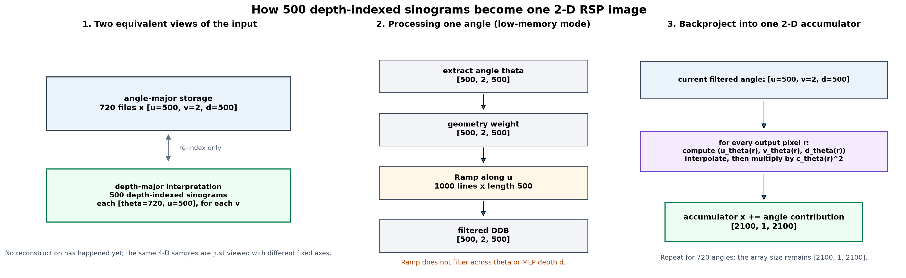

**图8a　解析重建中的维度变化。** 左：按角度存储和按深度观察是同一四维数组的
两种排列。中：低内存模式每次对一个`500×2×500`角度块加权并沿\(u\)轴滤波。
右：当前角度的结果直接累加到唯一的`2100×1×2100`输出图像。

### 3.2 完整流水线：哪些步骤改变数据，哪些不改变维度

| 步骤 | 输入维度 | 操作 | 输出维度 |
|---|---:|---|---:|
| 0. 读取 | 720个`500×2×500`文件 | 建立四维投影栈视图 | `500×2×500×720` |
| 1. 角度覆盖权重 | `500×2×500×720` | Parker/完整圆轨迹角度处理 | 不变 |
| 2. 抽取当前角度 | `500×2×500×720` | 取第\(l\)个角度，低内存循环 | `500×2×500` |
| 3. 几何预加权 | `500×2×500` | 每个元素乘发散束与角度权重 | `500×2×500` |
| 4. Ramp滤波 | `500×2×500` | 固定\((v,d)\)，沿500个\(u\)样本滤波 | `500×2×500` |
| 5. DDB反投影 | 当前角度`500×2×500` + 图像累加器 | 对每个输出像素查\((u,v,d)\)并插值 | 累加器`2100×1×2100` |
| 6. 角度循环 | 720次步骤2–5 | 角度贡献不断相加 | 始终`2100×1×2100` |
| 7. 写盘 | `2100×1×2100` | 写MHD/RAW | 一张二维RSP图 |

注意，步骤4以前，所有操作都仍发生在投影域；只有步骤5第一次把信息放回图像空间。
在实际运行的约170.64 s FDK核心时间中，预加权约16.21 s、Ramp约6.86 s、反投影
约147.55 s。反投影最慢，原因正是它要对720个角度反复遍历约441万个输出像素。

### 3.3 第一步：角度处理与几何预加权

RTK几何包含720个角度\(0,0.5,\ldots,359.5^\circ\)，源到等中心距离
\(D=1000\) mm，源到出口平面的等效距离\(D_{sd}=1110\) mm。完整圆轨迹先经过
与短扫描兼容的角度覆盖处理；这一步只改变数值权重，不合并角度，也不改变数组维度。

随后对当前角度\(l\)的每个DDB格点乘几何权重：

\[
G_l^{(w)}(u,v,d)=w_l(u,v)G_l(u,v,d),
\]

\[
w_l(u,v)=\Delta\theta_l\frac{D_{sd}}{2D}
\frac{D_{sd}-(\tau_l/D)u}{\sqrt{D_{sd}^2+u^2+v^2}}.
\]

其中\(\Delta\theta_l\)是该角度代表的角度宽度，\(\tau_l\)是横向源偏移；本实验
居中几何中\(\tau_l=0\)。权重的作用可以拆成三部分：

1. \(\Delta\theta_l\)：保证最后的角度求和近似连续角积分；
2. \(D_{sd}/(2D)\)：发散束放大率和Ramp公式中的归一化；
3. 最后的距离比值：校正离中心射线越远时的发散束几何。

该权重对相同\((u,v)\)的500个深度层重复使用。因此输入和输出仍然都是
`500×2×500`，只是每个浮点数被重新缩放。

### 3.4 第二步：只沿横向\(u\)做Ramp滤波

对当前角度，固定一个薄层\(j\)和一个MLP深度\(k\)，取出长度为500的一维数组：

\[
q_{l,j,k}[i]=G_l^{(w)}[i,j,k],\qquad i=0,\ldots,499.
\]

当前角度共有`2×500=1000`条这样的横向序列。程序分别对每一条做一维FFT、乘
Ramp频率响应、再逆FFT：

\[
\widetilde q_{l,j,k}
=\mathcal F^{-1}\!\left\{|\omega|\,
\mathcal F\{q_{l,j,k}\}(\omega)\right\}.
\]

因此：

- Ramp在\(u\)方向增强边缘和高频；
- 它**不沿角度\(\theta\)滤波**；
- 它**不在500个MLP深度层之间滤波**；
- 1000条长度500的序列处理完后，数组维度仍为`500×2×500`。

Ramp的频率响应为

\[
H(\omega)=|\omega|.
\]

`Hann=0`即no-Hann，表示不再用Hann窗削弱高频。它通常保留更锐利的边缘，同时也
更容易保留统计噪声、截断误差和水—外部强阶跃产生的振铃。

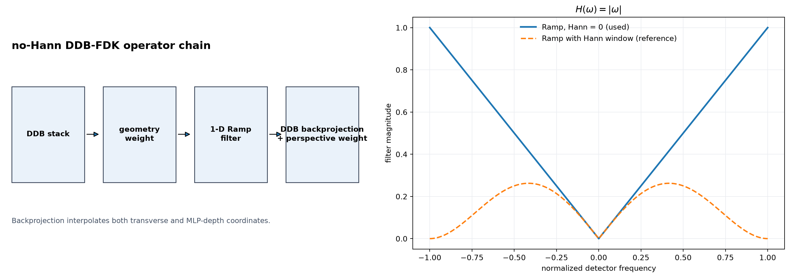

**图8　DDB-FDK投影域处理。** 几何加权和Ramp均不改变`500×2×500`维度；右图
比较正式采用的no-Hann Ramp和带Hann窗时的频率响应。

### 3.5 第三步：一个输出像素怎样从500个深度层中取值

现在建立一个全零图像累加器：

\[
x^{(0)}[a,0,b]\in\mathbb R^{2100\times1\times2100},
\]

其\(x,z\)方向间距均为0.1 mm。对当前角度\(\theta_l\)，反投影器遍历这441万个
像素。设当前输出像素的物理位置为\(\mathbf r=(x,0,z)\)，几何矩阵计算三个连续
DDB索引：

\[
\bigl(u_l(\mathbf r),\ v_l(\mathbf r),\ d_l(\mathbf r)\bigr).
\]

- \(u_l\)：从当前源看，这个像素横向投影到DDB的什么位置；
- \(v_l\)：它落在两个薄层样本之间的什么位置；
- \(d_l\)：它相对源处在MLP的哪个深度层。

#### 3.5.1 results0716居中几何下的直观公式

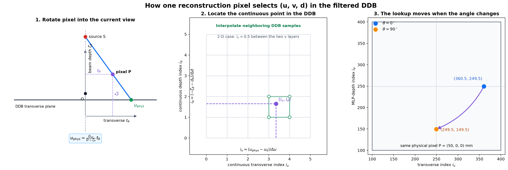

**图8b　一个输出像素如何选择DDB中的\((u,v,d)\)。** 左：先把像素表示在当前
投影视角中，横向分量经扇束放大后得到\(u\)，束流方向分量得到深度\(d\)。中：
把物理坐标换成连续DDB索引，并在相邻格点之间插值；当前二维层的\(v\)恒为0.5。
右：同一个物理像素在0°和90°时会查询完全不同的横向—深度位置。

可以先把图中的操作理解成四句话：

1. 随扫描角度转动坐标轴，而不是移动输出像素；
2. 看像素在当前视角下“横向偏了多少”，透视放大后得到\(u\)；
3. 看像素在当前视角下“沿束流有多深”，反射轴方向后得到\(d\)；
4. 将毫米坐标除以DDB间距得到连续索引，再对邻近格点插值。

对物理坐标为\(\mathbf r=(x,y,z)\)的像素，先旋转到当前角度的扫描器坐标：

\[
t_\theta=x\cos\theta-z\sin\theta,
\qquad
\zeta_\theta=x\sin\theta+z\cos\theta.
\]

其中：

- \(t_\theta\)是垂直于中心射线的横向坐标；
- \(\zeta_\theta\)是沿源—等中心方向的深度坐标；
- 当前RTK约定中源位于\(\zeta_\theta=D=1000\) mm处，所以源到像素的轴向距离为
  \(D-\zeta_\theta\)。

扇束放大率为

\[
m_\theta(\mathbf r)=\frac{D_{sd}}{D-\zeta_\theta}
=\frac{1110}{1000-\zeta_\theta}.
\]

于是DDB中的三个**物理坐标**为

\[
u_{\mathrm{phys}}=m_\theta t_\theta,
\qquad
v_{\mathrm{phys}}=m_\theta y,
\qquad
d_{\mathrm{phys}}=-\zeta_\theta.
\]

前两个式子就是普通锥束/扇束透视投影。第三个式子的负号来自已经验证的DDB深度轴
反射：DDB分箱把源放在负侧，而RTK反投影矩阵采用相反的源侧约定。

`proj0000.mhd`的原点和间距为

\[
(u_0,v_0,d_0)=(-124.75,-0.5,-124.75)\ \mathrm{mm},
\]

\[
(\Delta u,\Delta v,\Delta d)=(0.5,1,0.5)\ \mathrm{mm}.
\]

因此传给插值器的三个**连续数组索引**是

\[
i_u=\frac{u_{\mathrm{phys}}-u_0}{\Delta u},
\qquad
i_v=\frac{v_{\mathrm{phys}}-v_0}{\Delta v},
\qquad
i_d=\frac{d_{\mathrm{phys}}-d_0}{\Delta d}.
\]

本实验只重建\(y=0\)这一层，所以对所有像素和所有角度都有

\[
v_{\mathrm{phys}}=0,
\qquad i_v=\frac{0-(-0.5)}{1}=0.5.
\]

也就是说，反投影器在两个\(v\)格点之间取中点值。真正随像素和角度变化的是
\(i_u\)和\(i_d\)。

#### 3.5.2 两个具体数值例子

考虑像素\((x,y,z)=(50,0,0)\) mm：

| 当前角度 | \(t_\theta\) | \(\zeta_\theta\) | \(u_{\rm phys}\) | \(d_{\rm phys}\) | 连续索引\((i_u,i_v,i_d)\) |
|---:|---:|---:|---:|---:|---:|
| 0° | 50 mm | 0 mm | \(1110/1000\times50=55.5\) mm | 0 mm | \((360.5,0.5,249.5)\) |
| 90° | 0 mm | 50 mm | 0 mm | -50 mm | \((249.5,0.5,149.5)\) |

同一个像素在0°时表现为“横向偏右、深度居中”，旋转到90°后则表现为“横向居中、
深度靠近一侧”。这就是为什么不能固定读取某一张深度sinogram：同一像素的DDB深度
索引会随角度改变。

等中心像素\((0,0,0)\)在任意角度都有

\[
(i_u,i_v,i_d)=(249.5,0.5,249.5),
\]

正好位于DDB三个轴的几何中心。

#### 3.5.3 C++实际使用的矩阵写法

代码没有逐项手写上述三角函数，而是把“输出图像索引到物理坐标”“当前角度RTK
投影矩阵”和“DDB物理坐标到连续索引”预乘成一个矩阵\(M_\theta\)。对输出像素
索引\(\mathbf n=(n_x,n_y,n_z)\)，先算齐次量

\[
\begin{bmatrix}h_u\\h_v\\q\end{bmatrix}
=M_\theta
\begin{bmatrix}n_x\\n_y\\n_z\\1\end{bmatrix}.
\]

矩阵在等中心处被归一化为\(q=1\)。随后源码执行

\[
i_u=\frac{h_u}{q},
\qquad
i_v=\frac{h_v}{q},
\qquad
c_\theta=\frac1q,
\]

\[
i_d=\frac{Dq-D-d_0}{\Delta d}.
\]

对于当前居中几何，\(q=(D-\zeta_\theta)/D\)，所以最后一式立即化为

\[
i_d=\frac{-\zeta_\theta-d_0}{\Delta d},
\]

与前面的直观推导完全一致。矩阵写法的好处是源偏移、投影偏移、图像原点、间距和
方向矩阵都能统一包含在一次矩阵乘法中。

还要注意：这里计算\(d\)时不需要重新求一条MLP。MLP已经在DDB生成阶段决定了“每个
深度层的质子WEPL应该落在哪个\(u\)位置”。反投影阶段只需确定当前像素属于哪个深度
层，然后在该层查询对应的横向滤波值。

其中深度连续索引由透视距离得到：

\[
d_l(\mathbf r)=
\frac{D/c_l(\mathbf r)-D-z_{d,0}}{\Delta z_d},
\]

\(c_l(\mathbf r)\)是归一化透视因子，\(z_{d,0}\)和\(\Delta z_d=0.5\) mm分别是
DDB深度轴的原点和间距。

例如某像素在某角度得到\(d_l=247.3\)，它不会读取“第247张sinogram重建结果”。
它是在当前角度的DDB块中，在深度层247与248之间插值；同时\(u_l\)和\(v_l\)也通常
不是整数。C++使用三维线性插值，从\((u,v,d)\)周围最多8个格点取得一个值：

\[
p_l(\mathbf r)=
\operatorname{Interp3D}\!\left(
\widetilde G_l,
u_l(\mathbf r),v_l(\mathbf r),d_l(\mathbf r)
\right).
\]

再乘透视平方权重并加到同一个像素：

\[
x^{(l+1)}(\mathbf r)=x^{(l)}(\mathbf r)
+c_l^2(\mathbf r)p_l(\mathbf r).
\]

对720个角度全部完成后：

\[
x(\mathbf r)=\sum_{l=0}^{719}
c_l^2(\mathbf r)\,
\operatorname{Interp3D}\!\left(
\widetilde G_l,u_l(\mathbf r),v_l(\mathbf r),d_l(\mathbf r)
\right).
\]

这解释了500个深度层如何变成一张图：**每个输出像素在每个角度只查询与自身深度
相匹配的DDB位置；不同像素、不同角度会查询不同深度。** 500个深度层不是输出维度，
而是反投影查表时使用的额外坐标。

### 3.6 用一段伪代码概括实际执行过程

```text
x = zeros([2100, 1, 2100])

for theta in 720 angles:
    G = read_one_DDB_angle(theta)        # [500, 2, 500]
    G = angular_and_geometry_weight(G)   # [500, 2, 500]

    for depth in 500:
        for v in 2:
            G[:, v, depth] = ramp_filter(G[:, v, depth])
                                           # 每次滤长度500的u序列

    for pixel in output_2100_x_2100:
        u, v, depth, c = geometry(pixel, theta)
        value = trilinear_interpolate(G, u, v, depth)
        x[pixel] += c*c * value

write(x)                                  # [2100, 1, 2100]
```

这是一遍直接计算，没有“当前图像正投影—计算残差—更新图像”的循环，所以称为解析
重建。它仍是FDK/FBP思想：投影先滤波，再按几何反投影；区别是普通二维FBP只需查
\(u\)，这里为了利用MLP弯曲路径还必须查\(d\)。

### 3.7 与普通二维X射线FBP的逐项对照

| 项目 | 普通二维X射线FBP | 当前DDB-FDK |
|---|---|---|
| 投影函数 | \(g_\theta(u)\) | \(G_\theta(u,v,d)\) |
| 一组数据的直观形态 | 一张`angle×u` sinogram | 500个深度索引的`angle×u` sinogram，另有2个薄层样本 |
| Ramp方向 | \(u\) | 仍然只沿\(u\) |
| 反投影查找坐标 | \(u_\theta(\mathbf r)\) | \((u_\theta,v_\theta,d_\theta)(\mathbf r)\) |
| 路径假设 | 一条源—像素直线决定探测器位置 | MLP深度条件化的DDB决定当前应查询的位置 |
| 输出 | 一张二维衰减图 | 一张二维RSP图 |
| 是否迭代 | 否 | 否 |

因此它不是把DDB“直接当X射线sinogram使用”，而是保留X射线FBP的Ramp与角度积分
框架，并把反投影器改造成能够同时访问横向坐标和MLP深度坐标的专用算子。

### 3.8 三类容易混淆的权重

必须把三个阶段的权重分开：

1. **DDB生成**：每条质子在每个深度层落入最近格点，累加完整WEPL并求局部均值；
2. **解析DDB反投影**：对滤波后的`500×2×500`场做三维线性插值，再乘透视平方权重；
3. **迭代路径算子**：沿每条MLP以0.1 mm采样，用四邻域双线性长度权重构造\(A\)。

三者的数据对象、物理含义和归一化都不同，不能互换。

### 3.9 角度方向为什么会造成外围切向弧

OpenGATE物体坐标\(\mathbf s\)到第\(\theta\)个投影视角坐标的已验证关系为

\[
\mathbf r=R(\theta)F\mathbf s=FR(-\theta)\mathbf s,
\]

其中\(F\)反射DDB深度轴。如果旋转符号错误，反投影计算的\((u_l,d_l)\)就会落在
错误位置。位于等中心附近的结构错位较小，而半径越大的结构切向错位越大，因此形成
向外逐渐加长的弧，而不是整张图简单旋转。该历史错误已经通过720角度轨迹闭环修复。

### 3.10 results0716解析结果

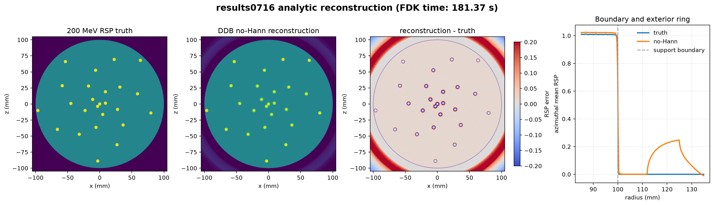

**图9　results0716真实RSP真值、no-Hann解析重建、误差和径向剖面。** 真值按仿真
材料几何在200 MeV处计算并以8×8子像素超采样生成；解析重建耗时181.37 s。

| 指标 | no-Hann DDB-FDK |
|---|---:|
| 水区RSP均值 | 1.01372 |
| 水区RSP标准差 | 0.00972 |
| 模体内RSP RMSE | 0.04508 |
| 铝柱内部平台/200 MeV真值 | 98.890% |
| 铝柱—水ROI CNR中位数 | 106.92 |
| 铝柱10%–90%边缘宽度中位数 | 1.1367 mm |

外围圆环与已经修复的角度符号错误不同。它近似径向对称，主要来自水—真空强阶跃、
有限DDB视野、Ramp滤波的长程响应、投影统计波动，以及解析算法没有显式施加
\(r\le100\) mm支撑域。重建网格仅覆盖约\(\pm105\) mm，边界外余量也较小。直接把
圆柱外设为0可以消除外部显示伪影，但不能倒推出边界内侧的Ramp响应已经被校正。

## 4. 迭代重建：GPU MLP OS-SART与Huber-TV

### 4.1 与DDB-FDK的根本差别

迭代程序不读取DDB，而直接逐批读取过滤后的list-mode pairs。每一批都由入口/出口
状态重新计算Schulte MLP和WEPL，然后把当前图像沿该弯曲路径正投影。这样避免了
DDB最近格点分箱的信息损失，也允许显式施加非负性、支撑域和正则化。

### 4.2 双线性路径算子及其转置

在圆柱内部以\(\Delta s=0.1\) mm沿MLP采样。设某采样点的连续像素坐标为
\((\xi,\zeta)=(i+\alpha,k+\beta)\)，\(0\le\alpha,\beta<1\)，其四邻域权重为

\[
w_{00}=(1-\alpha)(1-\beta),\quad
w_{10}=\alpha(1-\beta),\quad
w_{01}=(1-\alpha)\beta,\quad
w_{11}=\alpha\beta.
\]

系统矩阵元素是同一路径落在像素\(j\)上的所有采样贡献之和：

\[
a_{pj}=\sum_{\ell\in L_p}\Delta s_\ell w_{\ell j}.
\]

正投影和残差反投影分别为

\[
\hat b_p=(Ax)_p=\sum_j a_{pj}x_j,
\qquad
(A^Tr)_j=\sum_p a_{pj}r_p.
\]

反投影必须复用正投影的路径点、步长和四邻域权重，才能满足伴随内积关系

\[
\langle Ax,r\rangle=\langle x,A^Tr\rangle.
\]

这就是“严格配对转置”的含义；如果反投影采用另一套插值或归一化，更新方向不再是
当前离散数据项的正确转置方向。

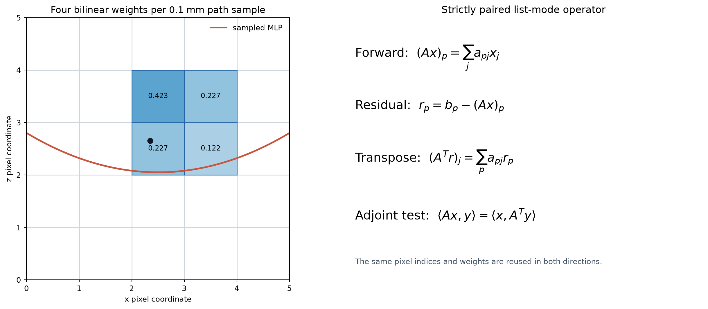

**图10　迭代路径算子。** 左图展示0.1 mm MLP采样点向四邻域分配长度权重；右图
表示正投影与转置反投影使用同一组\(a_{pj}\)。

### 4.3 OS-SART更新

244,217,799条质子按角度分到18个有序子集。对当前子集\(S\)，定义行归一化

\[
m_p=\sum_j a_{pj},\qquad p\in S,
\]

和列归一化

\[
d_j=\sum_{p\in S}a_{pj}.
\]

一次子集更新为

\[
x^{k+1}=P_{\Omega,+}\left[
x^k+\lambda_kD_S^{-1}A_S^TM_S^{-1}(b_S-A_Sx^k)
\right],
\]

其中\(M_S=\operatorname{diag}(m_p)\)、\(D_S=\operatorname{diag}(d_j)\)，
\(P_{\Omega,+}\)依次执行非负投影和半径100 mm支撑域投影。松弛因子按epoch衰减：

\[
\lambda_e=\frac{0.25}{1+0.2(e-1)},
\]

三轮分别为0.25、0.20833和0.17857。

未加权数据一致性可写成

\[
\mathcal D(x)=\frac12\|b-Ax\|_2^2.
\]

但当前方法是“有序子集SART更新 + 每轮一次近端正则化”的分裂算法，并且SART包含
行、列归一化和非恒定松弛。因此不能简单声称代码精确最小化某一个固定的
\(\mathcal D(x)+\beta R(x)\)目标函数；更准确的表述是，它交替降低预条件的数据
不一致性并施加图像先验。

### 4.4 Huber-TV近端步骤

每个epoch结束后，以SART结果\(f\)为输入，求解

\[
\min_{u\ge0,\,u\in\Omega}
\frac12\|u-f\|_2^2+\beta\sum_j\phi_\delta(|\nabla u_j|),
\]

其中\(\beta=0.0125\)、\(\delta=0.002\)，各轮执行100次Chambolle–Pock原始—对偶
迭代，原始和对偶步长均为0.25。Huber函数为

\[
\phi_\delta(t)=
\begin{cases}
\dfrac{t^2}{2\delta},&0\le t\le\delta,\\[4pt]
t-\dfrac{\delta}{2},&t>\delta.
\end{cases}
\]

小梯度区的二次惩罚有利于平滑水区噪声，大梯度区的线性增长比纯二次平滑更能保留
材料边缘。实现使用二维前向差分，但只有相邻两个像素都在\(\Omega\)内时才计算该
梯度；跨越已知水圆柱边界的差分被排除，避免正则化把圆柱边界主动拉向外部零值。

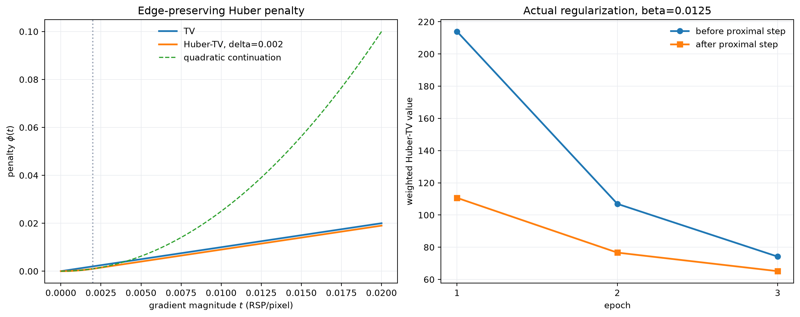

**图12　Huber-TV惩罚及三轮真实近端结果。** 每轮正则化值和图像改变量均下降；三次
近端计算合计约1.60 s，相比MLP投影成本很小。

### 4.5 results0716三轮运行结果

正式配置为全量质子、`2100×2100 @ 0.1 mm`、路径步长0.1 mm、18子集、batch
size 4096，以no-Hann FDK为初值，在RTX 4060 Laptop GPU上运行3 epoch。

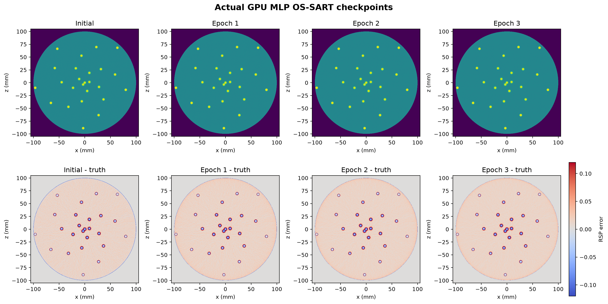

**图11　真实初值及epoch 1–3检查点。** 上排为RSP图像，下排为相对200 MeV RSP
真值的误差。已知支撑域使圆柱外严格为0。

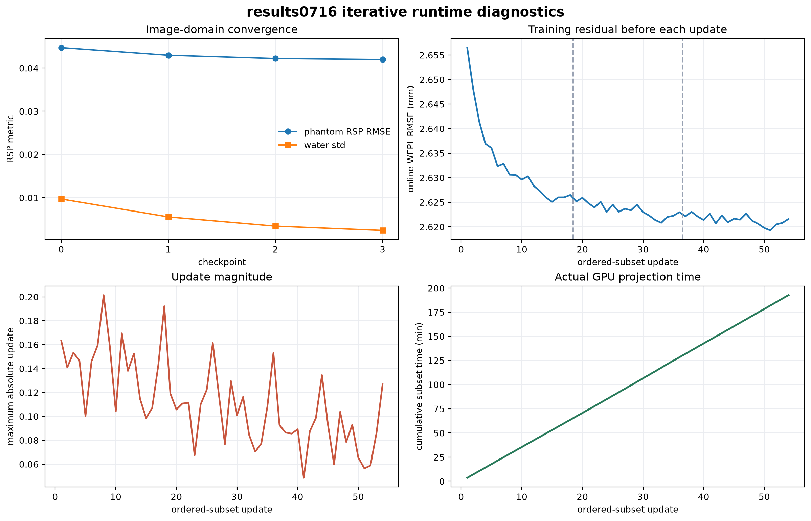

**图13　54个子集更新的实际过程。** 展示训练batch汇总WEPL残差、更新L2范数、
单子集时间以及累计运行时间。正式运行耗时11,559.33 s，即3 h 12 min 39 s；主要
成本来自对全量质子重复计算MLP、路径采样、正投影和转置反投影。

| 指标 | no-Hann初值 | epoch 1 | epoch 2 | epoch 3 |
|---|---:|---:|---:|---:|
| 水区RSP均值 | 1.01372 | 1.01459 | 1.01420 | 1.01406 |
| 水区RSP标准差 | 0.00972 | 0.00557 | 0.00344 | 0.00245 |
| 模体内RSP RMSE | 0.04471* | 0.04294 | 0.04219 | 0.04196 |
| 铝平台恢复率 | 98.890% | 98.870% | 98.787% | 98.711% |
| ROI CNR中位数 | 106.92 | 186.97 | 294.61 | 399.53 |
| 边缘宽度中位数 | 1.1367 mm | 1.1307 mm | 1.1243 mm | 1.1179 mm |

\* 迭代QC先将初值施加100 mm支撑域，因而其模体内采样边界与解析评价表的
0.04508略有不同；统一冻结评价中的正式解析值仍为0.04508。

三轮中RSP RMSE和水区噪声持续下降，CNR显著提高，边缘宽度没有被Huber-TV恶化；
铝平台则从98.890%轻微下降到98.711%，说明继续迭代与正则化并不会自动消除由能量
依赖、材料模型和部分容积共同造成的平台偏差。

### 4.6 固定10%子集WEPL残差的含义

阶段0使用`(RunID, filtered_row_index)`和固定种子20260713生成确定性90/10掩码。
验证部分含24,426,971条质子，其中21,292,138条形成有效测量。所有检查点使用同一
子集重新正投影：

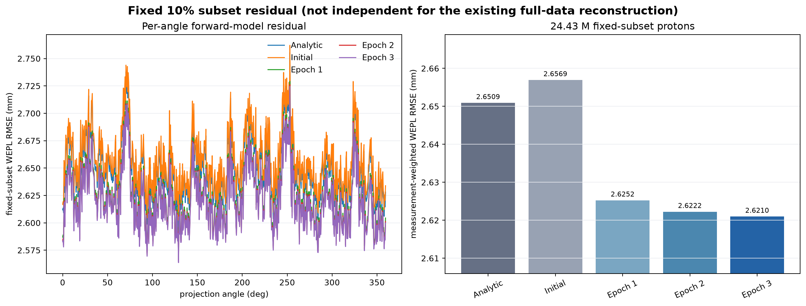

**图14　固定10%子集逐角度及汇总WEPL RMSE。** 汇总按有效measurement数量加权，
而不是简单平均720个角度的RMSE。

| 检查点 | WEPL RMSE | MAE | 平均偏差 |
|---|---:|---:|---:|
| 解析no-Hann | 2.65091 mm | 2.06626 mm | +0.32432 mm |
| 迭代初值 | 2.65694 mm | 2.07205 mm | +0.35083 mm |
| epoch 1 | 2.62525 mm | 2.04554 mm | +0.00461 mm |
| epoch 2 | 2.62223 mm | 2.04145 mm | +0.00240 mm |
| epoch 3 | 2.62098 mm | 2.03951 mm | +0.00218 mm |

这些数值衡量“给定当前MLP模型，图像正投影能否复现质子WEPL”。理想的无噪声、
精确路径、精确能量模型和无限表达能力情形下可趋近0；实际中能量涨落、路径不确定
性、核作用残余、离散化和模型失配使0并非可达到的合理目标。更重要的是，当前10%
掩码是在全量重建已经完成后才建立，而图像训练时使用过这些质子，所以这里只能称为
**固定子集残差，不是严格独立验证误差**。未来实验应在重建前冻结划分并只用
90%训练质子更新图像。

## 5. 方法对照、误差来源与适用边界

| 项目 | no-Hann DDB-FDK | GPU MLP OS-SART + Huber-TV |
|---|---|---|
| 输入 | 720幅深度索引DDB | 244,217,799条list-mode pairs |
| MLP使用方式 | 预处理时计算一次并分箱 | 每个batch、每个epoch重新计算 |
| 投影离散 | 每层最近格点累加完整WEPL | 0.1 mm路径采样与四邻域双线性长度权重 |
| 反投影 | DDB连续坐标插值、透视平方权重 | 与前投影严格配对的\(A^T\) |
| 显式约束 | 无 | 非负、100 mm支撑域 |
| 正则化 | Ramp，可选频率窗；正式结果无Hann | 每轮Huber-TV近端 |
| 主要优势 | 快，181.37 s；高分辨率直接基线 | 数据模型一致，可施加先验，噪声更低 |
| 主要成本 | DDB分箱和Ramp边界响应 | 全量MLP与路径算子，3轮约3.21 h |
| 主要误差源 | 最近格点DDB、截断、滤波振铃、无支撑约束 | MLP/能量模型失配、等权数据项、有限轮数和正则化偏差 |

当前结果应在以下边界内解释：

1. **均匀水MLP。** 散射协方差只使用已知水圆柱模型；铝柱不会局部改变MLP，也不随
   迭代图像更新。材料界面附近的真实路径统计可能与模型不同。
2. **统一水能量模型。** \(I=78\) eV用于WEPL换算，而真值是固定200 MeV RSP。沿程
   降能和材料能量依赖可能形成非零平台偏差。
3. **DDB最近格点分箱。** 0.5 mm格点上的nearest-neighbour累加带来量化和平滑误差；
   它不能与迭代算子的0.1 mm双线性权重混为一谈。
4. **等权数据项。** 当前OS-SART没有按单质子的能量不确定度、散射角或核反应概率
   加权，高置信和低置信测量具有相同地位。
5. **参考真值。** 200 MeV RSP适合统一图像评价，但不等于质子从200 MeV降能后的
   全路径有效RSP。本文不使用组成RED代替阻止本领真值。
6. **验证划分时序。** 当前固定10%子集没有参与新的独立训练实验，因而不能用于选择
   最优epoch或宣称外推性能。

## 6. 可复现资源与实现定位

只读生成本文图像：

```bash
.venv-gate/bin/python pct2d_reconstruction/report/build_principle_assets.py \
  --experiment 0716 --force
```

脚本读取已有pairs、DDB、RSP真值、解析/迭代检查点及QC，输出到
`pct2d_reconstruction/principle_assets/`。它不会改写`data/`中的任何正式产物，也
不会调用OpenGATE、DDB生成、FDK或GPU迭代。

关键实现文件：

- `preprocessing/run_preprocessing.py`：统一预处理入口；
- `preprocessing/paircuts.py`：与C++一致的局部3σ过滤；
- `include/pctProtonPairsToDistanceDrivenProjection.hxx`：DDB最近格点累加、count和
  variance的权威实现；
- `include/pctFDKDDWeightProjectionFilter.hxx`：解析重建几何与角度权重；
- `include/pctFDKDDBackProjectionImageFilter.hxx`：DDB连续坐标和透视反投影；
- `iterative_reconstruction/mlp.py`：向量化Schulte MLP；
- `iterative_reconstruction/gpu_mlp_operator.py`：GPU双线性路径算子及转置；
- `iterative_reconstruction/gpu_regularization.py`：Huber-TV近端；
- `evaluation/run_evaluation.py`：统一RSP与固定子集WEPL评价。

## 参考文献

1. Schulte RW, et al. *A maximum likelihood proton path formalism for application in proton computed tomography*. Medical Physics, 2008, 35(11): 4849–4856.
2. Rit S, et al. *Distance-driven binning for proton CT filtered backprojection along most likely paths*. Medical Physics, 2013, 40: 031103.
3. Feldkamp LA, Davis LC, Kress JW. *Practical cone-beam algorithm*. Journal of the Optical Society of America A, 1984, 1(6): 612–619.
4. Kak AC, Slaney M. *Principles of Computerized Tomographic Imaging*. IEEE Press, 1988.
5. Andersen AH, Kak AC. *Simultaneous algebraic reconstruction technique (SART): a superior implementation of the ART algorithm*. Ultrasonic Imaging, 1984, 6(1): 81–94.
6. Chambolle A, Pock T. *A first-order primal-dual algorithm for convex problems with applications to imaging*. Journal of Mathematical Imaging and Vision, 2011, 40: 120–145.
