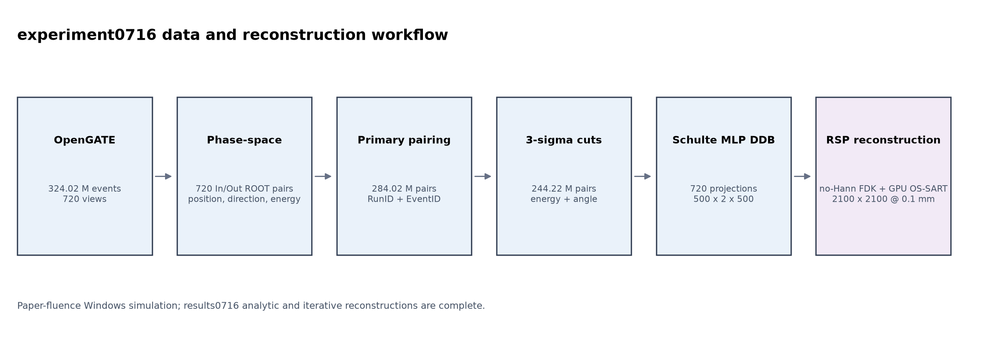
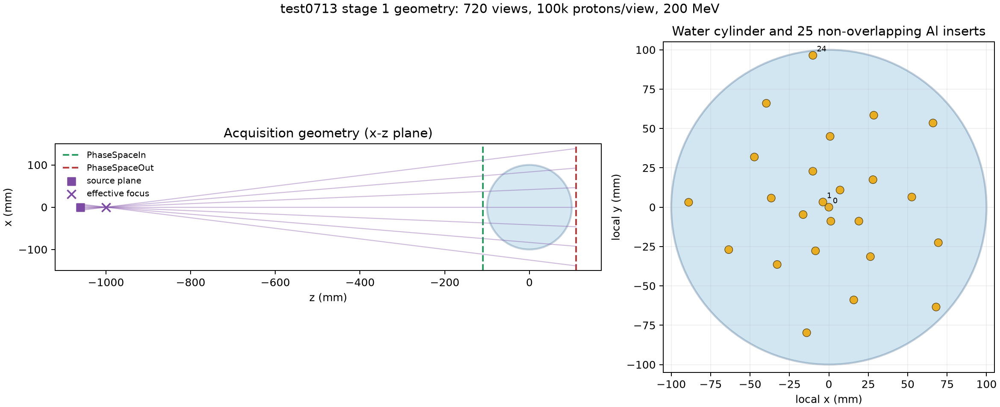
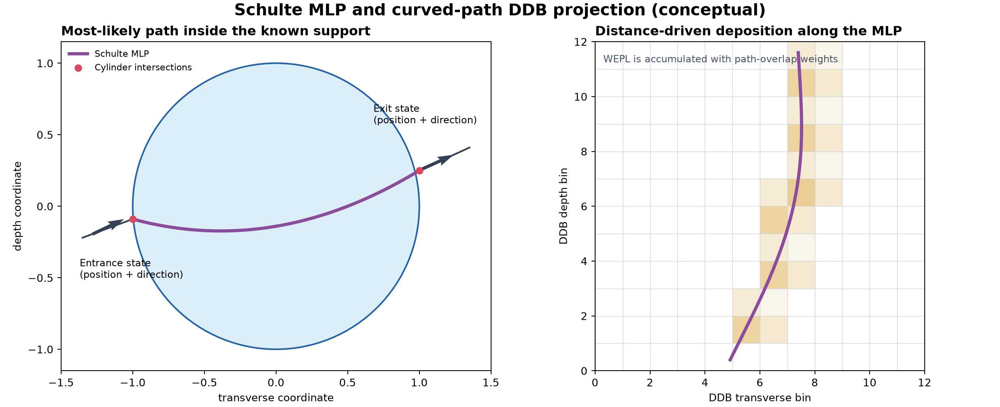
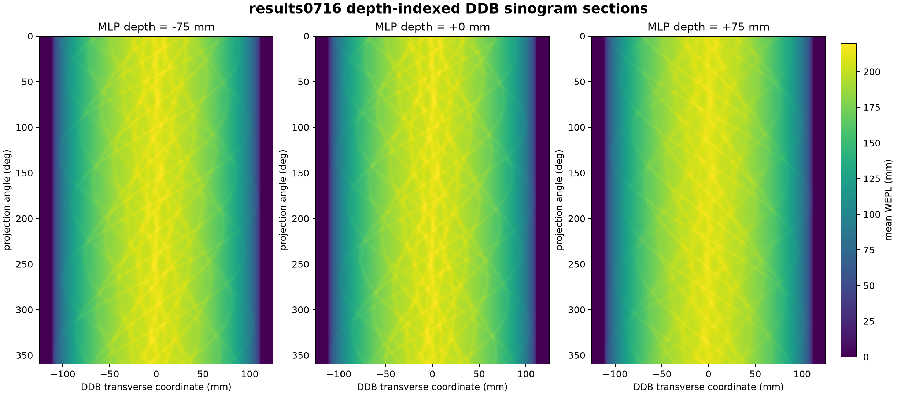
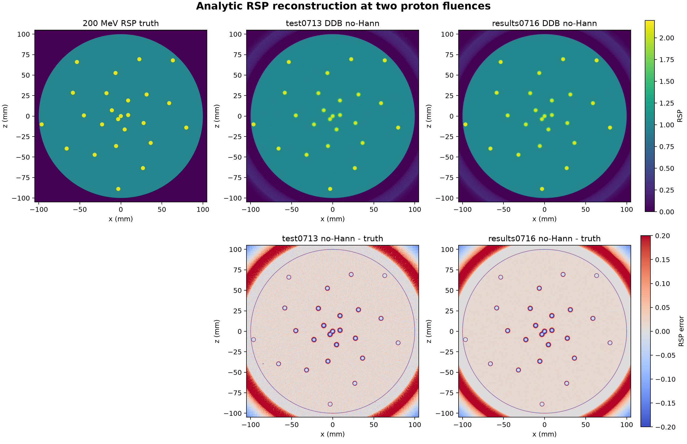
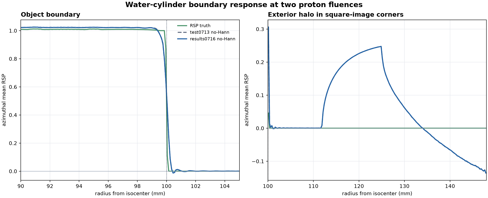
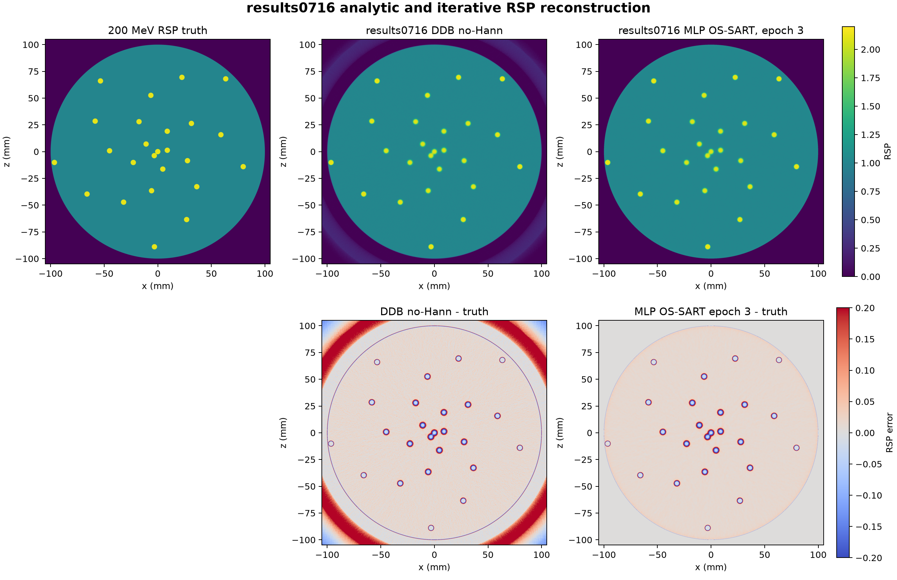
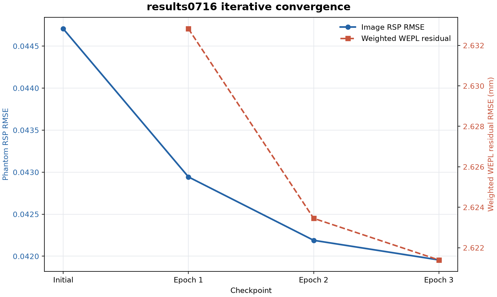

# experiment0716 质子CT仿真、数据处理与RSP重建实验报告

生成日期：2026-07-16

实验配置：`simulation0716 / results0716 / report0716`

## 摘要

本实验在`test0713`已验证流程的基础上，将质子通量提高到Rit等人Simulation 2
使用的`900 protons/mm²/projection`，并把蒙特卡洛仿真迁移到Windows工作站。
几何、材料、200 MeV能量、720个投影角度和DDB/重建网格均保持不变；每角度
计划质子数由100,000提高到450,000。720个单线程OpenGATE任务以12个独立进程
并行执行，得到`324,015,799`个event。

数据仍采用primary-only入口—出口配对、局部能量—角度3σ过滤、`I=78 eV`
水射程LUT和Schulte MLP距离驱动分箱。最终得到`284,021,915`条主质子pair、
`244,217,799`条过滤后pair和720组`500×2×500 @ 0.5 mm` DDB投影。

本文继续以**200 MeV参考RSP**作为解析图像的统一评价口径。results0716的
DDB no-Hann水区均值为`1.01372`、标准差为
`0.00972`，模体RSP RMSE为`0.04508`，铝柱内部平台为
`2.0955`，达到参考真值`2.11898`
的`98.89%`。相对低通量
test0713 no-Hann，水区标准差降低`53.0%`，模体RSP RMSE降低
`7.6%`，说明论文通量主要改善了统计噪声，同时保持材料平台和边缘
分辨率。

results0716进一步完成了全量`244,217,799`条
质子/epoch、0.1 mm网格、18子集和3轮GPU MLP OS-SART，并在每轮后施加
Huber-TV。第3轮水区标准差为`0.00245`，模体RSP RMSE为
`0.04196`，相对本次解析no-Hann分别降低`74.8%`
和`6.9%`；铝平台恢复率仍为
`98.71%`。第五部分暂时保持
原报告建议，不根据本次迭代结果重新排序。



图1概括了本次已完成的数据链。

## 第一部分：仿真模型与数据采集

### 1.1 pCT扇束采集原理

pCT不是只记录质子是否到达探测器。对每条质子历史，需要在物体前后测量位置、
方向和能量。入口、出口位置与方向约束质子在物体内因多重库仑散射形成的弯曲
路径；入口和出口动能之差则给出沿该路径积分的阻止本领信息。模体旋转一周后，
不同角度的路径积分共同约束二维RSP分布。

本实验用一个小平面源向`z=-1000 mm`处聚焦。焦点前为真空，因此越过焦点后的
束流在几何上等价于从该位置发出的扇束。模体绕全局`y`轴旋转，重建平面为
`x-z`平面；入口和出口相空间面分别位于模体前后10 mm之外。



图2左侧给出源、有效焦点、扇束边界、入口/出口相空间面和水圆柱；右侧给出
25根铝柱的螺旋状横截面布局。图中的射线只用于说明照射包络，不代表仿真中只
发射了有限条离散射线。

### 1.2 几何、源和探测器参数

| 类别 | 正式参数 |
|---|---|
| 质子源 | proton，200 MeV单能，平面源位于`z=-1060 mm` |
| 源平面尺寸 | `15×0.12×10⁻⁶ mm³`（`x×y×z`） |
| 有效焦点与SID | 焦点`z=-1000 mm`，SID=`1000 mm` |
| 照射范围 | 等中心面`250×2 mm²`，`900 protons/mm²/projection` |
| 角度与统计量 | 720角度，`0,0.5,…,359.5°`；每角度计划450,000个质子 |
| 入口相空间 | `z=-110 mm`，距焦点890 mm，`400×400 mm²` |
| 出口相空间 | `z=+110 mm`，距焦点1110 mm，`400×400 mm²` |
| 水模体 | 半径100 mm，总长度400 mm，圆柱轴沿`y`轴 |
| 铝柱 | 25根，直径5 mm；中心半径`0,5,9,…,97 mm`，角步长139° |
| 世界与物理 | Vacuum，`QGSP_BIC_EMZ`，水和铝内最大transport step为1 mm |
| 随机与执行 | MersenneTwister，基础seed=`20260713`；每任务1线程，12任务并行 |

相空间字段和理想探测面定义与test0713完全相同。源平面在`x`方向宽15 mm，
在`y`方向只有0.12 mm；后者是较小的束流厚度方向。越过距源平面60 mm的焦点后，
束流在等中心处覆盖`250×2 mm²`。`z`向`10⁻⁶ mm`只表示近似零厚度源平面。

### 1.3 软件、设备与运行时间

逐角度元数据记录的软件环境为Python 3.12.4、OpenGATE 10.1.0、
`opengate-core 10.1.0`和Windows 11（10.0.26200）。工作站为Intel Xeon
w5-2455X（12核、24线程），配备约255 GB内存。每个OpenGATE进程内部仍只使用
一个线程，但launcher同时运行12个独立角度；这与test0713单进程、单线程连续
执行720个run不同。

正式仿真的逐run元数据时间范围为2026-07-15 18:53:06至2026-07-15 20:43:43；
launcher记录墙钟时间`6639.24 s`，即`1.84423 h`。OpenGATE统计为：

- 720个独立run，`324,015,799`个event；
- `1,289,922,354`条track；
- `52,631,018,006`个step；
- 12进程墙钟平均吞吐约`48,803 protons/s`；
- 入口ROOT共20.13 GB、`324,193,565`条记录；
- 出口ROOT共19.35 GB、`293,921,776`条记录；
- primary-only配对得到`284,021,915`条存活主质子，按event计的存活率为
  `87.6568%`；
- 720组入口/出口ROOT全部完成，1440个文件迁移前后SHA-256校验一致。

计划质子数为324,000,000，实际event高出`15,799`，相对差异仅
`0.0049%`。这是GenericSource以activity和时间区间
生成事件时的泊松波动，不是角度缺失或重复运行。出口ROOT原始记录包含次级质子，
因此不能用出口总记录数直接计算主质子存活率。

### 1.4 与Rit等人Simulation 2的关系

results0716对齐了原文的720投影、200 MeV单能质子、1000 mm SID、直径200 mm
水圆柱、25根直径5 mm铝柱、`900 protons/mm²/projection`通量、DDB网格和
0.1 mm重建网格。相对于test0713，最主要的协议变化就是每角度质子数从
100,000提高到450,000，因此当前统计通量已经与论文一致。

仍有两项不能忽略的差异：原文使用GATE 6.2/Geant4 4.9.5.p01并考虑Air，
results0716使用OpenGATE 10.1.0、现代Geant4和Vacuum；此外原文的执行平台与
当前Windows多进程工作站不同。因此本实验是论文通量下的现代软件复现，而不是
历史软件环境的逐位复刻。

## 第二部分：数据处理与DDB投影

### 2.1 当前处理状态

| 阶段 | 数量 | 相对前一步 |
|---|---:|---:|
| 计划主质子 | 324,000,000 | 100% |
| 实际OpenGATE event | 324,015,799 | 100.004876% |
| 出口相空间记录 | 293,921,776 | 90.712% |
| primary-only pairs | 284,021,915 | 87.657%（相对event） |
| 3σ后pairs | 244,217,799 | 85.986% |
| 正式DDB投影 | 720组 | 全角度完成 |

目前720组ROOT、配对结果、过滤结果、DDB投影、200 MeV RSP真值、0.1 mm
no-Hann解析重建以及3轮全量GPU迭代重建均已完成，相关阶段QC均为PASS。
各阶段QC保存在代码目录，ROOT、MHD和RAW等大数据只保存在`data/`目录。

### 2.2 入口—出口质子配对

工作站仿真把每个角度保存为独立的`run_###/PhaseSpaceIn.root`和
`PhaseSpaceOut.root`，每个分片内部的本地RunID均为0。新预处理入口直接逐角度
读取720对ROOT，不先合并成两个大型ROOT。配对步骤为：

1. 读取同一角度的入口、出口记录，并仅保留主质子`TrackID=1`；
2. 以本地`(EventID,TrackID)`求交，建立同一存活质子的前后测量；
3. 把目录角度编号写成全局RunID，使后续文件编号保持`0000–0719`；
4. 使用记录方向把状态外推到固定`z=-110 mm`和`z=+110 mm`平面；
5. 写出入口/出口位置、方向以及`(E_in,E_out,TrackID)`组成的`5×3`结构。

正式接口仍调用经过test0713验证的
`pctpairprotons --stream-by-run --no-nuclear`算法，但避免了额外合并37 GB ROOT。
最终得到`284,021,915`条primary-only pair，占实际event的`87.657%`。
720组MHD/RAW均完整，所有输出TrackID均为1。

### 2.3 局部能量—角度3σ过滤

即使只保留主track，数据中仍可能包含大角度核散射、异常能损以及与主流统计
分布不一致的历史。若直接用于MLP分箱，这些离群值会形成长尾WEPL和错误路径，
并在重建中产生条纹或局部偏差。

过滤首先把入口位置按有效点源几何放大到统一参考平面：

\[
m=\frac{z_s-z_{out}}{z_s-z_{in}},\qquad
(i,j)=\operatorname{round}\!\left(\frac{m(x_{in},y_{in})-o}{\Delta}\right),
\]

其中`z_s=-1000 mm`，cut grid为`125×2`，间距`2×2 mm²`，原点为
`(-124,-1) mm`。在每个非空网格单元中，计算能损
\(\Delta E=E_{in}-E_{out}\)的均值\(\mu_E\)和标准差\(\sigma_E\)。入口、出口
方向分别投影到`x-z`和`y-z`平面，计算两个夹角\(\alpha_x,\alpha_y\)，并用

\[
\sigma_\alpha=
\sqrt{\frac{\sum \alpha_x^2+\sum \alpha_y^2}{2N}}
\]

描述该单元的散射尺度。质子只有同时满足

\[
|\Delta E-\mu_E|\le 3\sigma_E,\qquad
\alpha_x\le 3\sigma_\alpha,\qquad
\alpha_y\le 3\sigma_\alpha
\]

才被保留。该算法复现公共`pctpaircuts`的非稳健局部3σ实现；“非稳健”意味着
均值和方差本身仍会受到极端值影响，这是下一阶段可改进之处。

在`284,021,915`条输入pair中，`32,102,890`条落在cut grid之外；
网格内`251,919,025`条中又有`7,701,226`条
未通过3σ条件，最后保留`244,217,799`条。网格内3σ保留率为
`96.943%`，所有保留pair均为主质子。

### 2.4 从能量到WEPL

对水中的质子，Bethe–Bloch模型给出能量相关的阻止本领\(S_w(E)\)。先对其倒数
积分得到水中剩余射程

\[
R_w(E)=\int_0^E\frac{dE'}{S_w(E')},
\]

再由入口、出口能量得到单条质子的水等效路径长度

\[
b_p=\operatorname{WEPL}_p=R_w(E_{in,p})-R_w(E_{out,p}).
\]

正式实现使用PCT的Bethe–Bloch查找表，电离势取水的`I=78 eV`。查表把数千万
次积分转为确定性的快速索引，并已经与公共`pctbinning`抽样对齐。由于铝的
阻止本领与水不同，最终图像是水参照下的有效RSP；这也是本文选择RSP而非材料
组成量进行评价的原因。

### 2.5 Schulte最可能路径

多重库仑散射使质子路径不是入口点与出口点之间的直线。Schulte MLP把任一深度
处的横向位置和斜率写为状态\(\mathbf y=(t,\theta)^T\)。直线状态传播矩阵为

\[
R(\Delta u)=
\begin{bmatrix}1&\Delta u\\0&1\end{bmatrix}.
\]

从入口状态传播到深度\(u\)得到先验均值\(\boldsymbol\mu_0\)和散射协方差
\(\Sigma_0\)；由出口测量反向约束当前状态得到协方差\(\Sigma_2\)。忽略常数项
后，负对数后验为两个二次型之和：

\[
Q(\mathbf y)=
(\mathbf y-\boldsymbol\mu_0)^T\Sigma_0^{-1}
(\mathbf y-\boldsymbol\mu_0)
+(\mathbf y_2-R_2\mathbf y)^T\Sigma_2^{-1}
(\mathbf y_2-R_2\mathbf y).
\]

令其梯度为零可得MLP状态

\[
\mathbf y_{MLP}(u)=
\left(\Sigma_0^{-1}+R_2^T\Sigma_2^{-1}R_2\right)^{-1}
\left(\Sigma_0^{-1}\boldsymbol\mu_0+R_2^T\Sigma_2^{-1}\mathbf y_2\right).
\]

协方差由散射功率的零、一、二阶矩积分构成，因此中段路径允许更大的横向不确定
度，而入口、出口附近被实测状态强约束。正式算法先让入口、出口射线与半径
100 mm水圆柱相交，再只在两个交点之间评价MLP；物体外使用测量方向的直线延拓。



图3是原理示意而非按实际毫米比例绘制。左侧说明前后状态如何约束曲线；右侧
表示曲线路径在相邻DDB像素中的覆盖权重。

### 2.6 距离驱动DDB投影

普通CT投影把一个探测器像素对应为一条直线，而DDB保留了MLP随深度变化的位置。
对每条质子，在`500×2×500 @ 0.5×1×0.5 mm`网格的每个相关深度层计算MLP
横向位置，并根据路径足迹与相邻像素边界的重叠长度形成距离驱动权重
\(w_{pj}\)。投影像素是贡献WEPL的加权平均：

\[
g_j=\frac{\sum_p w_{pj}b_p}{\sum_p w_{pj}}.
\]

同一批权重还用于累计proton count和WEPL方差。这样生成的三维DDB投影并不是
“把弯曲路径压成一条中心直线”，而是在深度维保留了路径位移；后续DDB-FDK
反投影会在匹配的几何位置读取这些值。

720组投影全部有限。共`360,000,000`个DDB像素，零count
像素为`0`，半径100 mm物体包络内同样为0。
物体内平均count约`190.60`，约为test0713
的4.5倍；variance全部有限、非负，全DDB像素均值为
`0.09751 mm²`。当前无需hole filling。



图4把720个角度在三个固定MLP深度处的横向DDB剖面堆叠起来，横轴为DDB横向
坐标、纵轴为投影角度。这些图具有X射线CT sinogram的典型形式：离轴铝柱随角度
形成近似正弦轨迹。然而，DDB投影**不只是一张二维正弦图**。每个角度的正式
数据为`500×2×500`，额外的500层深度维记录MLP随深度的横向变化；因此完整
DDB数据更准确地说是一组“按MLP深度索引的sinogram”。普通直线CT只需一个
探测器坐标—角度平面，而这里不同深度切片并不相同，正是弯曲路径信息的体现。

### 2.7 数据处理时间与复现

本机完成工作站数据的预处理时间为：primary配对
`1573.47 s`、3σ过滤
`18.84 s`、4进程生成720组DDB
投影`928.55 s`。配对时间明显
长于test0713，既有4.5倍数据量因素，也包括逐角度启动公共配对程序的固定开销。

```bash
.venv-gate/bin/python pct2d_reconstruction/preprocessing/run_preprocessing.py \
  --experiment 0716 --stage all --jobs 4
```

默认拒绝覆盖已有结果；只有确认需要重算时才加入`--force`。

## 第三部分：解析重建

### 3.1 DDB-FDK方法

解析重建读取results0716的720组DDB投影和对应RTK圆轨迹几何。每个投影先做
几何加权，再沿探测器方向执行Ramp滤波，最后由距离驱动DDB反投影器累加到
`2100×1×2100 @ 0.1×1×0.1 mm`网格。results0716只保留成熟的
**DDB no-Hann**主链，不重复生成Hann=1敏感性结果。

几何文件生成耗时`11.31 s`，no-Hann
FDK耗时`181.37 s`。为了判断提高通量带来的
变化，本部分使用同一指标实现，把results0716 no-Hann与test0713 no-Hann
直接比较。

### 3.2 角度、深度反射与历史伪影

OpenGATE通过旋转模体产生角度\(\theta=0,0.5,\ldots,359.5^\circ\)。DDB分箱
坐标的源在负`z`侧，而RTK几何把源放在正侧，DDB反投影内部相当于对重建深度轴
施加反射。令\(F=\operatorname{diag}(1,-1)\)，正确关系为

\[
\mathbf r=R(\theta)F\mathbf s=FR(-\theta)\mathbf s.
\]

因此正式RTK几何必须使用`first_angle=0°`、`arc=+360°`。早期若把角度错误地
写成负号，只有等中心附近近似闭合；离轴点的角度误差随半径增长，铝柱会被拉成
切向弧。当前配置已用真实25个铝柱、720个角度做轨迹闭环，最大误差约
`1.0×10⁻¹³ mm`，最终图中不再存在这种随半径增长的切向结构。

### 3.3 RSP真值与解析结果

两次实验的几何、材料和重建坐标完全一致，两个`truth_rsp_200mev.raw`逐字节相同。
RSP真值不是从带噪重建反推，而是依据水圆柱、25根铝柱及材料密度，在
`2100×2100 @ 0.1 mm`网格上以每像素`8×8`子采样独立体素化。水定义为RSP=1，
铝的200 MeV参考值为

\[
\operatorname{RSP}_{Al}=
\frac{2.6989\times3.526}{1.0\times4.491}=2.118976.
\]

WEPL仍使用水的`I=78 eV` Bethe–Bloch射程LUT。该选择定义了水等效路径长度，
不会把Geant4中的铝改成水；但固定200 MeV铝真值与降能路径上的有效RSP并不
严格相同，因此约1%的铝平台差异不应直接解释为纯重建损失。



图5统一使用`0–2.2` RSP色标和`-0.20–0.20`误差色标。0716水区纹理明显减弱，
25根铝柱的位置和总体边缘形态与test0713一致。

| 指标 | 200 MeV参考真值 | test0713 DDB no-Hann | results0716 DDB no-Hann |
|---|---:|---:|---:|
| 水区均值 | 1.00000 | 1.01370 | 1.01372 |
| 水区标准差 | 0 | 0.02066 | 0.00972 |
| 模体RSP RMSE | 0 | 0.04877 | 0.04508 |
| 铝柱内部平台 | 2.11898 | 2.0956（98.89%） | 2.0955（98.89%） |
| ROI CNR中位数 | — | 49.77 | 106.92 |
| 10%–90%边缘宽度中位数 | 0 | 1.123 mm | 1.137 mm |

指标定义与test0713保持一致：水区为`r≤95 mm`且排除铝柱5 mm邻域；模体RMSE
只在真值非零支撑内计算；铝平台来自25根柱的平均径向剖面内部值；ROI CNR使用
2 mm柱ROI与4–8 mm局部水壳；边缘宽度排除中心柱，对24根柱各平均360条径向
剖面后测量10%–90%下降距离。

通量提高4.5倍后，水区标准差降低`53.0%`。若误差完全由独立泊松
噪声支配，标准差预期按`1/sqrt(4.5)`缩放到原来的47.1%；实测为
`47.0%`，与该数量级一致。RSP RMSE只降低`7.6%`，
说明RMSE还包含水区约+1.37%的共同标定偏差、铝柱边缘部分容积和模型误差，
这些成分不会随质子数按平方根消失。

铝平台恢复率由`98.89%`变为
`98.89%`，基本不变；边缘中位宽度
从`1.123 mm`变为
`1.137 mm`，差异远小于柱间分布。
因此提高通量显著改善噪声和CNR，但不会自动消除材料模型偏差或提高系统空间
分辨率。

### 3.4 外围圆环伪影



图6比较相同几何在两种质子通量下的方位平均径向响应。results0716在水区和边界
附近的随机波动更小，但`r>102 mm`外部均值仍为
`0.07046`，与test0713的`0.07046`
几乎相同。由此可见，四角圆环不是低统计噪声造成的；增加4.5倍质子只能让环
更平滑，不能消除其平均幅值。

现有证据继续支持“有限DDB网格、Ramp滤波的长程响应和FDK未施加100 mm支撑域”
的组合解释。约110–130 mm外环接近DDB横向半宽124.75 mm；它与早期错误角度
符号产生的随铝柱半径增长的切向弧不同。两次实验使用相同的正确
`first_angle=0°、arc=+360°`轨迹，因此本次高通量结果进一步排除了随机噪声和
角度映射错误作为圆环主因。

## 第四部分：0.1 mm迭代重建

### 4.1 MLP感知的list-mode前向模型

普通X射线迭代器假设射线沿直线传播，而质子在水和铝中发生多重库仑散射。
results0716因此不把DDB投影交给普通Joseph投影器，而是直接读取过滤后的
list-mode pairs。每批质子根据入口/出口位置、方向和能量重新计算Schulte MLP，
再以0.1 mm步长在半径100 mm圆柱支撑内离散路径。

对路径采样点采用双线性像素权重。前投影计算当前RSP图像沿MLP的加权路径积分，
反投影复用完全相同的像素索引和权重，保证前、反算子配对。目标数据仍是由
`I=78 eV`水射程LUT得到的单质子WEPL。

### 4.2 GPU OS-SART更新与正式配置

设当前子集的MLP系统矩阵为\(A_S\)，测量WEPL为\(b_S\)。单条路径按总长度
进行行归一化\(M_S\)，像素按该子集累计路径权重进行列归一化\(D_S\)：

\[
x^{k+1}=P_{\Omega,+}\!\left[
x^k+\lambda_kD_S^{-1}A_S^TM_S^{-1}(b_S-A_Sx^k)
\right].
\]

\(P_{\Omega,+}\)在每次子集更新后施加非负约束，并令半径100 mm支撑域外
严格为零。720个角度按角度编号模18交错分组，保证每个子集覆盖完整圆周。

| 参数 | results0716正式值 |
|---|---:|
| 输入 | 全量`244,217,799`条过滤后主质子/epoch |
| 初值 | results0716 DDB no-Hann，裁剪到100 mm支撑域 |
| 网格 | `2100×2100 @ 0.1 mm`，视野210 mm |
| MLP路径步长 | 0.1 mm |
| 子集/epoch | 18 / 3 |
| 松弛因子 | 第1轮0.25；\(\lambda_e=0.25/[1+0.2(e-1)]\) |
| batch | 4096条质子 |
| GPU | NVIDIA GeForce RTX 4060 Laptop GPU |

### 4.3 Huber-TV正则化

每个完整epoch后，以OS-SART结果\(f\)为中心求解

\[
\min_{u\in\Omega,u\ge0}
\frac12\|u-f\|_2^2+\beta\sum_j\phi_\delta(|\nabla u_j|),
\]

其中

\[
\phi_\delta(t)=
\begin{cases}
t^2/(2\delta),&t\le\delta,\\
t-\delta/2,&t>\delta.
\end{cases}
\]

正式参数为`β=0.0125`、`δ=0.002`，每轮执行100步Chambolle–Pock近端迭代，
primal/dual step均为0.25。小梯度区采用近似二次惩罚以降低水区噪声，大梯度区
接近TV以保留铝柱边缘。三次正则化合计只耗时
`1.60 s`，主要计算成本
来自每轮约2.44亿条质子的MLP生成和投影。

### 4.4 解析与迭代RSP对比



图7使用相同RSP和误差色标。第3轮保留全部25根铝柱，并把解析图像水区的随机
纹理显著压低。解析图像四角的外部圆环因100 mm支撑约束被严格置零；物体边界
内侧和铝柱边缘仍存在低幅正负误差，反映有限空间分辨率和模型误差。

| 指标 | 200 MeV参考真值 | results0716 DDB no-Hann | results0716迭代第3轮 |
|---|---:|---:|---:|
| 水区均值 | 1.00000 | 1.01372 | 1.01406 |
| 水区标准差 | 0 | 0.00972 | 0.00245 |
| 模体RSP RMSE | 0 | 0.04508 | 0.04196 |
| 铝柱内部平台 | 2.11898 | 2.0955（98.89%） | 2.0917（98.71%） |
| ROI CNR中位数 | — | 106.92 | 399.53 |
| 10%–90%边缘宽度中位数 | 0 | 1.137 mm | 1.118 mm |

相对解析no-Hann，第3轮将水区标准差降低`74.8%`，模体RSP
RMSE降低`6.9%`，ROI CNR提高`273.7%`。
铝平台恢复率仅降低
`0.18`
个百分点，边缘宽度从`1.137 mm`
变为`1.118 mm`，没有观察到Huber-TV导致的
边缘展宽。水区均值仍约高1.4%，说明迭代主要降低方差，未消除共同低频偏差。

### 4.5 逐轮收敛



| 检查点 | RSP RMSE | 水区标准差 | 铝平台恢复率 | ROI CNR | 边缘宽度 | WEPL残差 |
|---|---:|---:|---:|---:|---:|---:|
| 初值 | 0.04471 | 0.00972 | 98.89% | 106.92 | 1.137 mm | — |
| Epoch 1 | 0.04294 | 0.00557 | 98.87% | 186.97 | 1.131 mm | 2.63282 mm |
| Epoch 2 | 0.04219 | 0.00344 | 98.79% | 294.61 | 1.124 mm | 2.62345 mm |
| Epoch 3 | 0.04196 | 0.00245 | 98.71% | 399.53 | 1.118 mm | 2.62139 mm |

epoch WEPL残差按各子集有效measurement数加权：

\[
\operatorname{RMSE}_{epoch}=
\sqrt{\frac{\sum_sN_s\operatorname{RMSE}_s^2}{\sum_sN_s}}.
\]

图像RSP RMSE和训练WEPL残差均逐轮下降，但第2到第3轮的RSP RMSE改善已从
`0.00075`
缩小到
`0.00023`。
训练残差与图像真值误差含义不同；前者继续下降并不保证后者在更多epoch中仍
持续改善，因此后续若增加轮数仍应同时观察独立验证数据和RSP指标。

### 4.6 运行状态与限制

正式运行从`2026-07-16 13:12:10`至
`2026-07-16 16:24:49`，总耗时
`11559.33 s`，即约`3.21 h`；状态为
`PASS`。最终图像全部有限，100 mm支撑域外非零像素数为0。

当前结果仍有三项限制：MLP散射统计主要采用已知水圆柱模型，没有随局部材料
更新；过滤后的质子在数据项中全部等权，没有引入能量和散射不确定度；正则参数
没有使用独立验证集选择。因此第3轮是当前高通量基线，而不是算法性能上限。

## 第五部分：下一步工作

### 5.1 优先级一：边界伪影隔离仿真

下一组仿真应先回答解析外环来自哪里，而不是立即增加模体复杂度。建议保持
200 MeV、720角度、100,000质子/角度、相同SID和探测面，只保留半径100 mm
均匀水圆柱并移除全部铝柱。在同一数据上比较：

- 210、240和260 mm重建视野；
- 原始FDK、重建后100 mm支撑裁剪、投影截断校正；
- no-Hann和若干Hann截止频率；
- DDB横向网格半宽和重建外环峰值半径的对应关系。

均匀模体消除了插入物和材料响应混杂。如果扩大DDB/重建视野后外环随网格边界
移动，可确认有限投影边界是主因；若只随水边界变化，则Ramp滤波边界响应更关键；
若支撑裁剪只隐藏图外误差而不改善内部100 mm附近偏差，则还需要投影域校正。

### 5.2 优先级二：材料与空间分辨率标定模体

第二组仿真建议使用可分离“平台值”和“边缘”的标定模体：

- 在水圆柱内布置直径10–20 mm的大材料柱，提供足够宽的纯材料平台；
- 同种材料分别放在等中心、50 mm和90 mm半径，测量径向依赖；
- 保留若干直径5 mm柱，只用于空间分辨率评价；
- 选择具有已知阻止本领和平均激发能的水等效塑料、PMMA、骨替代材料和铝；
- 在计算资源允许时提高到约450,000质子/角度，对应原文约
  `900 protons/mm²/projection`的通量。

大柱内部平台可减少部分容积效应，5 mm柱继续测量边缘宽度；同材质多半径布局
能够把材料模型偏差和几何径向偏差分开。高通量运行应在均匀水控制实验完成后
再进行，避免用约4.5倍仿真成本重复一个尚未解释的系统伪影。

### 5.3 数据处理改进

1. **稳健过滤。** 用median/MAD、截尾估计或迭代重加权代替当前均值/标准差3σ，
   防止离群值反过来放宽自己的阈值。
2. **不确定度权重。** 根据入口/出口角变化、能量测量误差和MLP协方差，为每条
   质子赋予数据可信度，而不是过滤后全部等权。
3. **验证集。** 按固定随机种子留出1%–2%质子，只用于评价数据残差，建立不依赖
   仿真真值的早停依据。
4. **投影域诊断。** 保留代表性角度的count、variance和径向剖面，系统测试DDB
   边界、hole filling和截断校正，而不是只看全局汇总。

### 5.4 重建方法改进

解析方法应首先加入已知圆柱支撑域和投影截断/边界校正，再扫描滤波截止频率。
支撑裁剪能够消除物体外显示伪影，但只有投影域处理才能判断是否同时改善物体
内部边界误差。

迭代方法下一步建议采用逐轮减弱的正则化，例如强度从前期降噪逐步过渡到后期
保边；随后比较TGV或空间自适应TV，降低普通TV可能造成的平台化。数据项应加入
单质子统计权重，并用验证质子残差选择停止轮次。更长期的方向是能量相关、材料
相关的阻止本领与散射联合模型，或者根据当前重建更新MLP；不建议对铝柱进行
经验性全局乘法校准，因为它不能推广到未知材料和不同能量。

## 结论

experiment0716完成了论文通量下从Windows OpenGATE仿真到RSP解析重建的完整
数据链。12个独立单线程角度并行运行，使324,015,799个event的仿真在
`1.844 h`内完成；primary-only配对和局部3σ过滤最终保留
`244,217,799`条质子，720组Schulte MLP DDB投影均无零计数像素和非有限方差。

在与test0713完全相同的真值和重建网格上，论文通量no-Hann把水区标准差从
`0.02066`降低到`0.00972`，CNR从`49.77`
提高到`106.92`，模体RSP RMSE从
`0.04877`降低到`0.04508`。铝平台仍恢复约98.9%，边缘宽度基本
不变，表明新增统计量主要降低噪声，而不是改变材料幅值或空间分辨率。

外围同心圆环的径向均值几乎不随通量变化，进一步说明其主因是解析滤波、有限
DDB边界和缺少支撑域约束，而不是低统计噪声。高通量3轮GPU MLP OS-SART +
Huber-TV进一步将水区标准差降至`0.00245`、RSP RMSE降至
`0.04196`，同时保持`98.71%`
铝平台恢复率和`1.118 mm`边缘宽度。支撑域
约束完全消除了物体外圆环显示，但水区约+1.4%的共同均值偏差仍然存在。

## 参考文献

1. Rit S, Dedes G, Freud N, Sarrut D, Létang JM. Filtered backprojection proton CT reconstruction along most likely paths. *Medical Physics*. 2013;40(3):031103. [DOI: 10.1118/1.4789589](https://doi.org/10.1118/1.4789589)。
2. Schulte RW, Penfold SN, Tafas JT, Schubert KE. A maximum likelihood proton path formalism for application in proton computed tomography. *Medical Physics*. 2008;35(11):4849–4856. [DOI: 10.1118/1.2986139](https://doi.org/10.1118/1.2986139)。
3. Andersen AH, Kak AC. Simultaneous algebraic reconstruction technique (SART): a superior implementation of the ART algorithm. *Ultrasonic Imaging*. 1984;6(1):81–94. [DOI: 10.1016/0161-7346(84)90008-7](https://doi.org/10.1016/0161-7346(84)90008-7)。
4. Chambolle A, Pock T. A first-order primal-dual algorithm for convex problems with applications to imaging. *Journal of Mathematical Imaging and Vision*. 2011;40:120–145. [DOI: 10.1007/s10851-010-0251-1](https://doi.org/10.1007/s10851-010-0251-1)。

## 复现与审计附录

### A. 报告资源

- `assets/`：本报告8张图片，迭代相关两图由results0716检查点生成；
- `tables/analytic_rsp_metrics.csv`：test0713与results0716 no-Hann统一RSP指标；
- `tables/pipeline_counts.csv`：results0716数据链数量；
- `tables/processing_times.csv`：results0716仿真、处理及重建运行时间；
- `tables/protocol_comparison.csv`：test0713、results0716与Rit协议对照；
- `tables/iterative_epoch_rsp_metrics.csv`：results0716初值及3轮指标；
- `tables/reconstruction_rsp_comparison.csv`：results0716解析与最终迭代对比；
- `qc/report_summary.json`：资源、链接和关键数值的集成验证结果。

### B. 重新生成报告图表

```bash
.venv-gate/bin/python pct2d_reconstruction/report/build_report.py \
  --experiment 0716 --force
```

资源生成器只读取已有QC、CSV和MHD/RAW，不重新运行OpenGATE、预处理、FDK或
GPU迭代；生成结束时自动检查所有本地图片和表格链接。

### C. results0716解析重建复现

```bash
.venv-gate/bin/python \
  pct2d_reconstruction/analytic_reconstruction/run_analytic_reconstruction.py \
  --experiment 0716 --force
```

只有确认需要覆盖现有no-Hann重建和QC时才使用`--force`。

### D. results0716正式0.1 mm迭代重建复现

```bash
.venv-gate/bin/python \
  pct2d_reconstruction/iterative_reconstruction/run_iterative_reconstruction.py \
  --experiment 0716 --epochs 3 --force
```

配置文件提供全量质子、0.1 mm网格/路径步长、18子集和Huber-TV参数；只有确认
覆盖现有3轮检查点和QC时才使用`--force`。

### E. 指标定义

- 水区：`r≤95 mm`，并排除每根铝柱中心5 mm邻域；
- 模体RSP RMSE：只在200 MeV RSP真值非零的物体支撑内计算；
- 铝平台：25根铝柱径向平均边缘剖面的内部平台均值；
- ROI CNR：2 mm半径ROI相对4–8 mm局部水壳的对比除以局部水标准差，报告25柱
  中位数；
- 边缘宽度：排除中心柱，对24根非中心柱各平均360条径向剖面后计算10%–90%
  距离；
- epoch WEPL残差：按各子集有效measurement数加权汇总。
