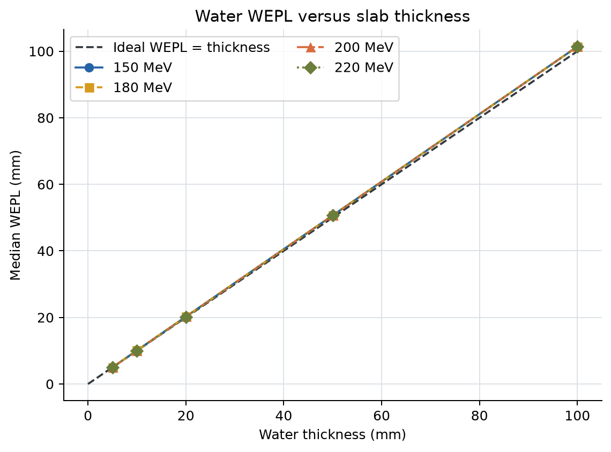
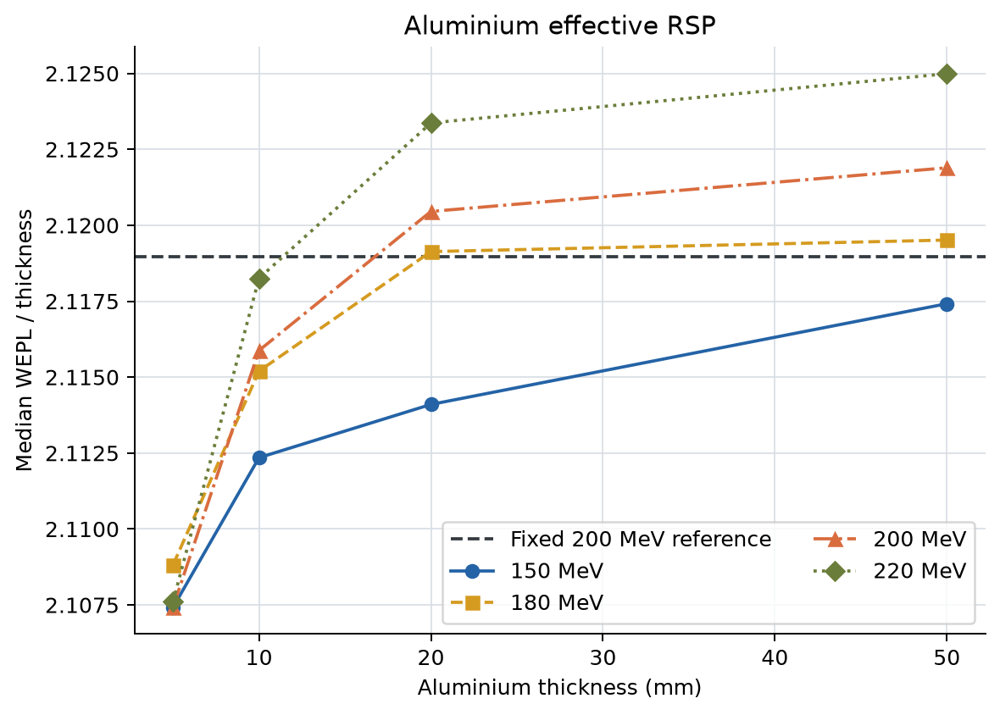
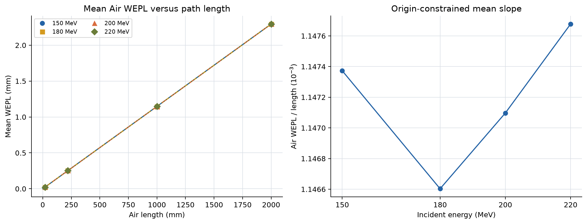
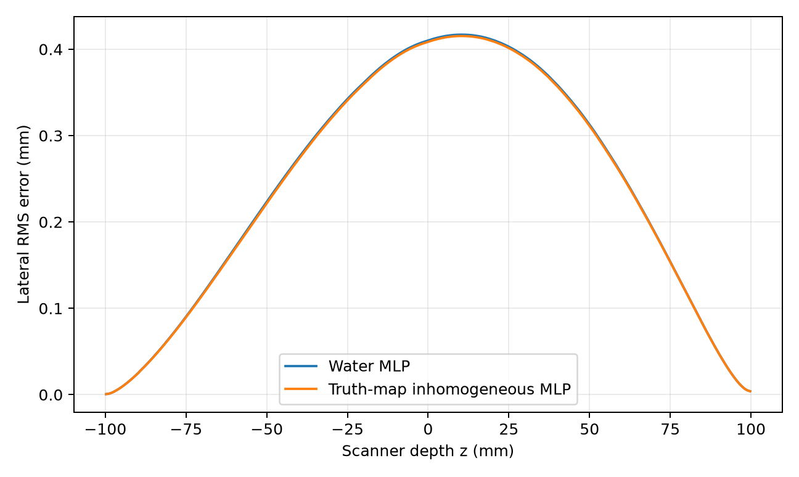

# 二维pCT研究阶段总结

**版本日期：2026-07-29**  
**报告状态：冻结的阶段性版本；阶段0--6B完成**

> 本轮企业实践已于2026-08-09结束。本报告不追溯改写Stage 7--8C结果，项目最终状态、最优二维/三维配置和候选后续路线统一见[`../../project_overview.md`](../../project_overview.md)。

## 摘要

本报告总结`results0716`基线建立之后开展的二维pCT分阶段研究。研究不再只比较
“新图像是否比旧图像好看”，而是依次处理评价口径、材料与能量标定、诊断模体、
数据过滤与权重、迭代参数、路径模型和先验约束。

截至本版报告：

- 阶段0冻结了results0716的解析和迭代基线，并建立统一评价接口；
- 阶段1证明固定200 MeV参考RSP与沿降能路径得到的有效RSP并不完全相同；
- 阶段2用S2--S5把水平台、Air、边界圆环、多材料定量和空间分辨率分开评价；
- 阶段3完成稳健过滤和数据加权的预注册比较，但没有候选达到晋升门槛，最终保留
  局部3σ过滤和等权OS-SART；
- 阶段4冻结了松弛调度、二次数据损失、Huber-TV、18子集和5 epoch，并通过
  S1--S5锁定测试，晋升为阶段5/6使用的固定MLP迭代基线。
- 阶段5用Monte Carlo逐step真实轨迹检验了真值材料图驱动非均匀MLP的理论收益，
  但全部/强异质验证路径的平均改善仅为`0.006%/0.074%`，未通过Level 1门槛，
  因而按预注册流程保留阶段4水MLP并停止后续交替MLP。
- 阶段6比较TGV、边缘自适应TV和方向TV。候选能够提高S5 MTF，但水区标准差
  增加17.6%--47.1%，材料与RSP指标没有实质改善，因此继续保留阶段4 Huber-TV。
- 阶段6A用独立虚拟MLIC冻结材料参考。它证明results0716铝小柱的旧参考误差
  很大，但S4材料MAPE仍约1.19%，水平台约+1.4%仍是外部准确性偏差。
- 阶段6B使用84个独立水板工况冻结Geant4一致射程表，使S2/S3水均值回到约
  0.9996，S4大材料柱MAPE降至0.255%，且S5空间分辨率没有退化。

目前最重要的物理结论是：高统计MLIC Water和阶段6B独立标定共同确认，旧
`+1.4%`水偏差来自简化水射程LUT，并已通过Geant4一致标定消除。最重要的
方法学结论是：简单更换稳健阈值或依据出射能量进行
逆方差加权没有改善总体性能；在当前场景中，真值材料非均匀MLP与三类高级图像
先验也没有超过阶段4。下一步应停止在同一理想数据上继续增加算法复杂度，转向
Air、硅跟踪器和读出误差的外部鲁棒性验证。

## 1. 报告范围与证据等级

本报告与[report0716](../report0716/report0716_summary_report.md)的关系如下：

| 文档 | 回答的问题 |
|---|---|
| `report0716` | 一次完整高通量二维pCT实验是如何仿真、处理和重建的 |
| 本报告 | 在基线之后，各项误差假设经过了什么对照实验，哪些被支持或否决 |

为了避免把调参结果误写成最终性能，本报告使用三种证据等级：

1. **正式冻结结果**：流程完成、选择规则已执行，并在允许的独立数据上确认；
2. **开发/验证结果**：可用于选参数，但不能宣称最终泛化性能；
3. **计划或待验证结果**：尚未计算，不能写入性能结论。

阶段0--6B属于第一类，其中阶段6只到验证门槛、锁定测试未打开；阶段6B则完成
独立锁定测试与三场景确认。阶段7--8属于第三类。

## 2. 数据集与研究路线

### 2.1 基线与S1--S6

| 数据 | 场景 | 通量 | 主要用途 |
|---|---|---:|---|
| results0716 | Vacuum水圆柱和25根5 mm铝柱 | 720×450,000 | 历史解析/迭代基线 |
| S1 | results0716模体，外部介质改为Air | 720×450,000 | 高通量Air对照和锁定确认 |
| S2 | Vacuum中的均匀水圆柱 | 720×100,000 | 水平台、边界圆环和FOV |
| S3 | Air中的均匀水圆柱 | 720×100,000 | Air能损与散射 |
| S4 | Air背景、多材料大柱和中心小铝柱 | 720×100,000 | 材料平台、径向趋势、部分容积 |
| S5 | Air背景、线对和多方向斜边 | 720×100,000 | fMTF和线对可视性 |
| S6 | Water/Aluminium/Air薄板扫描 | 52×100,000 | 能量—厚度—有效RSP标定 |

S1--S5仍使用理想入口/出口相空间记录，不包含硅厚度、像素化、电子学噪声或真实
能量探测器。因此当前结论用于隔离物理模型和重建算法，不等价于真实设备性能。

### 2.2 当前阶段状态

| 阶段 | 内容 | 状态 | 当前决策 |
|---:|---|---|---|
| 0 | 冻结基线与评价体系 | PASS | results0716作为历史基线 |
| 1 | 能量相关RSP与WEPL一致性 | PASS | 固定RSP与有效RSP并行报告 |
| 2 | 诊断模体处理与评价 | PASS | S2--S5成为后续公共诊断集 |
| 3 | 稳健过滤、权重和噪声模型 | PASS，保留基线 | 局部3σ + 等权 |
| 4 | 固定MLP下优化迭代方法 | PASS，方案晋升 | 18子集、5 epoch方案通过锁定测试 |
| 5 | 非均匀MLP与迭代MLP | PASS，保留阶段4 | Level 1未通过，停止Level 2/3 |
| 6 | 高级图像先验 | PASS，保留阶段4 | 验证门槛未通过，测试集未打开 |
| 6A | 虚拟MLIC真值 | PASS | 冻结200 MeV主参考并完成双口径重评 |
| 6B | 独立WEPL标定 | PASS，模型晋升 | 冻结Geant4一致射程表并完成三场景复算 |
| 7--8 | 探测器和三维扩展 | 未完成 | 尚无正式性能结论 |

机器可读版本见[tables/stage_status.csv](tables/stage_status.csv)。

## 3. 阶段0：冻结基线与统一评价

### 3.1 为什么先冻结

results0716最初并不是在重建前划分训练集和验证集。阶段0没有重新训练它，而是
冻结所有输入、代码和正式检查点，并将10%确定性子集定义为“固定评估子集”。
它可以统一比较已有检查点的数据一致性，但不能被追溯称为严格独立验证集。

质子按`(RunID, filtered_row_index)`和固定种子`20260713`使用
`splitmix64-v1`划分。总计244,217,799条过滤后质子被分为：

- 互补集合：219,790,828条；
- 固定评估集合：24,426,971条，占10.0021%；
- 两个集合均覆盖720个角度。

### 3.2 冻结的历史性能

| 正式结果 | 水均值 | 水标准差 | 模体RSP RMSE | 铝平台恢复率 | 固定评估WEPL RMSE/mm |
|---|---:|---:|---:|---:|---:|
| no-Hann DDB-FDK | 1.013718 | 0.009720 | 0.045075 | 98.8901% | 2.65091 |
| OS-SART + Huber-TV，epoch 3 | 1.014063 | 0.002453 | 0.041956 | 98.7113% | 2.62098 |

迭代结果降低了噪声和图像RMSE，但没有把水均值从约1.014校正到1.0。该现象成为
阶段1、2首先需要解释的问题。

## 4. 阶段1：能量相关RSP与WEPL一致性

### 4.1 物理问题

当前测量量由

\[
\mathrm{WEPL}=R_w(E_{\mathrm{in}};I=78\,\mathrm{eV})
-R_w(E_{\mathrm{out}};I=78\,\mathrm{eV})
\]

计算，而固定真值是在200 MeV处定义的材料相对阻止本领。质子穿过物体时持续
降能，因此`WEPL/物理厚度`得到的是整段能量历史的有效RSP，并不要求严格等于
入口能量处的固定RSP。

### 4.2 水的有效RSP



在200 MeV、5--100 mm Water薄板中，中位数有效RSP为
`0.996135--1.013897`。原点约束拟合斜率为`1.013518`，与results0716迭代水均值
`1.014063`只差`0.000545`。

这说明此前相对固定Water RSP=`1.0`的约`+1.4%`偏差，主要与当前WEPL标定口径
一致。它不能简单归因于解析滤波、OS-SART没有收敛或正则化设置不正确。

### 4.3 Aluminium与Air



200 MeV、5 mm Aluminium的中位数有效RSP为`2.107424`，比固定200 MeV参考值
`2.118976`低`0.545%`。固定参考与有效RSP的差异可以解释铝平台误差的一部分，
但S6不能完整替代穿过200 mm水和多材料后的真实能谱。



200 MeV Air的操作性WEPL斜率为
`0.00114710 mm-WEPL/mm-Air`。Air贡献应按每条路径的Air长度和能量处理，不能对
所有质子减去同一个常数。

### 4.4 阶段决策

- 历史兼容计算继续使用`I=78 eV`；
- 后续同时报告固定200 MeV参考RSP和S6支持的有效RSP解释；
- 不把经验最优的`I=72.5 eV`解释成新的水物理常数；
- 材料平台误差必须拆分为参考定义、部分容积和重建/路径模型三部分。

## 5. 阶段2：诊断模体处理与评价

**统一处理口径。**

S2--S5均使用200 MeV、720角度和每角度100,000个入射质子。处理流程固定为：

```text
primary-only配对
→ 局部3σ过滤
→ 过滤前固定80%/10%/10%划分
→ 训练质子生成Schulte水MLP DDB
→ Air场景逐质子扣除圆柱外Air WEPL
→ no-Hann DDB-FDK解析重建
→ 固定ROI和锁定测试质子评价
```

解析主结果为`2100×2100 @ 0.1 mm`的no-Hann DDB-FDK，且没有施加100 mm硬
支撑域；因此图中保留了物体外负值和Ramp滤波边界响应。S2/S3另外运行了3 epoch
GPU OS-SART + Huber-TV，用于比较解析与迭代；**S4材料指标和S5空间分辨率指标
在阶段2中都只来自解析重建**。这样设计是为了先建立不受迭代正则化影响的材料和
MTF基线，后续阶段4再用相同ROI判断迭代方法的偏差—方差折衷。

解析DDB和迭代更新只使用80%训练质子，10%验证质子用于开发检查，最后10%锁定
测试质子仅用于正投影评价。S4和S5过滤后的训练量分别为37,261,574和37,108,911
条质子。因此下面的图像指标不是用全部质子重建得到，但锁定测试WEPL具有真正的
独立性。

### 5.1 Vacuum与Air：Air不是水平台偏差主因


S2 Vacuum和经过Air校正的S3解析水区均值分别为`1.013774`和`1.013761`，都接近
S6有效RSP=`1.013518`。S3的Air校正只使水均值改变`+0.000218 RSP`。因此Air影响
可以测量，但不能解释约`+1.4%`的水平台偏差。

从每条质子的WEPL中扣除Air贡献，并不保证解析图像的水均值以同一方向、同一比例
变化。DDB分箱、无物体路径的零值截断、Ramp滤波和全角度反投影共同决定最终
像素值，因此S3校正后的水均值反而略高于未校正值。这一变化只有`0.0218%`，远小
于水平台相对固定RSP的偏差；它的意义是Air项必须建模，而不是Air校正能够解决
当前主要标定问题。

S2与S3使用不同随机种子，因此两者是“几何配置配对、统计实现独立”的实验，不是
逐质子差分。当前证据支持：

1. 两个场景水均值与S6有效RSP一致；
2. Vacuum/Air的边界形态和残差量级接近；
3. Air修正是必要的小修正，但不是当前误差预算的主项。

### 5.2 外围圆环：支撑域清零不等于边界已修复


圆形边界响应在没有铝柱的S2中仍然存在，在S2/S3中相似，并且210--260 mm FOV
下径向剖面基本不变。这排除了三个主要假设：

- 圆环不是25根铝柱伪影的简单叠加；
- 圆环不主要来自外部Air；
- 继续扩大输出FOV不能消除主要内侧误差。

100 mm支撑域可将100--105 mm物体外RMSE从`0.077054`严格清零，但90--100 mm
内侧边界RMSE仍为`0.042764`。支撑域是有效的外部约束，不是对Ramp/DDB边界
响应的完整修复。

这个诊断还把两个过去容易混淆的现象分开：

- 历史角度符号错误会产生随半径增长、带明显方向性的切向弧；
- 当前误差近似圆对称，并紧贴水—背景阶跃，更符合Ramp非局部响应、DDB最近
  格点分箱、有限统计和边界模型共同造成的径向响应。

扩大FOV没有效果，说明继续增加物体外空白像素不是高优先级方向。硬支撑域适合
迭代重建，因为它明确表达已知外形；若要改进解析结果，则应直接研究DDB分箱、
滤波截止、边界延拓或截断校正，而不是把支撑域后的外部零值当作算法修复。

### 5.3 解析与迭代：降低方差不等于完成物理标定


| 数据 | 解析有效RSP RMSE | 迭代epoch 3有效RSP RMSE | 水标准差改善 |
|---|---:|---:|---:|
| S2 Vacuum | 0.026243 | 0.013684 | 64.8% |
| S3 Air corrected | 0.029531 | 0.015633 | 57.5% |

解析DDB-FDK是线性重建，no-Hann Ramp保留高频，但也保留较大的统计波动和边界
振铃。OS-SART直接使用list-mode pairs和MLP路径，以非负、100 mm支撑域和
Huber-TV逐轮约束图像。因此迭代将物体外误差严格清零并明显抑制水区高频噪声，
但由LUT定义的水平台整体尺度基本不变。

锁定测试进一步说明这种区别。S2/S3解析的测试WEPL RMSE约为
`2.478/2.480 mm`，迭代后为`2.445/2.443 mm`，改善约`1.3%--1.5%`；但平均偏差
从`+0.303/+0.317 mm`降至`+0.001/+0.002 mm`。也就是说，迭代很好地消除了
可由图像调整解释的整体数据偏差，剩余约2.44 mm的单质子散布主要来自随机能损、
MLP近似和有限离散，而不是一个简单的全局偏置。

**本节结论：** 迭代的主要价值是降低方差、约束物体外区域和改善数据一致性；
它不会自动把有效RSP口径转换为固定200 MeV RSP。图像变平滑和残差偏差接近零，
都不能替代独立的物理标定。

### 5.4 S4多材料定量：接近及格线，但尚未通过

#### 5.4.1 使用了什么重建和真值


本节使用的是**Air校正后的no-Hann DDB-FDK解析重建**，不是迭代结果。重建只用
S4的80%训练质子，网格为`2100×2100 @ 0.1 mm`。15 mm材料柱的物理半径为
7.5 mm，评价ROI半径收缩到5.5 mm，在边界处保留2 mm余量，尽量降低部分容积；
中心5 mm铝柱作为小目标单列，不与大柱采用同一解释。

材料真值是OpenGATE材料电子密度和平均激发能经Bethe--Bloch计算的固定200 MeV
名义RSP。它适合在同一仿真内复现和比较，但不是MLIC或射程实验得到的独立物理
参考，也没有完整积分质子降能过程。因此本节衡量的是“相对仿真名义真值的重建
误差”，不能直接等同于真实设备的绝对RSP准确度。

#### 5.4.2 结果如何分布

| 材料 | 30 mm半径误差 | 60 mm半径误差 | 85 mm半径误差 | 主要趋势 |
|---|---:|---:|---:|---|
| Lung | +1.57% | +1.13% | +1.79% | 正偏差，非单调 |
| A150 tissue plastic | +1.39% | +1.30% | +1.33% | 稳定正偏差 |
| SpineBone | +1.12% | +1.30% | +1.33% | 轻微随半径增加 |
| Aluminium | +0.26% | +0.58% | +0.76% | 小幅径向增加 |

非Air的15 mm材料柱总体MAPE为`1.17%`，最大单ROI误差为`1.79%`。所有大柱的
重建平台都偏高，但偏差比例并不相同：Aluminium明显好于低RSP Lung和组织等效
材料，所以不能通过对整幅图乘一个统一比例因子同时修正全部材料。

中心5 mm Aluminium的重建值为`2.073688`，相对名义RSP=`2.102101`低
`1.35%`；三个15 mm Aluminium却分别高`0.26%、0.58%、0.76%`。同一种材料仅
改变目标尺寸就出现偏差符号变化，说明小铝柱误差主要受部分容积、边缘响应和
有限分辨率影响，不能把它直接解释成Aluminium阻止本领模型错误。

Aluminium随半径的误差呈单调增加，但Lung并不单调，A150变化很小；因此当前只能
称为“存在材料相关和轻微径向趋势”，还不足以证明固定水MLP在外围产生统一的
几何尺度错误。要确认MLP贡献，需要阶段5将水MLP、非均匀MLP和Monte Carlo真实
轨迹逐质子比较。

#### 5.4.3 与项目性能基准相比

| 基准项 | 理想二维及格线 | 优秀线 | S4解析结果 | 判定 |
|---|---:|---:|---:|---|
| 水均值相对固定RSP偏差 | ≤1.0% | ≤0.5% | +1.374% | 未通过固定真值口径 |
| 多材料MAPE | ≤1.0% | ≤0.5% | 1.17% | 接近，但未通过 |
| 最大单材料误差 | ≤2.0% | ≤1.0% | 1.79% | 通过及格线，未达优秀 |
| S4解析测试WEPL RMSE | ≤3.0 mm | ≤2.0 mm | 2.671 mm | 通过及格线 |
| S4解析测试WEPL偏差 | ≤0.2 mm | ≤0.1 mm | +0.327 mm | 未通过 |

水偏差若改用S6有效RSP=`1.013518`评价只有约`+0.022%`，但外部基准要求明确且
独立的参考，不能为了通过阈值临时切换真值。更严谨的结论是：当前WEPL口径下
水平台内部自洽，但固定200 MeV名义真值与有效RSP之间仍未完全统一。

与公开真实原型约`0.7%--1.1%`的多材料MAPE相比，S4的`1.17%`处于接近原型
常见量级但略偏高的水平；INFN在高剂量、大ROI和多层平均条件下达到约
`0.21%--0.23%`，明显优于本结果。不过这些数字不能直接排榜：S4是低通量、
理想探测器、二维单层仿真，而文献的材料、ROI、剂量和真值来源均不同。

**本节结论：** S4解析重建已经建立了有意义的多材料基线，最大误差和WEPL RMSE
达到本项目理想二维及格线，但多材料MAPE、水固定真值偏差和WEPL偏差尚未通过
全部硬门槛。因此整体评价是“接近及格，尚未及格”，更不能称为优秀或突破。
阶段4已使用同一批ROI完成锁定评价：名义RSP RMSE和最大材料误差改善，但材料
MAPE轻微恶化。因此迭代改善了整体图像误差，并未解决全部材料系统偏差。

### 5.5 S5空间分辨率：理想条件下优秀，但不是现实突破

#### 5.5.1 使用了什么重建和测量方法


本节同样使用**Air校正后的no-Hann DDB-FDK解析重建**，不是迭代结果。no-Hann
保留完整Ramp高频响应，因此适合作为解析分辨率上限，但其噪声高于加窗或正则化
结果。图像网格仍是0.1 mm；这个数值只是采样间隔，绝不表示0.1 mm实际分辨率。

S5设置五个15 mm SpineBone斜边，分布在25、53和78 mm半径并使用不同方向。
评价时以0.025 mm间隔对斜边法向距离过采样，得到边缘扩展函数ESF；数值微分得到
LSF，再对LSF执行FFT并归一化：

\[
\mathrm{LSF}(r)=\frac{d\,\mathrm{ESF}(r)}{dr},\qquad
\mathrm{MTF}(f)=
\frac{|\mathcal F\{\mathrm{LSF}\}(f)|}
{|\mathcal F\{\mathrm{LSF}\}(0)|}.
\]

`fMTF50`和`fMTF10`分别是MTF下降到50%和10%时的空间频率。前者反映中等对比
细节的保持，后者更接近系统还能传递的高频范围。所有测量值都远低于0.1 mm像素
对应的5 lp/mm Nyquist频率，因此没有发生Nyquist截断。

#### 5.5.2 五个位置的实际结果

| 半径/mm | 斜边方向 | fMTF50/lp·mm⁻¹ | fMTF10/lp·mm⁻¹ |
|---:|---:|---:|---:|
| 25.0 | 5° | 0.367 | 0.934 |
| 53.2 | 50° | 0.470 | 1.023 |
| 53.2 | -40° | 0.398 | 1.239 |
| 78.0 | 28° | 0.745 | 1.253 |
| 78.0 | -28° | 0.530 | 0.992 |
| **平均** | — | **0.502** | **1.088** |

五个靶的`fMTF10`都高于0.9 lp/mm，但同一约53 mm半径的两个方向分别为
1.023和1.239 lp/mm，同一约78 mm半径分别为1.253和0.992 lp/mm。因为每个位置
同时改变了半径和边缘方向，本实验只能证明分辨率具有明显的空间/方向依赖，不能
把差异唯一归因于半径。外围靶并没有一致变差，说明当前结果也不是简单的“越靠外
MLP越差”。

线对提供直观补充：

| 线宽=间隙/mm | 频率/lp·mm⁻¹ | 稳健调制度 |
|---:|---:|---:|
| 0.50 | 1.000 | 0.1098 |
| 0.75 | 0.667 | 0.1269 |
| 1.00 | 0.500 | 0.1707 |
| 1.50 | 0.333 | 0.2914 |
| 2.00 | 0.250 | 0.3441 |
| 3.00 | 0.167 | 0.3416 |

1.0 lp/mm的0.5 mm线对仍有约0.11调制度，与平均fMTF10约1.09 lp/mm的结果方向
一致：系统在1 lp/mm附近仍传递少量高对比信息，但已经接近10%响应量级。非零
调制度不等于在噪声背景下可靠可辨，也不能替代低对比可探测实验。

#### 5.5.3 与项目性能基准和公开原型相比

| 比较项 | 及格线 | 优秀/突破数值线 | S5解析结果 | 数值判断 |
|---|---:|---:|---:|---|
| 全视野fMTF10目标 | ≥0.5 lp/mm | ≥0.8 lp/mm | 五点最低0.934，平均1.088 | 已测点超过优秀线；尚非连续全视野验收 |
| S5解析测试WEPL RMSE | ≤3.0 mm | ≤2.0 mm | 2.599 mm | 通过及格线 |
| S5解析测试WEPL偏差 | ≤0.2 mm | ≤0.1 mm | +0.324 mm | 未通过 |
| 多随机种子重复性 | CV≤5% | CV≤2% | 仅一个种子 | 尚未验收 |
| 剂量匹配 | 必须报告 | 突破目标≤0.5 mGy | 未计分 | 无法验收 |

真实原型文献中常见`fMTF10`约为`0.46--0.61 lp/mm`，部分径向测量约
`0.511--0.858 lp/mm`。S5的数值明显更高，但不能据此声称已经超过真实扫描器，
原因包括：

1. S5是二维窄束、理想入口/出口位置和方向、理想能量记录；
2. 没有硅层多重散射、像素/条带量化、探测效率和电子学噪声；
3. no-Hann解析重建刻意保留高频，同时也保留更多噪声；
4. 没有吸收剂量，无法进行相同剂量和相同噪声下的公平比较；
5. 靶是高对比SpineBone边缘，不代表软组织低对比分辨率；
6. 五个靶并非严格的同半径径向/切向成对设计。

`pct_performance_benchmarks.md`定义的“突破性”要求是在现实探测器、完整三维、
独立物理参考和低剂量下，**同时**实现多材料MAPE≤0.5%、全视野
`fMTF10≥0.8 lp/mm`、剂量≤0.5 mGy及射程偏差≤0.5 mm。S5只满足其中一个理想
条件数值，且S4材料MAPE仍为1.17%，所以不能称为突破。

**本节结论：** 当前no-Hann解析方法在理想二维条件下的空间分辨率属于优秀水平，
五个测点均超过项目设定的0.8 lp/mm优秀线；但方向差异明显、WEPL偏差未过线，
并且缺少剂量、探测器和三维条件。准确表述应是“理想解析重建的高分辨率上限表现
优秀”，而不是“系统达到现实前沿”或“突破性结果”。阶段4锁定测试中，S5的
fMTF50和fMTF10分别提高1.13%和0.66%，证明本次降噪没有以明显MTF下降为代价。

### 5.6 阶段2的综合基准定位

将S2--S5视为同一套低通量理想二维诊断协议，可以得到以下不完全验收表：

| 核心维度 | 当前最好已冻结证据 | 项目及格要求 | 状态 |
|---|---:|---:|---|
| 水固定RSP偏差 | 解析约1.38%，阶段2迭代约1.39% | ≤1.0% | 未通过；但与有效RSP自洽 |
| 多材料MAPE | S4解析1.17% | ≤1.0% | 接近，未通过 |
| 最大材料误差 | S4解析1.79% | ≤2.0% | 通过 |
| fMTF10 | S5解析五点最低0.934 lp/mm | 全视野≥0.5 lp/mm | 已测点通过；全视野径/切向覆盖未完成 |
| 水区标准差 | S2/S3迭代0.640%/0.930% | ≤0.5% | 当前pilot未通过；通量也低于S1正式协议 |
| 独立测试WEPL RMSE | S2/S3迭代约2.44 mm | ≤3.0 mm | 通过 |
| 独立测试WEPL偏差 | S2/S3迭代约0.001--0.002 mm | ≤0.2 mm | 通过 |
| 重复随机种子 | 每场景1个 | 3个种子CV≤5% | 未完成 |
| 剂量 | 未计分 | 必须报告 | 未完成 |
| 现实探测器/三维 | 不包含 | 更高等级比较必需 | 未完成 |

这张表不能简单给出“阶段2整体通过性能及格线”的结论，因为项目采用硬门槛：
所有核心项同时满足才算完整及格。当前状态更准确地说是：

- 分辨率和独立测试WEPL量级较好；
- 固定真值下的水偏差与多材料MAPE仍是主要短板；
- 评价口径已经从单一铝柱扩展到多材料、MTF和独立测试；
- 现实探测器、剂量、重复性和三维完整性尚未验收。

### 5.7 阶段决策

S2--S5形成后续方法必须共同读取的诊断集：

- S2/S3评价水平台、噪声、边界和Air；
- S4评价材料MAPE、径向趋势和小目标恢复；
- S5评价fMTF与位置/方向依赖；
- 不能再只用单一RMSE或肉眼图像决定算法是否改进。

阶段2自身状态为PASS，是因为四个诊断场景、固定划分、解析/迭代评价和锁定测试
都按计划完成；它不表示当前重建已经通过全部外部性能门槛。后续方法必须至少做到：

1. 不以降低MTF换取漂亮的水区标准差；
2. 不以统一缩放掩盖不同材料的偏差；
3. 同时报告固定参考和有效RSP，且不临时切换真值；
4. 使用锁定测试WEPL检查开发集改善能否泛化；
5. 最终在D1和三维数据上重新评价，不能把理想二维结论外推为设备性能。

## 6. 阶段3：稳健过滤、权重与噪声模型

### 6.1 实验纪律

阶段3在过滤之前按`(RunID, paired_row_index)`执行80%训练、10%验证和10%锁定
测试划分。S1--S5合计536,185,925条配对质子；过滤器和噪声模型只使用训练集，
验证集负责选择，测试集只在方案冻结后打开。

### 6.2 过滤器比较

| 过滤方法 | 验证WEPL RMSE/mm | 绝对残差p99/mm | S4材料MAPE | 结论 |
|---|---:|---:|---:|---|
| 局部均值/标准差3σ | 2.48036 | 6.53416 | 1.158% | 冻结基线 |
| median/MAD | 2.48345 | 6.46246 | 1.097% | p99仅改善1.10% |
| 稳健马氏距离 | 2.48524 | 6.41008 | 1.147% | p99仅改善1.90% |

两个稳健候选都没有达到预先规定的p99至少改善5%的门槛。median/MAD改善了小铝柱
误差，但不能据此事后放宽总体晋升规则。

### 6.3 噪声模型和权重

S2训练集拟合的出射能量—WEPL标准差模型，在S2和S3都只有7/10个能量十分位
通过校准要求。逆方差权重使S2/S4平均验证RMSE由`2.53992 mm`恶化至
`2.55549 mm`，S4材料MAPE由`1.196%`恶化至`1.301%`。

稳健置信权重与等权结果几乎相同，没有足够收益抵消额外复杂度。最终冻结：

```text
filter = baseline_3sigma
data_weight = equal
```

### 6.4 锁定测试

| 数据 | 测试WEPL RMSE/mm | MAE/mm | bias/mm | p99/mm |
|---|---:|---:|---:|---:|
| S1 | 2.61943 | 2.03888 | +0.00130 | 7.15944 |
| S3 | 2.44458 | 1.92405 | +0.00140 | 6.43216 |
| S5 | 2.56278 | 1.99869 | -0.00057 | 6.91132 |

三个场景的平均偏差接近零，但单质子RMSE仍约2.4--2.6 mm。这种剩余误差更可能
混合了路径近似、能量/材料模型和相关系统误差，不能指望仅靠独立逆方差权重消除。

### 6.5 阶段决策

阶段3为**PASS（完整比较通过，保留基线）**。PASS表示实验流程和锁定测试有效，
不表示新方法优于原方法。没有任何阶段3候选晋升到成熟预处理或迭代代码。

## 7. 阶段4：固定MLP迭代优化的正式结果

阶段4固定使用阶段3保留的局部3σ、等权数据项和Schulte水MLP，只优化OS-SART
松弛调度、数据损失、Huber-TV、停止epoch及子集数。

### 7.1 冻结参数

| 项目 | 当前选择 | 依据 |
|---|---|---|
| 初始松弛因子 | 0.25 | S2/S4验证集筛选 |
| 衰减参数 | 0.2 | 与0.1处于0.2%等效带，保留更保守调度 |
| 数据损失 | quadratic | Huber 3/5 mm均未改善RMSE或p99 |
| Huber-TV权重 | 固定0.0125 | 图像收益通过材料、偏差和MTF约束 |
| 停止轮数 | epoch 5 | epoch 6的材料退化超过平衡收益规则 |
| 子集数 | 18 | 36子集RMSE仅改善0.0537%，未达到0.2%门槛 |

Huber 3 mm相对二次损失使平均验证RMSE恶化约`0.019%`、p99恶化约`0.122%`；
Huber 5 mm分别恶化约`0.004%`和`0.057%`，因此没有晋升。

### 7.2 Huber-TV开发集结果

固定`β=0.0125`、epoch 5相对同轮无正则化候选：

- S2有效RSP RMSE改善约`41.5%`；
- S2水区标准差改善约`81.3%`；
- S5标称RSP RMSE改善约`9.6%`；
- S4材料MAPE轻微恶化，但仍在预设约束范围内。

这些开发结果说明正则化具有明显价值，但是否晋升最终由锁定测试决定，而不是由
上述同轮无正则化对照单独决定。

### 7.3 子集数量选择

36子集相对18子集将S2/S4/S5平均验证WEPL RMSE从`2.544504 mm`降低到
`2.543138 mm`，相对改善`0.0537%`；累计5 epoch时间由10,910 s增加到11,138 s，
时间比为`1.0209`。S4材料、S2水偏差和S5 fMTF50/fMTF10约束全部通过，但RMSE
改善低于预注册的`0.2%`门槛，因此不为极小收益增加方法复杂度，正式冻结18子集。

### 7.4 S1--S5锁定测试

| 数据 | 阶段3 WEPL RMSE/mm | 阶段4 WEPL RMSE/mm | 改善 |
|---|---:|---:|---:|
| S1 | 2.619433 | 2.618084 | 0.051% |
| S2 | 2.448066 | 2.446209 | 0.076% |
| S3 | 2.444578 | 2.442195 | 0.097% |
| S4 | 2.633671 | 2.629892 | 0.144% |
| S5 | 2.562785 | 2.560057 | 0.106% |

五个数据集的测试WEPL RMSE均略有改善，平均改善`0.095%`。该值没有达到预设
`0.25%`实质改善门槛，但逐数据集安全检查全部通过，测试bias均保持在约
±0.002 mm。阶段4的主要收益不是进一步显著降低单质子残差，而是在维持数据
一致性的同时降低图像噪声。

关键图像变化为：

| 指标 | 阶段3 | 阶段4 | 相对变化 |
|---|---:|---:|---:|
| S2水区标准差 | 0.006300 | 0.003336 | -47.05% |
| S3水区标准差 | 0.009613 | 0.005802 | -39.65% |
| S4名义RSP RMSE | 0.043907 | 0.041199 | -6.17% |
| S4材料MAPE | 1.196% | 1.203% | +0.0073个百分点 |
| S4最大材料误差 | 1.907% | 1.723% | -9.67% |
| S5名义RSP RMSE | 0.050917 | 0.049539 | -2.71% |
| S5 fMTF50/lp·mm⁻¹ | 0.486455 | 0.491955 | +1.13% |
| S5 fMTF10/lp·mm⁻¹ | 1.109446 | 1.116718 | +0.66% |

S2/S3水区标准差平均降低`42.58%`，超过5%的实质改善门槛；S5两项MTF没有
因正则化下降。S4材料MAPE轻微恶化但远小于允许上限，同时最大材料误差明显降低。

### 7.5 阶段决定

所有安全检查通过，且水区标准差满足实质改善条件，最终决定为
**PASS（PROMOTE_STAGE4）**。阶段5和阶段6应使用本阶段冻结的5 epoch、18子集
配置作为固定MLP迭代基线，不再重新搜索这些参数。

这一晋升不代表材料定量问题已经解决：平均测试WEPL只改善0.095%，S4材料MAPE
没有改善，说明下一步应把重点转向材料/能量模型和非均匀MLP。成熟的
`iterative_reconstruction/`正式入口也没有被自动替换。完整候选、运行成本和
验收记录见
[`stage4_summary.md`](../../research_stages/stage4_iterative_optimization/qc/stage4_summary.md)。

## 8. 阶段5：非均匀MLP真实轨迹上限实验

### 8.1 为什么先做路径上限实验

阶段5没有直接启动昂贵的图像驱动或交替更新MLP，而是先回答一个更基础的问题：
即使已知真实材料分布，用真实RScP图计算非均匀散射矩，是否能比均匀水Schulte
MLP更准确地逼近Monte Carlo真实路径？

这是一个有意设置的“上限实验”。若真值材料图驱动的路径模型都没有稳定收益，
由噪声重建图估计材料、再反复更新路径通常只会引入更多误差与计算成本。反之，
只有Level 1先证明路径误差明显降低，才有理由继续Level 2固定非均匀MLP和
Level 3交替更新MLP。

本阶段使用`results0724_mlp_truth_pilot`。它专门保存确定性抽样质子在物体内的
Geant4逐step轨迹，并包含Air、Lung、A150组织替代物、SpineBone和Aluminium等
异质区域。比较的两条估计路径为：

- 阶段4所用的均匀水Schulte MLP；
- 由真值材料图提供局部RScP的非均匀MLP。

二者都与同一条Monte Carlo真实轨迹比较，避免把图像噪声、材料分割和重建迭代
混入路径模型评价。

### 8.2 数据完整性与数值验证

pilot覆盖72个角度。301,991条入口/出口状态成功配对，其中222,901条同时具有
可用、顺序正确的物体内真实轨迹。数据在模型比较前按稳定质子身份固定划分为
80%训练、10%验证和10%锁定测试，验证集包含22,462条质子。

路径计算和QC总耗时357.84 s。GPU正投影/转置反投影的伴随内积相对误差为
`5.01×10⁻⁷`；轨迹有限性、材料图索引、入口/出口方向和两端点连续性检查均
通过。因此Level 1停止是科学门槛触发，而不是程序异常或数据缺失。

### 8.3 路径误差结果

预注册决策使用“每条质子先计算相对改善，再在质子间取平均”的配对统计，并以
强异质路径bootstrap置信下限判断稳定性：

| 验证集范围 | 水MLP路径RMSE/mm | 非均匀MLP路径RMSE/mm | 平均相对改善 |
|---|---:|---:|---:|
| 全部质子 | 0.273815 | 0.272731 | +0.006% |
| 强异质质子 | 0.322155 | 0.320338 | +0.074% |

直接对全部误差平方合并后再开方，整体与强异质RMSE分别约下降`0.40%`和
`0.56%`；它会给误差较大的少数质子更高权重。预注册的逐质子平均改善则只有
`0.006%/0.074%`，说明收益没有广泛出现在多数路径上。两种汇总都表明变化很小，
不能据此宣称路径模型获得实质改善。

材料分组进一步显示收益方向并不一致：

| 材料子组 | 验证集平均相对改善 |
|---|---:|
| Air | +0.100% |
| Lung | -0.146% |
| A150 tissue plastic | +0.047% |
| SpineBone | +0.195% |
| Aluminium | +0.377% |

Aluminium子组改善最大，但仍不到0.4%；Lung子组反而恶化。强异质路径的配对
bootstrap 95%下限为`-0.194%`，跨过零，也未达到预注册的整体3%和强异质5%
门槛。


上图比较水MLP、非均匀MLP与Monte Carlo真实轨迹的误差分布。按深度观察的结果
如下，主要差异仍局限在材料边界和部分高密度路径，没有形成覆盖全路径的稳定
优势。



### 8.4 阶段决定

阶段5流程状态为**PASS**，方法决策为
**`RETAIN_STAGE4_LEVEL1_FAIL`**：实验、数值验证和科学门控均正常完成，但候选
非均匀MLP没有通过Level 1晋升门槛。程序因此按设计跳过Level 2、Level 3和
全通量图像重建，没有把路径模型的小幅不稳定变化放大为新的调参自由度。

该结果支持在当前200 MeV、当前模体尺度、局部3σ过滤和理想相空间条件下继续
使用水Schulte MLP。它不证明非均匀MLP在更厚、更高密度、更低能量或真实探测器
场景中永远无效。若未来场景显著提高异质散射影响，应重新做真实轨迹上限实验，
而不是直接复用本阶段结论。

完整指标和决策见
[`stage5_summary.md`](../../research_stages/stage5_inhomogeneous_mlp/qc/stage5_summary.md)。

## 9. 阶段6：高级图像先验验证

### 9.1 单因素比较设计

阶段6固定阶段3的局部3σ与等权数据、阶段4的5 epoch/18子集调度，以及阶段5
保留的水Schulte MLP，只改变每个epoch后的图像域近端先验。比较14组二阶
Huber-TGV、边缘自适应Huber-TV和弱方向TV参数。

TGV在无正则化检查点预筛中未通过S5 fMTF10安全约束。自适应TV的
`β=0.0125、最小权重0.4`和方向TV的`β=0.0125、最小权重0.5`进入S2/S4/S5
完整5 epoch验证重建。整个阶段耗时`06:06:48`，所有检查点有限且支撑域外为零。

### 9.2 数据一致性与图像权衡

| 指标 | 阶段4 | 自适应TV | 方向TV |
|---|---:|---:|---:|
| S2验证WEPL RMSE/mm | 2.445583 | 2.446071 | 2.445912 |
| S4验证WEPL RMSE/mm | 2.628644 | 2.630043 | 2.629573 |
| S5验证WEPL RMSE/mm | 2.559286 | 2.559993 | 2.559712 |
| S2水区标准差 | 0.003336 | 0.004909 | 0.004252 |
| S4材料MAPE | 1.2035% | 1.1991% | 1.2011% |
| S4最大材料误差 | 1.7228% | 1.7598% | 1.7485% |
| S5 RSP RMSE | 0.049539 | 0.049819 | 0.049648 |
| S5 fMTF50/lp·mm⁻¹ | 0.491955 | 0.508753 | 0.505985 |
| S5 fMTF10/lp·mm⁻¹ | 1.116718 | 1.207165 | 1.202002 |

WEPL RMSE变化只有`+0.013%--+0.053%`，远低于0.5%安全上限，说明候选和阶段4
具有近似的数据一致性。差别主要表现为图像偏差—方差权衡：自适应TV和方向TV
分别将S2水区标准差提高47.15%和27.47%，同时把S5 fMTF50提高3.41%和2.85%、
fMTF10提高8.10%和7.64%。

材料MAPE只改善0.0044和0.0024个百分点，远低于0.2个百分点实质改善线；最大
材料误差及S4/S5 RSP RMSE反而恶化。高级先验实际做的是减弱平滑、恢复部分高频，
并没有形成优于阶段4的整体噪声—分辨率平衡。

### 9.3 阶段决定

两个完整候选都通过逐项安全约束，但所有预注册实质改善条件均为false，因此决定
为**`RETAIN_STAGE4_VALIDATION_FAIL`**。候选没有冻结，锁定测试保持关闭，
不能把这些验证集结果表述为独立测试性能。

阶段6说明在当前理想数据上继续增加先验复杂度的边际收益已经很低。后续阶段7
因此直接使用阶段4冻结算法评价D1，没有在探测器数据上重新搜索阶段3--6参数。完整记录见
[`stage6_summary.md`](../../research_stages/stage6_advanced_priors/qc/stage6_summary.md)。

## 10. 阶段6A：虚拟MLIC参考与重新评价

阶段6A不再使用同一套Bethe--Bloch参数同时生成measurement和材料真值，而是
模拟材料样品引起的水中R80射程移动。150、180、200和220 MeV首轮共24个case；
考虑到首轮100,000质子/case对亚百分比比较仍偏弱，又独立完成200 MeV、
1,000,000质子/case的高统计补充。

高统计仿真60/60任务完成，无失败，12进程墙钟时间19分31秒。冻结结果为：

| 材料 | 200 MeV MLIC-RSP | 相对bootstrap SD |
|---|---:|---:|
| Water | 0.999746 | 0.075% |
| Lung | 0.258145 | 0.322% |
| A150 tissue plastic | 1.124245 | 0.074% |
| SpineBone | 1.322261 | 0.067% |
| Aluminium | 2.094511 | 0.143% |

Water对照与1一致，且不同R80平滑/重分箱方案引起的RSP变化小于0.09%。这使
MLIC可以作为外部论文比较的主参考，但Lung仍需携带较大的参考不确定度。

重新评价揭示了两种不同情况：

| 场景 | 历史口径 | MLIC口径 | 解释 |
|---|---:|---:|---|
| results0716迭代铝平台误差 | −1.289% | −0.136% | 旧铝参考解释了大部分误差 |
| S1阶段4铝指标 | −1.026% | +0.130% | Air下同样接近MLIC |
| S4阶段4材料MAPE | 1.203% | 1.192% | 真值变化影响很小 |
| S5阶段4骨—水边缘对比恢复 | — | 100.74% | 对比定量良好 |
| S5阶段4 3 mm铝线p90恢复 | — | 99.64% | 宽线平台接近MLIC |

因此不能把所有材料误差统一归咎于固定200 MeV真值：results0716的5 mm铝柱
确实主要受旧参考影响；S4原参考本就接近MLIC，其约1.2% MAPE仍然存在。MLIC
Water接近1也把“有效RSP解释”限定为内部物理口径说明，而不是外部准确性豁免。
阶段4参数没有根据本次重新评价调整，避免测试结果反向参与选模。

完整结果见
[`stage6a_summary.md`](../../research_stages/stage6a_mlic_reference/qc/stage6a_summary.md)。

## 10B. 阶段6B：独立WEPL标定与三场景复算

阶段6B用30--230 MeV、84个独立水板工况拟合严格单调的Geant4一致射程表，
避免使用S1--S5图像作经验缩放。入口840万唯一主质子中有7,888,461条出口
可配对记录；训练、验证和测试能量在仿真前固定。

| 数据划分 | 平均绝对相对偏差 |
|---|---:|
| 训练 | 0.0604% |
| 验证 | 0.0545% |
| 锁定测试 | 0.0461% |

锁定测试最大单工况误差为0.1657%，通过平均0.2%、最大0.5%的预注册门槛。
冻结模型随后用于重新生成S2/S3及S1/S4/S5的WEPL、DDB和no-Hann初值，并在
不改变阶段4算法参数的条件下完成5轮list-mode重建。

S2/S3水均值分别为`0.999641/0.999635`，均通过`1.000±0.003`门控。三种
经典场景的核心变化为：

| 场景与指标 | 阶段4旧WEPL | 阶段6B新标定 | 结论 |
|---|---:|---:|---|
| S1水区均值 | 1.013979 | 0.999733 | 统一水尺度偏差消除 |
| S1铝相对MLIC误差 | +0.130% | −1.307% | 小目标/材料残差仍存在 |
| S4大柱MLIC-MAPE | 1.1987% | 0.2551% | 改善78.7% |
| S4全部非Air MAPE | 1.1924% | 0.4408% | 受5 mm铝柱影响 |
| S5平均fMTF50 | 0.4920 lp/mm | 0.5003 lp/mm | 提高1.69% |
| S5平均fMTF10 | 1.1167 lp/mm | 1.1733 lp/mm | 提高5.07% |

结果为**PASS（PROMOTE_G4_WATER_CALIBRATED）**。这项结果验证了此前的代码
审计判断：约+1.4%主要来自简化水射程标定，而不是配对、MLP或OS-SART错误。
新模型显著改善大平台材料定量且未牺牲空间分辨率；S1小铝柱仍低约1.31%，
说明后续问题已经转向材料相关模型和小目标成像。

完整结果见
[`stage6b_summary.md`](../../research_stages/stage6b_wepl_calibration/qc/stage6b_summary.md)。

## 11. 阶段7：Air、四层硅跟踪器与数字化效应

### 11.1 设计与数据完整性

阶段7读取D1的720组六平面ROOT，同时使用理想入口/出口参考状态和四层200 μm
硅hit。阶段4算法、阶段6A MLIC参考和阶段6B WEPL模型全部冻结，不使用D1结果
重新调参。

8个配置均先使用10%质子完成3 epoch筛选：理想参考面、连续硅hit、0.1/0.2/
0.5 mm单层位置噪声，以及在0.2 mm位置噪声基础上叠加0.5%/1%/2%出射能量
噪声。预注册的理想参考面、连续hit和1%能量噪声配置再完成全量5 epoch重建。

理想参考面共有269,752,734条可配对质子；四层hit要求同一主质子遍历全部硅层，
可配对数为256,186,178条。连续hit拟合的入口/出口方向RMSE为`2.57/6.15 mrad`；
0.2 mm位置噪声后增至`13.52/14.61 mrad`。所有720角度、DDB、解析初值和GPU
检查点均完整，图像有限且支撑域外严格为零。

### 11.2 全量结果与解释

| 配置 | 水均值 | 水标准差 | 模体RMSE | 铝平台RSP | 铝相对MLIC误差 | 中位CNR |
|---|---:|---:|---:|---:|---:|---:|
| 理想参考面 | 0.999447 | 0.001826 | 0.039868 | 2.069840 | −1.178% | 551.14 |
| 四层连续硅hit | 0.999407 | 0.001888 | 0.040748 | 2.070807 | −1.132% | 516.90 |
| 0.2 mm位置 + 1%能量噪声 | 0.999739 | 0.002594 | 0.056903 | 2.044424 | −2.391% | 371.80 |

连续硅hit相对理想参考使水标准差增加3.41%、模体RMSE增加2.21%、CNR降低
6.21%，铝平台只变化0.047%。因此四层物理硅、直线拟合和接受率损失带来的退化
是可测但温和的，冻结算法并未失效。

位置噪声筛选呈单调趋势，0.5 mm时噪声和RMSE显著恶化。全量
`energy_1pct`的水标准差和RMSE相对理想参考分别增加42.08%和42.73%，CNR降低
32.54%。不过该配置同时含0.2 mm位置噪声；10%筛选中它相对`strip_0p2mm`的
RMSE只增加0.96%，所以不能把全量相对理想的全部差异归因于1%能量噪声。

### 11.3 阶段决定和限制

决定为**`D1_DETECTOR_EFFECTS_CHARACTERIZED`**。阶段4算法和阶段6B WEPL模型
继续保留，允许进入Stage 8。

D1没有物理能量探测器，能量噪声只是离线施加到出射能量的高斯扰动；未包含
响应非线性、效率、死区、堆积和相关电子学噪声。因此Stage 7完成的是R3物理
硅跟踪器和R2离线数字化的表征，而非完整R4探测器验收。它同时说明，未来的
WEPL似然与数据加权必须建立在独立探测器响应标定上，不能直接复用阶段3的经验
逆方差权重。

完整结果见
[`stage7_summary.md`](../../research_stages/stage7_detector_effects/qc/stage7_summary.md)。

## 12. 跨阶段结论

### 12.1 已经得到较强证据的结论

1. **水平台约+1.4%的来源已经定位并消除。** 独立Geant4一致射程标定使
   S2/S3及三种经典场景水均值回到约0.9996--0.9997，验证旧简化水LUT是主因。
2. **外围圆环是边界/解析算子问题，而不是单一几何错误。** 它在均匀水、
   Vacuum/Air和更大FOV中仍存在；支撑域只清除物体外部分。
3. **迭代重建主要改善方差和数据偏差。** 它不能自动纠正错误或不一致的物理真值。
4. **材料定量与空间分辨率必须使用专用模体。** S4和S5揭示了小目标部分容积、
   径向趋势以及方向相关MTF。
5. **更复杂的数据处理不必然更好。** median/MAD、稳健马氏距离、Huber数据损失
   和逆方差权重都经过定量比较，其中没有一个达到总体晋升门槛。
6. **当前非均匀MLP没有达到继续开发的路径收益门槛。** 即使直接使用真值材料
   RScP图，验证集路径改善仍小且不稳定，因此阶段5保留水MLP。
7. **高级先验没有超过阶段4的噪声—分辨率平衡。** 自适应和方向TV提高MTF，
   但噪声和RSP RMSE回升；TGV未通过预筛约束。
8. **真值定义与WEPL标定必须分开。** results0716铝误差主要受旧参考影响；
   S4在仅更换MLIC真值时MAPE仍为1.192%，而独立更换WEPL模型后才降至
   0.441%（大柱0.255%）。
9. **独立WEPL标定显著改善多材料平台。** S4大材料柱MAPE降至0.255%，但
   5 mm小铝柱仍提示部分容积和材料相关误差。
10. **连续四层硅hit没有使冻结算法失效。** 相对理想参考，RMSE增加2.21%；
    现实位置与能量数字化组合则会显著降低CNR并提高RMSE。

### 12.2 尚不能下结论的问题

- 物理能量探测器的响应非线性、效率、堆积和相关噪声影响；
- 三维出平面散射和体积重建的性能与资源代价。

## 13. 下一步

当前执行顺序更新为：

```text
阶段8紧凑三维重建
```

阶段8继续冻结阶段4算法和阶段6B WEPL模型，先完成compact-3D数据完整性、坐标
方向、三维算子内积和小批量GPU闭环，再执行`240×80×240 @ 0.5 mm`首版体积
重建。Stage 7暴露的能量似然问题保留为后续硬件建模支线，不阻塞首版三维基线。

## 14. 可复现来源

本报告的正式来源如下：

- 阶段0：
  [`evaluation/baselines/results0716/baseline_summary.md`](../../evaluation/baselines/results0716/baseline_summary.md)
- 阶段1：
  [`stage1_summary.md`](../../research_stages/stage1_material_calibration/qc/results0717_s6_material_energy_scan/stage1_summary.md)
- 阶段2：
  [`stage2_summary.md`](../../research_stages/stage2_diagnostic_phantoms/qc/stage2_summary.md)
- 阶段3：
  [`stage3_summary.md`](../../research_stages/stage3_robust_weighting/qc/stage3_summary.md)
- 阶段4正式结果：
  [`stage4_iterative_optimization/qc/`](../../research_stages/stage4_iterative_optimization/qc/)
- 阶段5：
  [`stage5_summary.md`](../../research_stages/stage5_inhomogeneous_mlp/qc/stage5_summary.md)
- 阶段6：
  [`stage6_summary.md`](../../research_stages/stage6_advanced_priors/qc/stage6_summary.md)
- 阶段6A：
  [`stage6a_summary.md`](../../research_stages/stage6a_mlic_reference/qc/stage6a_summary.md)
- 阶段6B：
  [`stage6b_summary.md`](../../research_stages/stage6b_wepl_calibration/qc/stage6b_summary.md)
- 阶段7：
  [`stage7_summary.md`](../../research_stages/stage7_detector_effects/qc/stage7_summary.md)
- 项目现状、完整结果与后续路线：
  [`project_overview.md`](../../project_overview.md)

核心机器可读指标汇总在
[tables/key_results.csv](tables/key_results.csv)。若汇总表与阶段QC发生差异，应以
完成标志、机器可读选择JSON和阶段正式总结三者共同核验后的结果为准。
