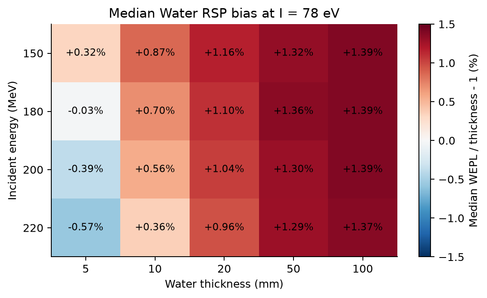
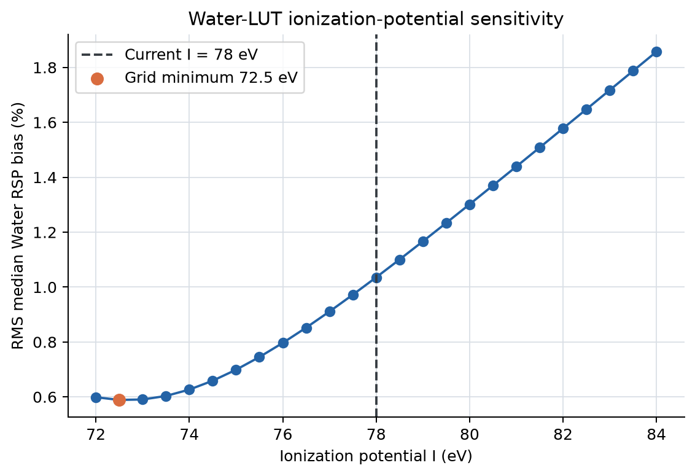
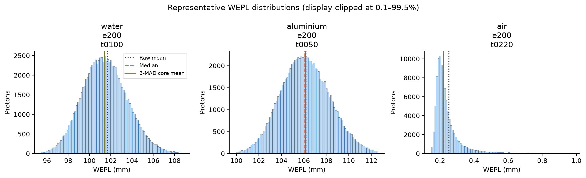

# S6材料能量扫描：阶段1技术总结

## 技术摘要

阶段1状态为**PASS**。52组Water、Aluminium和Air case均已读取，ROOT内容、
主质子配对和工作站汇总完成交叉核对。正式结论以逐case中位数和3-MAD核心均值
为主，原始均值仅用于展示核反应/异常能损尾部的影响。

当前`I=78 eV`水LUT并未在所有厚度上严格给出`WEPL=水厚度`：200 MeV下，
5--100 mm Water的中位数RSP范围为
`0.996135`--
`1.013897`。I值网格的经验
最小点为`72.5 eV`，但这只是吸收
Geant4与简化Bethe--Bloch差异的有效参数，不解释为新的水物理常数。

200 MeV Water各厚度的原点约束拟合斜率为
`1.013518`，
与results0716迭代水区均值
`1.014063`
仅差`+0.000545`。这为此前约
`+1.4%`的水偏差提供了强证据：它主要与当前WEPL标定口径一致，而不是由重建
算法单独产生。不过S6最长只有100 mm、且是单材料薄板，因此尚不能把这一吻合
当作对200 mm混合路径的严格因果分解。

200 MeV、5 mm Aluminium的中位数有效RSP为
`2.107424`，相对固定
200 MeV参考值`2.118976`低
`-0.545%`。
因此results0716迭代铝平台的总偏差中，物理参考定义可以解释一部分，但S6最低
仅覆盖150 MeV，尚不足以精确代表穿过200 mm水后的完整能谱。

Air在200 MeV下的期望WEPL原点约束斜率为
`0.00114710 mm-WEPL/mm-Air`。该模型可进入
S1/S3/D1的Air背景修正，但对150 MeV以下下游质子属于外推，必须保留敏感性检查。

## 52组数据通过完整性和配对检查

数据粒度是一条穿过指定材料薄板、同时在入口和出口参考面保留状态的主质子。
入口和出口按EventID匹配，只保留`TrackID=1`。全部WEPL统计均以“出口仍存在的
存活主质子”为条件；存活率另行报告，不能把缺失出口事件当作零WEPL。

| 项目 | 结果 |
|---|---:|
| case数 | 52 |
| ROOT数 | 104 |
| 配对主质子 | 5,032,273 |
| ROOT/QC问题 | 0 |
| 工作站汇总最大数值差 | 0 |
| ITK/C++ LUT最大差/mm | 0.000182 |

## Water显示厚度相关的有效偏差

图中虚线是理想`WEPL=厚度`。中位数曲线随厚度逐渐偏离理想线，说明偏差不是
单纯随机噪声；它综合反映Geant4输运、当前简化Bethe--Bloch水LUT和能量损失
分布的差异。

热图给出中位数`WEPL/厚度-1`。短薄板的相对指标更容易受到能量量化和分布形状
影响；长薄板更接近后续CT的降能条件，但仍不能替代真实路径上的连续材料混合。

I值扫描只用于判断78 eV是否造成系统趋势。即使另一个I值使Water经验偏差更小，
也不能仅凭本扫描更改正式LUT；更改会同时改变所有历史WEPL，并可能把Geant4
模型差异错误吸收到单一参数中。

## Aluminium的固定参考与有效RSP并不完全相同

固定参考线是results0716真值使用的`2.118976`。不同能量和厚度的有效RSP跨过
该参考线，证明“一个固定200 MeV数值”与“沿降能路径测得的平均有效RSP”不是
同一物理量。

200 MeV各厚度结果：

| 厚度/mm | 中位数有效RSP | 相对固定参考/% | 存活率/% |
|---:|---:|---:|---:|
| 5 | 2.107424 | -0.545 | 98.762 |
| 10 | 2.115876 | -0.146 | 97.554 |
| 20 | 2.120455 | +0.070 | 95.206 |
| 50 | 2.121892 | +0.138 | 88.423 |

## Air校正应使用路径长度和能量

Air的**均值WEPL**近似随长度线性增长，斜率随能量轻微变化。操作模型使用均值
的强制过原点斜率，并在150、180、200、220 MeV之间线性插值。中位数和3-MAD
核心均值只作为能损分布尾部诊断。后续不能对所有质子减去同一Air常数：圆柱外
Air长度随射线路径变化，上下游能量也不同。

## 尾部使原始均值不适合作为唯一标定量

图只显示0.1%--99.5%范围，完整数值仍用于原始均值。中位数和3-MAD核心均值
对稀有尾部更稳定；原始均值、稳健统计及核心保留率均保存在`case_metrics.csv`，
后续过滤设计可以直接复用这些证据。

## 定义、方法与不确定度

- `WEPL=R_w(E_in;I)-R_w(E_out;I)`，正式I值为78 eV；
- 有效RSP定义为逐case中位数WEPL除以物理薄板厚度；
- 3-MAD核心只用于稳健敏感性，不覆盖或删除原始统计；
- 95%区间由EventID模100的确定性分块估计；
- Air操作模型拟合逐质子WEPL均值并强制满足零长度对应零WEPL，同时保留中位数、
  3-MAD核心均值和自由截距拟合作为诊断；
- 所有能量统计以存活primary为条件，核反应导致的出口缺失通过存活率单独呈现。

## 局限与稳健性边界

1. S6能量范围为150--220 MeV，没有覆盖长水路径后的低能质子；
2. 薄板是单一材料，不能完全再现Water与Aluminium交替路径；
3. 当前参考面位于薄板表面外0.5 mm的Vacuum中，未包含真实探测器；
4. 有效I拟合不能区分Geant4物理模型、密度效应和简化LUT各自贡献；
5. Air修正很小，模型外推误差通常也小，但仍需在S2/S3配对实验中实测验证。

## 建议的下一步

1. 保留`I=78 eV`作为历史兼容主口径，同时把Water经验偏差作为校准系统项报告；
2. 在S2/S3中验证Air模型能否消除Vacuum/Air差异；
3. S4材料评价同时报告固定200 MeV RSP和S6支持的有效RSP解释；
4. 若需要严格分解results0716铝误差，补充80--140 MeV的5 mm Aluminium低通量扫描；
5. 在S1/S3/D1中记录修正前后WEPL偏差，避免Air校正成为不可审计的常数处理。

## 进一步问题

- 低于150 MeV时Aluminium相对水停止本领比是否继续沿现有趋势变化？
- S2/S3中的Air差异是否与S6模型在统计误差内一致？
- 使用Geant4原生水射程表替代当前简化LUT后，Water厚度趋势是否消失？
