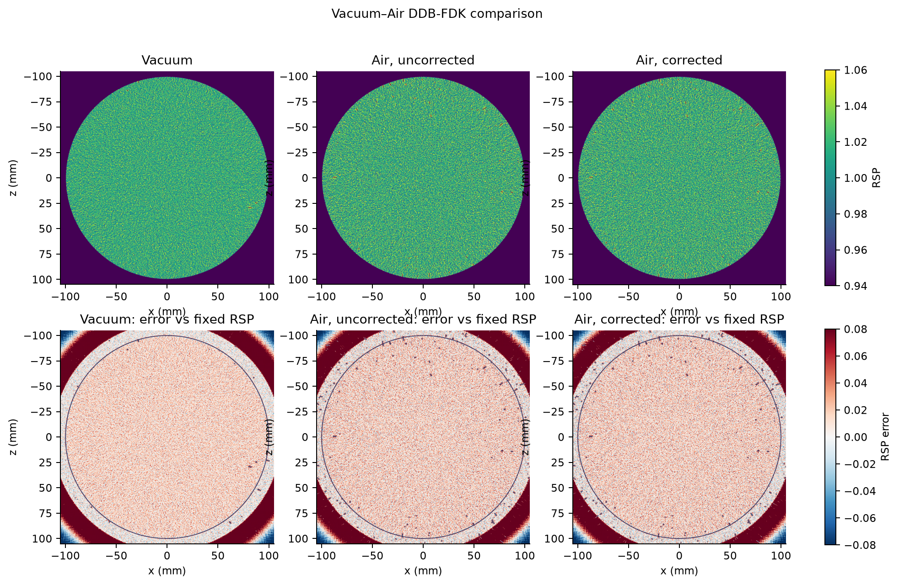
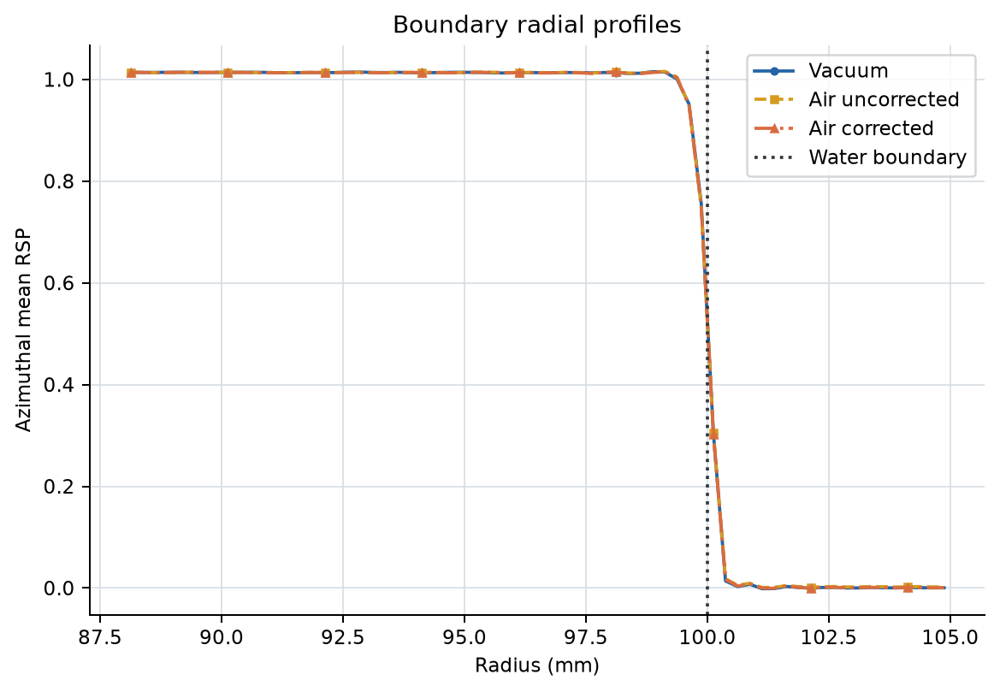
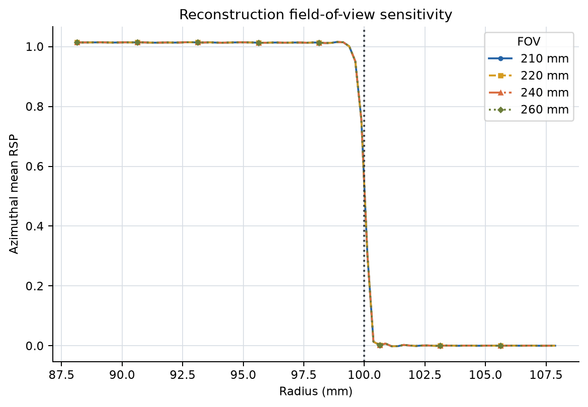
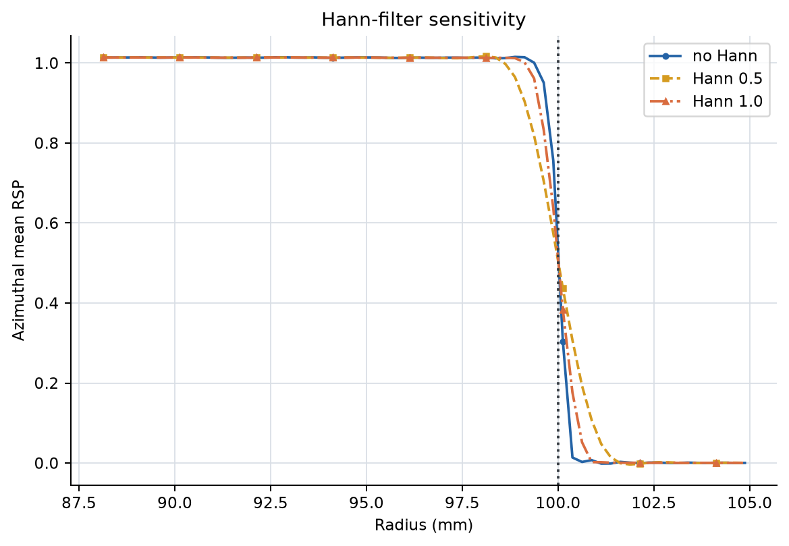
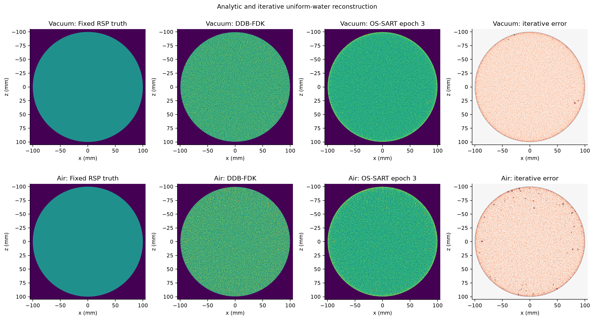
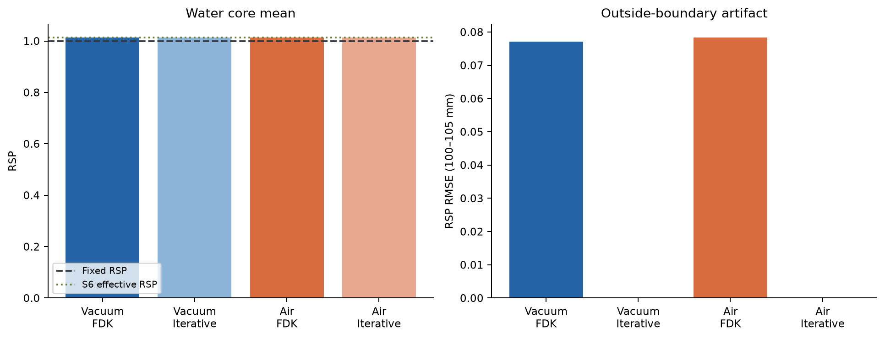
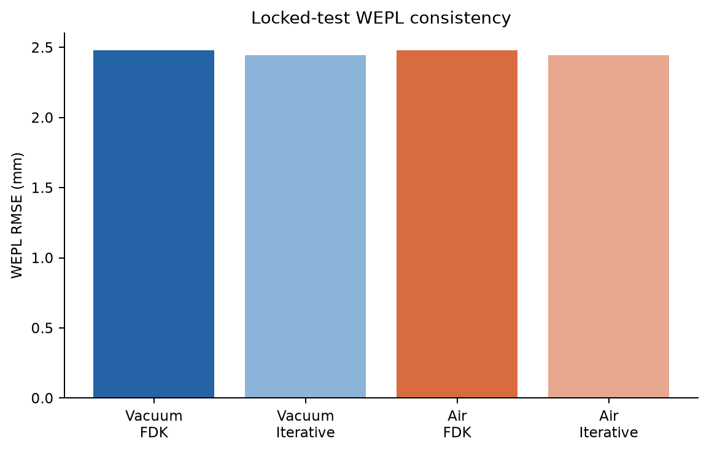
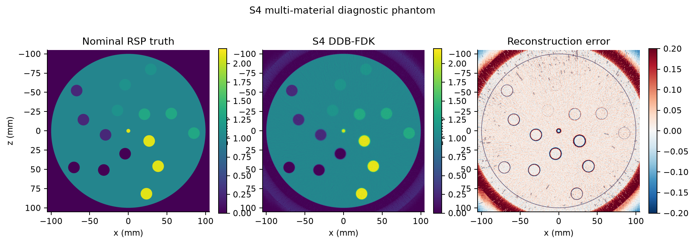
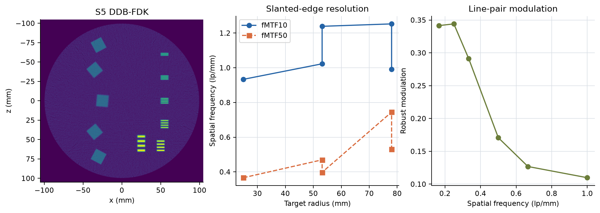

# 阶段2：诊断模体处理与评价

## 技术摘要

阶段2状态为**PASS**。S2 Vacuum与S3 Air均使用720角度、每角度100,000个
200 MeV质子，并在过滤后按同一确定性规则划分80%训练、10%验证和10%锁定测试。
两组解析水区均值分别为`1.013774`和
`1.013761`，均更接近S6有效RSP
`1.013518`而不是固定参考`1.0`。这支持阶段1判断：水平台的主要系统偏差来自
当前OpenGATE—WEPL标定口径，而不是Air或单一重建算法。

Air修正使S3解析水区均值从
`1.013543`变为
`1.013761`，改变量为
`+0.000218`。
因此参考面之间约20 mm Air的WEPL影响可测但很小，不能解释此前约`+1.4%`水偏差。

## 1. 实验设计与S2--S5仿真场景回顾

### 1.1 为什么需要四个诊断模体

results0716同时包含水、25根小铝柱、Vacuum背景、解析滤波和迭代约束。一旦出现
水平台偏差、铝恢复误差或外围圆环，仅凭一张复杂模体图像无法判断误差来自材料
定义、外部介质、路径模型、解析滤波、统计噪声还是部分容积。阶段2因此没有直接
增加复杂算法，而是设计四个低通量、完整角度的诊断场景，每个场景回答一个相对
独立的问题：

| 场景 | 唯一主要变化 | 主要研究问题 | 不能单独回答的问题 |
|---|---|---|---|
| S2 | 删除全部插入物，只保留Vacuum中的均匀水 | 水平台、圆柱边界、FOV、Hann和支撑域 | Air、材料定量和真实探测器效应 |
| S3 | 在S2基础上将Vacuum改为Air | 外部Air能损/散射及Air WEPL修正 | 材料依赖误差 |
| S4 | Air背景中加入多材料大柱和中心小铝柱 | 材料平台、径向趋势、部分容积 | 标准空间分辨率和低对比能力 |
| S5 | Air背景中加入线对和多方向斜边 | 线对可视性及位置/方向相关MTF | 材料平台准确性和低对比能力 |

S2与S3构成最关键的成对对照；S4与S5则把“定量准确性”和“空间分辨率”拆成
两套专用模体。四组均保留720角度，而只把每角度通量降到100,000，目的是降低
pilot成本，同时避免角度欠采样成为新的混杂因素。

### 1.2 共用扫描几何和物理设置

| 参数 | S2--S5统一设置 |
|---|---:|
| 质子源 | 200 MeV单能质子 |
| 角度采样 | 720角度，`0, 0.5, …, 359.5°` |
| 每角度/每场景入射量 | 100,000 / 72,000,000质子 |
| 旋转轴 | 扫描器\(y\)轴 |
| 水圆柱 | 半径100 mm、轴向长度400 mm |
| 物理源平面/有效焦点 | `z=-1060/-1000 mm` |
| 源平面尺寸 | `15×0.12×10⁻⁶ mm³` |
| 等中心束流覆盖 | 约`250×2 mm²` |
| 理想入口/出口参考面 | `z=-110/110 mm` |
| 物理列表 | `QGSP_BIC_EMZ` |
| 模体最大step | 1 mm；S5细线局部进一步限制 |
| OpenGATE并行方式 | 每个角度单线程，多个角度由外部启动器并行 |

源平面到有效焦点仅60 mm，横向源尺寸传播到等中心后形成约`250×2 mm²`扇束。
其中一个方向只有2 mm，因此这是准二维pCT，而不是三维锥束扫描。入口和出口面
使用`PhaseSpaceActor`理想记录位置、方向和动能；它们不是物理硅跟踪器，也没有
像素量化、电子学噪声、探测效率或能量探测器响应。因此阶段2衡量的是模体、
介质和重建链本身，不代表完整真实设备性能。

### 1.3 S2：Vacuum均匀水圆柱

S2的场景只有半径100 mm、长度400 mm的Water圆柱，圆柱外为Vacuum，没有任何
插入物；随机种子为`20261720 + angle_index`。
该设计把真值简化为圆柱内常数、圆柱外零，使径向不均匀和边界响应可以直接观察。

S2主要验证四个假设：

1. 若没有铝柱时外围圆环仍存在，则圆环不是插入物条纹的叠加；
2. 比较210--260 mm重建FOV，可判断圆环是否由输出图像边界余量不足造成；
3. 比较no-Hann、Hann=0.5和Hann=1，可观察Ramp高频噪声与边缘振铃的折衷；
4. 施加100 mm支撑域前后分别评价90--100 mm内侧和100--105 mm外侧，区分
   “清除物体外像素”和“真正修复边界模型”。

### 1.4 S3：Air均匀水圆柱

S3保持S2的水圆柱、束流、参考面、角度和通量不变，只把外部介质改为Air；随机
种子为`20262720 + angle_index`。由于入口和出口
能量定义在`z=-110/+110 mm`，质子在水圆柱外、两个参考面之间经过的Air能损也
包含在测得WEPL中。若不处理，这部分WEPL会被错误归入水圆柱。

本阶段采用S6薄板扫描得到的Air均值斜率
`0.001147188 mm-WEPL/mm-Air`，
按每条质子的已知圆柱外路径长度扣除Air贡献，并同时保留未修正DDB作为对照。
S3用于判断：

- Air会把水平台推移多少；
- Air散射是否显著改变噪声、边缘圆环和锁定测试残差；
- S6得到的简单均值修正能否在完整CT路径中复现；
- Vacuum与Air均存在的共同误差是否应归因于更上游的WEPL/RSP口径或重建模型。

S2和S3使用不同随机种子，属于“配置配对、统计独立”的对照，不是逐事件配对；
因此微小差异必须结合统计噪声解释。

### 1.5 S4：多材料与径向位置标定模体

S4在Air背景的100 mm水圆柱中放置Air、Lung、A150_Tissue_Plastic、
SpineBone和Aluminium五种材料。每种材料都以直径15 mm柱分别出现在30、60和
85 mm半径，中心另有一根直径5 mm铝柱；随机种子为
`20263720 + angle_index`。

| 环半径/mm | 柱直径/mm | 五种材料的局部方位角 |
|---:|---:|---|
| 30 | 15 | Air 8°、Lung 80°、A150_Tissue_Plastic 152°、SpineBone 224°、Aluminium 296° |
| 60 | 15 | Air 32°、Lung 104°、A150_Tissue_Plastic 176°、SpineBone 248°、Aluminium 320° |
| 85 | 15 | Air 56°、Lung 128°、A150_Tissue_Plastic 200°、SpineBone 272°、Aluminium 344° |

15 mm柱提供相对稳定的平台ROI，避免results0716中5 mm铝柱过度受部分容积支配；
同一材料的三个半径用于检查几何或MLP误差是否随离心距离增长。中心5 mm铝柱则
故意保留，用于把“小目标恢复不足”与“大材料平台的系统偏差”分开。内部Air柱是
模体中的真实低密度空腔，与水圆柱外需要扣除的Air路径不是同一个量。

S4使用固定200 MeV名义RSP评价材料平台。该真值由OpenGATE材料电子密度和
Geant4平均激发能经Bethe--Bloch相对Water归一化得到，适合可复现的横向比较；
但它还不是质子降能过程中严格的材料相关有效RSP。

### 1.6 S5：线对与斜边空间分辨率模体

S5在Air背景的水圆柱内同时设置Aluminium线对和SpineBone斜边；随机种子为
`20264720 + angle_index`。线对提供直观
可视性，斜边提供更可重复的ESF、LSF和fMTF测量。

| 线宽=间隙/mm | 理论频率/lp·mm⁻¹ | 局部中心/mm | 铝条数 |
|---:|---:|---:|---:|
| 0.5 | 1.000 | `(-60, -55)` | 4 |
| 0.75 | 0.667 | `(-30, -55)` | 4 |
| 1 | 0.500 | `(0, -55)` | 4 |
| 1.5 | 0.333 | `(30, -55)` | 4 |
| 2 | 0.250 | `(58, -50)` | 4 |
| 3 | 0.167 | `(55, -25)` | 4 |

每组线对由4根长度10 mm的平行铝条组成，理论频率为
\(f=1/(2w)\)。为避免蒙卡几何步长直接抹平细线，局部最大step不超过线宽的一半。

| 斜边目标 | 局部中心/mm | 尺寸/mm² | 旋转角/deg |
|---:|---:|---:|---:|
| 1 | `(0, 25)` | `15×15` | 5 |
| 2 | `(40, 35)` | `15×15` | 50 |
| 3 | `(-40, 35)` | `15×15` | -40 |
| 4 | `(72, 30)` | `15×15` | 28 |
| 5 | `(-72, 30)` | `15×15` | -28 |

五个15 mm SpineBone方块分布在不同半径和方向，倾斜边缘避免与0.1 mm重建像素
完全对齐。多个目标的意义不是简单取一个最好数值，而是观察位置和方向依赖。
S5没有专用1%--5%低对比模块，所以本阶段可以报告空间分辨率，不能据此声明
低对比可探测能力。

## 2. 数据处理、重建与评价口径

### 2.1 从相空间记录到独立数据集

| 数据集 | 过滤后质子 | 训练 | 验证 | 锁定测试 |
|---|---:|---:|---:|---:|
| S2 Vacuum | 54,376,097 | 43,499,353 | 5,438,156 | 5,438,588 |
| S3 Air | 46,617,975 | 37,291,681 | 4,663,898 | 4,662,396 |
| S4 materials | 46,580,037 | 37,261,574 | 4,660,044 | 4,658,419 |
| S5 resolution | 46,389,226 | 37,108,911 | 4,641,175 | 4,639,140 |

质子身份为`(RunID, filtered_row_index)`，采用`splitmix64-v1`与固定种子
`20260713`。解析和迭代重建只使用训练集；参数扫描不读取锁定测试集。图像同时
相对固定200 MeV Water RSP=`1.0`与S6有效RSP=`1.013518`评价。

完整处理顺序为：入口/出口ROOT primary-only配对 → 固定参考面状态外推 →
局部能损和散射角3σ过滤 → 80/10/10划分 → `I=78 eV`水射程LUT计算WEPL →
Schulte MLP → `500×2×500 @ 0.5 mm` DDB。Air场景在划分后、生成DDB或迭代
输入前，按同一确定性Air路径模型生成校正数据，不改写原始过滤后pairs。

Air场景中`125×2 @ 2 mm`二维局部网格会把出平面/横向散射离开中心层接受窗的
质子记为网格外。该损失与真正的3σ异常剔除分开统计，不能把较低保留率直接解释
为核反应或错误历史增加。

### 2.2 解析、迭代和锁定测试评价

S2--S5均执行no-Hann DDB-FDK，主输出网格为`2100×1×2100 @ 0.1 mm`。S2另外
扫描210、220、240和260 mm FOV以及Hann=0、0.5、1，并比较100 mm硬支撑域。
S2/S3使用各自80%训练质子执行3 epoch GPU MLP OS-SART + Huber-TV：18个子集、
0.1 mm路径步长、no-Hann初值、非负和100 mm支撑域。S4/S5本阶段只做解析诊断，
避免在基准尚未建立时把正则化偏差引入材料和MTF结论。

图像指标回答“重建图像是否接近已定义真值”；锁定测试WEPL指标则使用从未参加
重建或参数选择的10%质子，把重建图像重新沿MLP正投影，回答“图像能否预测未见
质子的测量”。两者必须同时阅读：较低图像RMSE不保证较低测试残差，反之亦然。

## 3. 重建结果与诊断分析

### 3.1 S2/S3：Vacuum与Air的主要差异很小

S3先按S6均值斜率从逐质子WEPL中扣除圆柱外Air路径贡献，再生成DDB。修正前后
图像的差异远小于固定RSP与有效RSP之间的差异。S2和修正后S3仍存在相似的圆形
边界响应，因此外围圆环不能主要归因于Air。

S2解析水区均值为`1.013774`，S3未修正和修正后
分别为`1.013543`与
`1.013761`。Air校正只带来
`+0.000218`
的变化，而S2/S3相对固定RSP=1.0仍约高1.38%。两组均接近S6 Water有效RSP
`1.013518`，所以“水平台偏高”的首要解释是当前WEPL标定与固定RSP真值口径不同，
而不是Air导致。

### 3.2 S2参数实验：扩大FOV没有消除内侧边界响应

210、220、240和260 mm FOV下，100--105 mm外部RMSE范围为
`0.077054`--
`0.077054`。
若径向剖面在扩大FOV后仍基本重合，说明圆环主要不是由输出图像边缘离水边界仅
5 mm造成，而更接近Ramp反卷积、DDB采样及水—背景阶跃的共同响应。

这是一项有价值的负结果：继续把FOV从260 mm向外扩展，预期不会触及主要误差源。
后续更值得测试的是DDB分箱、滤波截止、边界模型和解析算子的支撑处理。

### 3.3 Hann降低振铃，但改变噪声—分辨率折衷

no-Hann、Hann=0.5和Hann=1的水区标准差分别为
`0.018174`、
`0.002744`和
`0.006894`。Hann可压低高频噪声和部分
振铃，但会展宽边缘，因此no-Hann仍保留为高分辨率基线。

Hann=0.5在本pilot中得到最低水区标准差，但这不能直接等同于最优设置，因为材料
边缘、线对和MTF会同时受到频率截断。阶段2保留no-Hann作为诊断基线，正是为了
让高频误差不被过早平滑隐藏。

### 3.4 支撑域只消除圆柱外部分，不能修复内侧误差

对S2 no-Hann直接施加100 mm支撑域后，100--105 mm外部RMSE由
`0.077054`降为
`0.000000`；但90--100 mm内侧
边界RMSE仍由`0.042764`变为
`0.042764`。因此支撑域
适合约束物体外像素，却不能被描述为对Ramp边界响应的完整校正。

因此“圆柱外一圈被消除”不意味着解析边界误差已经解决：支撑域是已知几何先验，
只是把外部像素强制设为零；90--100 mm内侧的Ramp/DDB响应仍然存在。

### 3.5 迭代重建降低噪声，但没有改变水平台口径

| 数据集 | 方法 | 水区均值 | 水区标准差 | 固定RSP RMSE | 有效RSP RMSE | 外部RMSE |
|---|---|---:|---:|---:|---:|---:|
| Vacuum | DDB-FDK | 1.013774 | 0.018174 | 0.028990 | 0.026243 | 0.077054 |
| Vacuum | OS-SART epoch 3 | 1.013881 | 0.006402 | 0.019777 | 0.013684 | 0.000000 |
| Air corrected | DDB-FDK | 1.013761 | 0.021891 | 0.031959 | 0.029531 | 0.078385 |
| Air corrected | OS-SART epoch 3 | 1.013873 | 0.009304 | 0.021163 | 0.015633 | 0.000000 |

S2迭代相对解析将水区标准差降低
`64.8%`，
有效RSP RMSE降低
`47.9%`；
S3对应降低
`57.5%`
和
`47.1%`。
100 mm支撑域使外部RMSE严格为零，Huber-TV进一步抑制水区高频波动。

另一方面，迭代水均值仍为
`1.013881/1.013873`，
没有向固定RSP=1.0移动。这再次说明正则化能改善方差和数据一致性，但不会自动
修正WEPL—真值定义的全局标定偏差。

### 3.6 锁定测试集确认数据一致性改善

| 数据集 | 方法 | 测试WEPL RMSE/mm | MAE/mm | 偏差/mm |
|---|---|---:|---:|---:|
| Vacuum | DDB-FDK | 2.47780 | 1.95232 | +0.30343 |
| Vacuum | OS-SART epoch 3 | 2.44496 | 1.92450 | +0.00129 |
| Air corrected | DDB-FDK | 2.48004 | 1.95314 | +0.31688 |
| Air corrected | OS-SART epoch 3 | 2.44349 | 1.92299 | +0.00245 |
| S4 materials | DDB-FDK | 2.67091 | 2.06692 | +0.32678 |
| S5 resolution | DDB-FDK | 2.59855 | 2.02967 | +0.32369 |

测试质子从未参与重建或参数选择。WEPL残差仍包含Schulte MLP、能量LUT、散射和
有限像素离散误差，不能被解释成单独的图像RSP误差。

S2/S3迭代相对解析的测试WEPL RMSE改善分别约为
`1.33%`
和
`1.47%`。
RMSE降幅不大，但偏差从
`+0.303/+0.317 mm`
降到
`+0.001/+0.002 mm`，
说明迭代主要消除了系统性数据偏差；剩余约2.44 mm RMSE已不能由平均偏差解释，
其中仍混合了逐质子涨落、MLP近似和离散误差。

### 3.7 S4材料定量结果

S4包含五种材料在30、60和85 mm三个半径的15 mm柱，以及中心5 mm铝柱。
这里的固定200 MeV名义RSP由OpenGATE材料电子密度和Geant4平均激发能代入
Bethe--Bloch后相对Water归一化得到；它是可复现的名义参考，不等同于混合路径的
能量加权有效RSP。解析重建的模体RMSE为
`0.054000`，非Air材料MAPE为
`1.17%`。

| 材料 | 半径/mm | 名义RSP | 平台均值 | 平台标准差 | 绝对相对误差 |
|---|---:|---:|---:|---:|---:|
| Air | 30 | 0.000000 | 0.000646 | 0.028378 | N/A |
| Lung | 30 | 0.257490 | 0.261526 | 0.025060 | 1.57% |
| A150_Tissue_Plastic | 30 | 1.124458 | 1.140083 | 0.028695 | 1.39% |
| SpineBone | 30 | 1.321545 | 1.336288 | 0.031166 | 1.12% |
| Aluminium | 30 | 2.102101 | 2.107475 | 0.031092 | 0.26% |
| Air | 60 | 0.000000 | 0.001100 | 0.024315 | N/A |
| Lung | 60 | 0.257490 | 0.260404 | 0.028601 | 1.13% |
| A150_Tissue_Plastic | 60 | 1.124458 | 1.139045 | 0.036007 | 1.30% |
| SpineBone | 60 | 1.321545 | 1.338774 | 0.032972 | 1.30% |
| Aluminium | 60 | 2.102101 | 2.114247 | 0.034321 | 0.58% |
| Air | 85 | 0.000000 | 0.002172 | 0.027374 | N/A |
| Lung | 85 | 0.257490 | 0.262104 | 0.030857 | 1.79% |
| A150_Tissue_Plastic | 85 | 1.124458 | 1.139370 | 0.033896 | 1.33% |
| SpineBone | 85 | 1.321545 | 1.339174 | 0.034051 | 1.33% |
| Aluminium | 85 | 2.102101 | 2.118151 | 0.035334 | 0.76% |
| Aluminium | 0 | 2.102101 | 2.073688 | 0.019042 | 1.35% |

同一材料在三个半径的结果用于判断径向几何趋势；中心5 mm铝柱主要反映部分容积，
不与15 mm平台采用同一解释。

非Air材料总体MAPE为
`1.17%`，最大单ROI相对误差为
1.79%。15 mm Aluminium的误差由30、60到85 mm半径分别为0.26%、0.58%和
0.76%，提示存在小幅径向趋势，但幅度尚不足以单独证明MLP几何失配。中心5 mm
铝柱误差为1.35%，高于三个大铝柱中的多数结果，符合小目标更容易受部分容积和
边缘响应影响的预期。

Lung、A150和SpineBone普遍重建偏高约1%--1.8%，说明误差不是统一比例缩放即可
完全消除。下一步应优先补充这些材料的能量—厚度有效RSP标定，再判断剩余部分是
固定水MLP、Air修正还是解析重建造成。

### 3.8 S5空间分辨率结果

五个15 mm SpineBone斜边采用0.025 mm过采样ESF、数值微分LSF和FFT计算
fMTF；平均fMTF50和fMTF10分别为
`0.502`和
`1.088 lp/mm`。

| 靶编号 | 半径/mm | 旋转角/deg | fMTF50/lp·mm⁻¹ | fMTF10/lp·mm⁻¹ |
|---:|---:|---:|---:|---:|
| 0 | 25.0 | 5.0 | 0.367 | 0.934 |
| 1 | 53.2 | 50.0 | 0.470 | 1.023 |
| 2 | 53.2 | -40.0 | 0.398 | 1.239 |
| 3 | 78.0 | 28.0 | 0.745 | 1.253 |
| 4 | 78.0 | -28.0 | 0.530 | 0.992 |

线对仅作为可视性和调制度补充，不替代斜边MTF：

| 线宽/mm | 空间频率/lp·mm⁻¹ | 稳健调制度 |
|---:|---:|---:|
| 0.50 | 1.000 | 0.1098 |
| 0.75 | 0.667 | 0.1269 |
| 1.00 | 0.500 | 0.1707 |
| 1.50 | 0.333 | 0.2914 |
| 2.00 | 0.250 | 0.3441 |
| 3.00 | 0.167 | 0.3416 |

五个目标的fMTF50从0.367到0.745 lp/mm，说明测得分辨率对位置和边缘方向敏感；
当前平均值`0.502 lp/mm`应作为
阶段2基线，而不能代替每个方向的完整结果。0.5 mm线对对应1.0 lp/mm，仍有
`0.1098`
稳健调制度，但“非零调制度”不等于满足某个临床可分辨判据。后续算法比较必须
使用相同ROI和调制度定义。

## 4. 局限性

1. S2--S5只有每角度100,000个质子，统计噪声高于论文通量results0716；
2. S2与S3使用不同随机种子，比较的是同配置独立样本，不是逐事件配对；
3. S6有效RSP来自5--100 mm单材料薄板，尚不是200 mm路径的严格真值；
4. Air修正采用近似能量无关的均值斜率，下游低于150 MeV部分属于外推；
5. 当前支撑域是重建后的硬约束，未改变解析反投影本身；
6. S4的多材料参考是固定200 MeV名义RSP，尚无对应薄板有效RSP扫描；
7. S5没有低对比模块，不能由本结果声称低对比可探测能力。

此外，S4/S5本阶段只有解析结果，尚不能判断迭代正则化对材料平台和MTF的偏差—
方差折衷；S2/S3的结论也只适用于理想相空间记录，不能直接推广到有限位置、
方向和能量分辨率的真实探测器。

## 5. 总结与阶段决策

阶段2完成了从“复杂模体中观察现象”到“用专用模体隔离误差来源”的转换，主要
结论如下：

1. **水平台偏差的主因不是Air。** S2与S3均稳定在约`1.0138`，与S6有效RSP一致；
   Air修正只改变约`0.00022 RSP`，固定200 MeV RSP与当前WEPL标定口径的差异才是
   约`+1.4%`水平台偏差的首要解释。
2. **外围圆环不是铝柱、Air或简单FOV不足造成。** 均匀水中仍出现圆环，
   Vacuum/Air表现相似，210--260 mm FOV径向剖面基本重合。支撑域只能可靠清零
   物体外部分，不能修复90--100 mm内侧边界响应。
3. **迭代重建的主要收益是降低方差和系统性数据偏差。** S2/S3有效RSP RMSE约
   减半，水区标准差明显下降，锁定测试WEPL偏差接近零；但水平台均值没有向
   固定RSP=1.0移动，说明全局物理标定不能靠增加迭代轮数解决。
4. **S4建立了可用的多材料定量基线。** 非Air材料MAPE为
   `1.17%`，位置趋势总体较小；
   15 mm大柱与中心5 mm铝柱的差异证明部分容积必须与材料系统偏差分开报告。
5. **S5建立了可重复的空间分辨率基线。** 平均fMTF50/fMTF10为
   `0.502/1.088 lp/mm`，同时观察到明显的
   位置和方向差异；本结果不包含低对比性能结论。

因此阶段2状态为**PASS**。S2--S5均已形成独立训练、验证和锁定测试集，结果足以
支持进入阶段3。近期不建议仅为消除圆环继续扩大解析FOV，也不建议在未补充材料
有效RSP标定前对S4施加统一经验缩放。下一步应先在S1--S5上开展稳健过滤、
WEPL不确定度和数据权重研究；D1下载后再在阶段7集中评价完整通量Air、物理硅
跟踪器和参数化读出误差。S4/S5是否提高到论文通量，应依据后续算法是否需要
更低统计噪声再决定。
