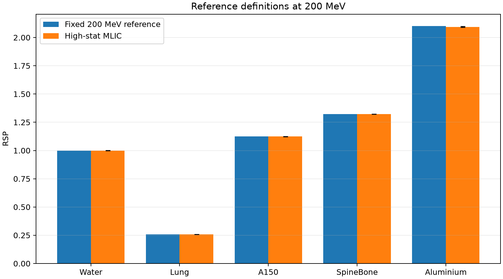
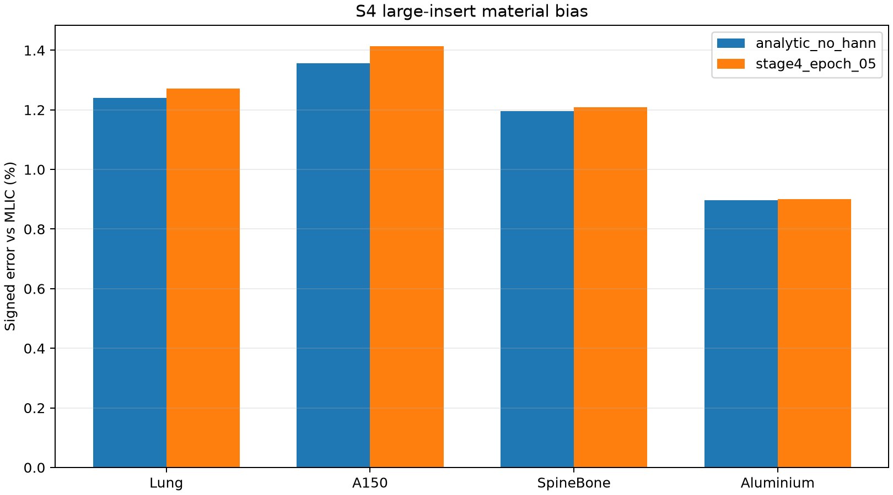

# 阶段6A：虚拟MLIC真值与基线重新评价

## 1. 仿真与冻结状态

四能量首轮扫描完成24个case、240万质子；200 MeV高统计补充完成6个case、
600万质子。高统计任务60/60完成，无失败，墙钟时间19分31秒。主参考采用
10个独立重复、每case合计100万质子的R80射程移动结果。

| 材料 | MLIC-RSP | bootstrap SD | 相对SD | 95% CI |
|---|---:|---:|---:|---:|
| Water | 0.999746 | 0.000747 | 0.075% | 0.998219–1.001181 |
| Lung | 0.258145 | 0.000832 | 0.322% | 0.256432–0.259707 |
| A150_Tissue_Plastic | 1.124245 | 0.000833 | 0.074% | 1.122580–1.125857 |
| SpineBone | 1.322261 | 0.000889 | 0.067% | 1.320473–1.323945 |
| Aluminium | 2.094511 | 0.002994 | 0.143% | 2.088576–2.100478 |

Water为0.999746，偏离1仅−0.025%。平滑和0.2 mm重分箱带来的最大RSP
变化低于0.09%，因此200 MeV参考达到本阶段冻结条件。Lung因15 mm样品只
产生约3.87 mm射程移动，相对不确定度仍最高（0.322%），后续比较必须保留
该误差条。

四能量首轮Water中，180 MeV结果为0.995528，其单项bootstrap 95% CI
上限0.999065，略低于1；若对四个Water同时检验采用Bonferroni校正的
family-wise 95%区间则包含1。该点按低统计能量敏感性保留并明确标记，不
用于冻结200 MeV主参考。这是相对原计划“每个单项95% CI均包含1”的实际
偏差。

## 2. results0716与S1铝柱

| 数据集 | 方法 | 铝测量RSP | 固定参考误差 | MLIC参考误差 | MLIC恢复率 |
|---|---|---:|---:|---:|---:|
| results0716 | analytic_no_hann | 2.095457 | -1.110% | +0.045% | 100.045% |
| results0716 | iterative_epoch_03 | 2.091670 | -1.289% | -0.136% | 99.864% |
| s1 | stage4_epoch_05 | 2.097238 | -1.026% | +0.130% | 100.130% |

results0716第3轮迭代铝平台从固定参考下的约98.71%恢复率，变为MLIC口径
99.864%。因此此前约1.29%的铝低估主要来自参考定义；剩余平台偏差约
−0.14%，已与MLIC统计不确定度处于相近量级。S1阶段4结果同样接近MLIC参考。

## 3. S4多材料重新评价

| 方法 | 固定参考MAPE | MLIC参考MAPE | 仅15 mm大柱MAPE | 最大APE |
|---|---:|---:|---:|---:|
| analytic_no_hann | 1.170% | 1.159% | 1.172% | 1.534% |
| stage4_epoch_05 | 1.203% | 1.192% | 1.199% | 1.465% |

与铝小柱不同，S4原先使用的材料参考已经由OpenGATE材料参数计算，数值与
MLIC相近。因此阶段4的材料MAPE仅由1.203%变为1.192%，不能再把S4约
1.2%的误差主要归因于“使用了错误真值”。四种15 mm材料均整体偏高约
0.9%–1.4%，更可能涉及WEPL标定、路径平均能量、统一水LUT和重建系统偏差。

## 4. S5空间分辨率模体

| 方法 | fMTF50 | fMTF10 | 骨—水边缘对比恢复 | 3 mm铝线p90恢复 |
|---|---:|---:|---:|---:|
| analytic_no_hann | 0.5017 | 1.0880 | 100.64% | 100.19% |
| stage4_epoch_05 | 0.4920 | 1.1167 | 100.74% | 99.64% |

MTF是归一化边缘形状指标，不因RSP真值口径改变。MLIC仅用于重新解释边缘
对比和宽线平台：阶段4结果的骨—水边缘对比约为MLIC期望的100.7%，3 mm
铝线p90约恢复99.64%。更细线对仍主要受部分容积和空间分辨率限制。

## 5. 结论与决策

1. 200 MeV高统计MLIC参考通过完整性、Water一致性、统计误差和R80方法
   稳定性检查，正式冻结为后续论文比较的主材料参考。
2. 固定200 MeV理论RSP继续保留为历史口径；不得删除或改写旧指标。
3. results0716铝柱的固定参考误差大部分属于真值定义差异；MLIC口径下当前
   迭代平台误差约−0.14%。
4. S4材料MAPE在MLIC口径下仍约1.19%，说明该误差主要不是参考值选错。
5. 阶段6A改变评价口径但不反向调整阶段4参数，避免测试集泄漏。
6. 阶段6A状态为PASS；可以开始阶段7，但所有外部性能比较必须注明MLIC
   仿真、理想探测器与真实实验之间的差别。

## 6. 机器可读产物

- `mlic_reference_200mev.csv`：冻结的200 MeV参考；
- `mlic_energy_sensitivity.csv`：150–220 MeV首轮能量趋势；
- `aluminium_reevaluation.csv`：results0716/S1铝柱双口径结果；
- `s4_material_reevaluation.csv`与`s4_summary.csv`：S4逐ROI与汇总；
- `s5_reevaluation.csv`：S5 MTF、边缘对比和宽线平台；
- `stage6a_summary.json`：输入哈希、验收和核心结论。

最终状态：**PASS**。
