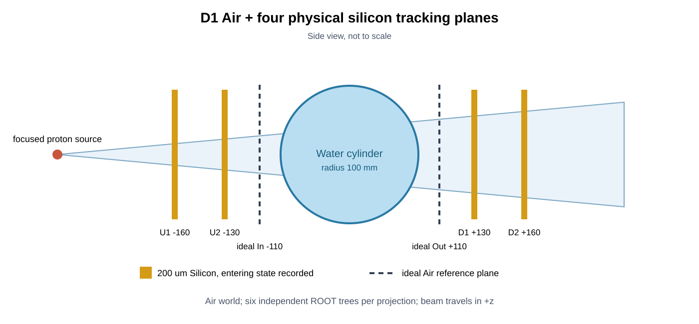

# D1：Air与四层物理硅跟踪器仿真

本文件夹可以整体复制到：

```text
D:\OpenGATE\windows_air_silicon_tracker_d1_0718
```

它在results0716二维模体和论文通量基础上，将世界材料改为Air，并加入四层
200 μm物理硅跟踪器。出口能量仍由理想参考面记录，不包含物理能量探测器、像素
量化或电子学噪声。

## 当前状态

工作站正式仿真已于2026-07-20完成：720/720角度成功，12进程墙钟时间约
20.55小时，六类ROOT合计约114.55 GiB。manifest和日志已在本目录
`qc/full/`。大型ROOT保存在Windows
`D:\临时\results0718_d1_air_tracker_full`，Stage 7已通过WSL只读挂载完成
六平面配对、数字化筛选和三套全量重建，最终状态为
`D1_DETECTOR_EFFECTS_CHARACTERIZED`。阶段7总结见
[`../../research_stages/stage7_detector_effects/qc/stage7_summary.md`](../../research_stages/stage7_detector_effects/qc/stage7_summary.md)。



## 场景参数

| 项目 | 配置 |
|---|---|
| 质子源 | 200 MeV单能，720角度，450,000个/角度 |
| 等中心照射范围 | `250×2 mm²` |
| 名义面通量 | 900 protons/mm²/projection |
| 模体 | 半径100 mm、长度400 mm水圆柱 |
| 插入物 | 25根直径5 mm铝柱，与results0716相同 |
| 外部介质 | Air |
| 跟踪器 | 4层Silicon，每层`320×20×0.2 mm³` |
| 上游层 | `z=-160,-130 mm` |
| 理想参考面 | `z=-110,+110 mm` |
| 下游层 | `z=+130,+160 mm` |
| 物理列表 | `QGSP_BIC_EMZ` |
| 输出 | 每角度6个ROOT和一组QC |

## 六个记录面的区别

`TrackerUpstream1/2`和`TrackerDownstream1/2`是有厚度的硅体积。质子会在其中真实
发生能损、多重散射和少量核反应；PhaseSpaceActor使用
`steps_to_store="entering"`，记录质子进入各硅层时的连续状态。

`PhaseSpaceIn/Out`是Air中的近零厚度理想参考面：

- `PhaseSpaceIn`位于`z=-110 mm`，在两个上游硅层之后；
- `PhaseSpaceOut`位于`z=+110 mm`，在两个下游硅层之前；
- 两者提供D1中的理想入口/出口能量和真实方向，供后续与hit拟合结果对照；
- 当前仿真不包含能量量程望远镜或量能器。

后续测量方向应由两个tracker hit拟合，而不是直接使用参考面真方向：

\[
\hat{\mathbf d}_{in}=\frac{\mathbf h_{U2}-\mathbf h_{U1}}
{\|\mathbf h_{U2}-\mathbf h_{U1}\|},\qquad
\hat{\mathbf d}_{out}=\frac{\mathbf h_{D2}-\mathbf h_{D1}}
{\|\mathbf h_{D2}-\mathbf h_{D1}\|}.
\]

每个ROOT都保存`RunID`、`EventID`、`TrackID`、`KineticEnergy`、`PreGlobalTime`、
三维`Position`和三维`Direction`。单角度文件中的RunID为0，拷回Linux后由目录编号
恢复全局角度。

## 运行方法

打开已激活`opengate_env`的PowerShell：

```powershell
cd D:\OpenGATE\windows_air_silicon_tracker_d1_0718
.\00_check_environment.bat
.\01_smoke_test.bat
.\02_run_full.bat 12
```

另开一个PowerShell查看状态：

```powershell
cd D:\OpenGATE\windows_air_silicon_tracker_d1_0718
.\03_show_status.bat
```

大型ROOT写入：

```text
D:\OpenGATE\data\simulation_data\results0718_d1_air_tracker_full
```

日志、配置哈希、逐角度metadata、完成标志和manifest保存在本文件夹的`qc\full`。
中断后重新执行同一个`02_run_full.bat 12`即可；完整角度会跳过，失败角度会重试。
已有结果若配置哈希或质子数不同，启动器会拒绝混写。

## 时间和容量

| 项目 | 计划/实测 |
|---|---:|
| 正式OpenGATE时间 | 实测约20.55小时 |
| 六组ROOT总量 | 实测约114.55 GiB |
| 启动所需最小可用空间 | 200 GB |
| Stage 7本地预处理/重建 | 实测约55/1.2 GB |

smoke test只运行角度0的2,000个质子，并自动检查六个ROOT的树名、必需分支、有限
浮点值、primary数量和重复primary hit。

## Air和WEPL注意事项

`PhaseSpaceIn/Out`之间除了水圆柱，还包含圆柱表面到`z=±110 mm`之间的Air。
由两面能量计算的WEPL包含这段Air贡献。若重建目标只定义为水圆柱内部RSP，必须：

1. 根据已知Air路径扣除Air WEPL；或
2. 在前向模型中把Air作为已知固定背景。

不能把全部测量能损无条件归入水圆柱。硅层位于两个理想参考面之外，因此本D1
参考面WEPL不直接包含硅层能损；硅主要通过改变入射能量、存活率和测量方向影响数据。

## 不包含的内容

- OpenGATE内部的像素/条带量化和电子学读出；
- OpenGATE内部的参数化能量噪声；
- 完整物理能量探测器；
- 仿真包自身不包含D1配对和重建代码。

Stage 7已在仿真后离线实现连续hit拟合、`0.1/0.2/0.5 mm`位置扰动以及
`0.5/1/2%`出射能量噪声。连续硅hit相对理想参考面的模体RMSE增加`2.21%`；
`0.2 mm + 1%`能量噪声组合增加`42.73%`。后者是参数化灵敏度分析，不能解释为
真实能量探测器的实测性能。
