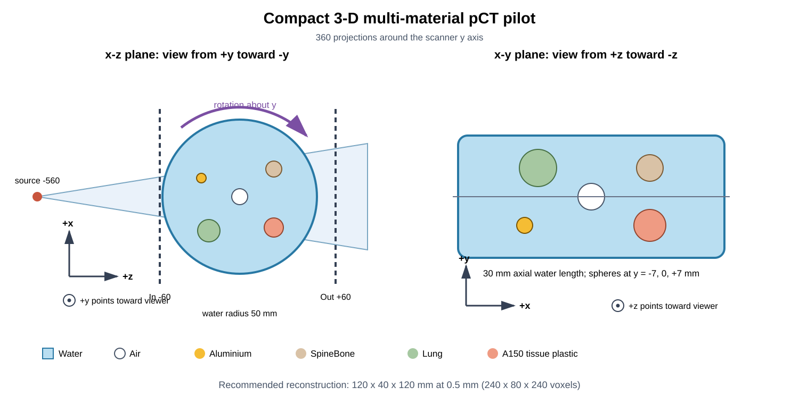

# 紧凑三维多材料pCT pilot

本文件夹可以整体复制到：

```text
D:\OpenGATE\windows_compact_3d_pilot_0718
```

该实验用于生成第一套真正随轴向位置变化的三维pCT数据。它使用紧凑几何、Air
世界和理想二维相空间面，不加入硅跟踪器、像素噪声或物理能量探测器，以便单独
验证三维结构重叠、出平面散射和后续三维MLP数据链。

## 当前状态

工作站正式仿真已于2026-07-21完成：360/360角度成功，共7.2亿个质子，12进程
墙钟时间约13.63小时，入口/出口ROOT合计约86.37 GiB。manifest和日志已在
`qc/full/`。大型ROOT保存在外部存储，并通过`/mnt/f/临时/`只读挂载。Stage 8
首轮三维读取、预处理、算子筛选和全量3 epoch重建已经完成；工程链通过，但材料
球性能未通过，不能把该pilot视为已经得到可靠三维图像。结果见
[`Stage 8总结`](../../../pct3d_reconstruction/qc/results0718_compact_3d_pilot/stage8_summary.md)。



## 三维坐标和采集几何

扫描器坐标使用：

- `z`：0°时的质子主传播方向；
- `y`：水圆柱轴向和360°旋转轴；
- `x`：横向方向。

场景图左侧是从`+y`半轴朝`-y`方向观察的`x-z`截面：屏幕向右为`+z`，向上
为`+x`，紫色圆弧表示模体在该平面内绕`y`轴旋转。右侧是从`+z`半轴朝`-z`
方向观察的`x-y`视图：屏幕向右为`+x`，向上为`+y`，不同`z`位置在该视图中
投影到一起。圆点符号表示相应正轴朝向观察者。

| 项目 | 配置 |
|---|---|
| 质子源 | 200 MeV单能 |
| 投影 | 360角度，`0,1,…,359°` |
| 每角度质子 | 2,000,000 |
| 总质子 | 720,000,000 |
| 名义面通量 | 416.7 protons/mm²/projection |
| 有效SID | 500 mm |
| 物理源/焦点 | `z=-560/-500 mm` |
| 源尺寸 | `14.4×4.8×10⁻⁶ mm³` |
| 等中心射野 | `120×40 mm²` |
| 理想记录面 | `z=-60/+60 mm`，`160×60 mm²` |
| 水圆柱 | 半径50 mm，轴向长度30 mm |
| 外部介质 | Air |
| 最大步长 | 模体内0.5 mm |
| 物理列表 | `QGSP_BIC_EMZ` |

源面到焦点距离为60 mm，因此等中心射野为：

\[
(14.4,4.8)\times\frac{500}{60}=(120,40)\ {\rm mm^2}.
\]

出口面位于焦点后560 mm，其射野约`134.4×44.8 mm²`，完整包含在
`160×60 mm²`记录面内。

## 三维材料球体

以下中心均是0°扫描器坐标`(x,y,z)`，不是模体局部坐标。程序自动用基准旋转的
逆矩阵转换为OpenGATE母体局部坐标，并验证球体在水圆柱内且互不重叠。

| 材料 | 直径 | 中心/mm | 作用 |
|---|---:|---|---|
| Air | 10 mm | `(0,0,0)` | 中心低密度空腔 |
| Aluminium | 6 mm | `(-25,-7,12)` | 高RSP、小目标 |
| SpineBone | 10 mm | `(22,7,18)` | 骨材料定量 |
| Lung | 14 mm | `(-20,7,-22)` | 低密度材料 |
| A150_Tissue_Plastic | 12 mm | `(22,-7,-20)` | 组织等效材料 |

所有球体在不同的`y`位置，不沿圆柱轴向贯穿，因此投影中存在真实三维结构重叠。

## 运行方法

打开已激活`opengate_env`的PowerShell：

```powershell
cd D:\OpenGATE\windows_compact_3d_pilot_0718
.\00_check_environment.bat
.\01_smoke_test.bat
.\02_run_full.bat 12
```

另开PowerShell查看状态：

```powershell
cd D:\OpenGATE\windows_compact_3d_pilot_0718
.\03_show_status.bat
```

大型ROOT写入：

```text
D:\OpenGATE\data\simulation_data\results0718_compact_3d_pilot
```

每个角度只输出`PhaseSpaceIn.root`和`PhaseSpaceOut.root`。QC、日志、配置哈希、
逐角度metadata和manifest位于本文件夹的`qc\full`。中断后重新运行同一命令会跳过
完整角度并重试失败角度；不允许不同配置或质子数混写同一个输出目录。

## 时间、文件和后续数据量

| 阶段 | 估计 |
|---|---:|
| OpenGATE正式仿真 | 5–10小时 |
| 入口/出口ROOT | 80–130 GB |
| 未压缩pairs | 约40–45 GB |
| 过滤后pairs | 约35–40 GB |
| 完整研究所需预留空间 | 200–300 GB |

启动器要求目标盘至少有200 GB可用空间。smoke test只运行角度0的2,000个质子，
自动检查两个ROOT的树、分支、有限性、primary数量以及球体几何。

## 推荐三维重建规格

首版采用：

```text
FOV       = 120 × 40 × 120 mm³
spacing   = 0.5 × 0.5 × 0.5 mm³
grid      = 240 × 80 × 240
voxels    = 4,608,000
```

一个float32体积约18.4 MB。三线性路径算子使用8邻域权重，建议batch size从1024
开始。首轮完整80%训练集3 epoch重建用时约88分钟；该数字不包含ROOT审计、
预处理、算子门控和正则化筛选，不能直接外推到修正后的再次运行。

不应直接使用0.1 mm三维网格：`1200×400×1200`包含5.76亿体素，单个float32体积
约2.3 GB，多组GPU工作数组将超过8 GB显存。

## 当前限制

**现有`pct2d_reconstruction/`成熟入口仍是二维实现，不能处理本数据。** 三维
pairs、双方向MLP、0.5 mm三线性前/反投影、有限圆柱支撑域和ROI评价已经在
独立工程`pct3d_reconstruction/`实现。首轮材料恢复失败，目前需要诊断三维坐标、
路径覆盖和收敛性，而不是回退到二维入口。

本pilot不保存物体内逐step真实轨迹，也不包含D2数字化或真实探测器效应。
