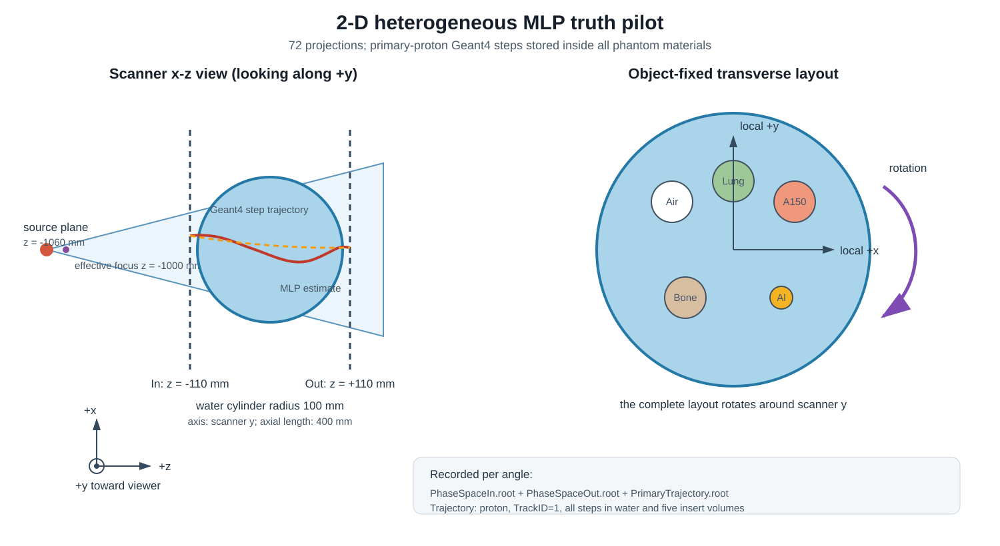

# MLP真实轨迹异质模体 pilot

本目录是一个可独立复制到Windows工作站运行的OpenGATE 10.1.0仿真包。它的核心目的不是获得新的正式重建，而是保存质子在异质模体内部的Geant4逐步轨迹，用作后续非均匀介质MLP、迭代MLP和路径误差评价的参考真值。

## 当前状态

72个角度的三类ROOT已经复制到
`data/simulation_data/results0724_mlp_truth_pilot/`：入口、出口和主质子逐step
轨迹文件各72个，轨迹ROOT约4.34 GiB。工作站侧正式QC尚未整理进本目录，当前
只能确认文件数量与基本布局；阶段5开始前仍需冻结manifest、检查ROOT分支并验证
轨迹—入口—出口EventID配对。

## 1. 为什么需要这次仿真

当前Schulte MLP使用已知水圆柱的均匀水散射统计。它能够利用入口、出口位置和方向估计一条平滑路径，但没有随局部Air、肺、软组织、骨和铝材料更新散射协方差。现有数据的用途分别是：

| 数据 | 主要用途 | 是否保存模体内真实轨迹 |
|---|---|---:|
| S4材料诊断模体 | 材料RSP偏差与小铝柱恢复 | 否 |
| D1 Air+四层硅跟踪器 | 跟踪器材料和hit拟合误差 | 否 |
| compact-3D pilot | 三维几何和出平面散射 | 否 |
| 本次MLP truth pilot | 直接比较直线、均匀水MLP和Geant4路径 | 是 |

本数据可回答以下问题：

1. 均匀水Schulte MLP在不同材料界面附近偏离真实路径多少；
2. 路径误差是否随材料、半径、角度、散射量和出射能量变化；
3. 非均匀介质MLP或迭代更新MLP是否真正减小路径误差；
4. 路径改善是否足以支持后续正式全通量仿真。

它不能直接代表临床探测器性能，也不包含硅跟踪器、位置分辨率或能量噪声。



## 2. 仿真场景

### 2.1 扫描与束流

| 参数 | 设置 |
|---|---:|
| 质子能量 | 200 MeV，单能 |
| 投影数 | 72 |
| 角度 | `0, 5, ..., 355 deg` |
| 每角度质子数 | 5,000 |
| 总质子数 | 360,000 |
| 物理列表 | `QGSP_BIC_EMZ` |
| 世界材料 | Air |
| 随机种子 | `20260724 + angle_index` |
| OpenGATE线程 | 每个角度1线程 |
| Windows并发 | 默认最多12个角度进程 |

物理源平面位于`z=-1060 mm`，束流聚焦到`z=-1000 mm`的有效点源，穿过焦点后形成扇束。源平面尺寸为`15 × 0.12 × 10^-6 mm3`，在等中心形成约`250 × 2 mm2`的照射范围。入口和出口理想记录面位于`z=-110 mm`和`z=+110 mm`。

### 2.2 异质模体

母体是半径100 mm、轴向长度400 mm的水圆柱，圆柱轴与扫描器`y`轴平行。水和所有插入物的最大Geant4步长均为1 mm。

| 插入物 | GATE材料 | 直径/mm | 物体固定横截面坐标/mm |
|---|---|---:|---:|
| Air | `Air` | 30 | `(-45, 35)` |
| Lung | `Lung` | 30 | `(0, 50)` |
| A150软组织塑料 | `A150_Tissue_Plastic` | 30 | `(45, 35)` |
| 脊椎骨 | `SpineBone` | 30 | `(-35, -35)` |
| 铝 | `Aluminium` | 16 | `(35, -35)` |

表中的坐标是OpenGATE圆柱母体的局部横截面坐标，随模体一起绕全局`y`轴旋转。它不是固定不变的全局`(x,z)`坐标。角度0时，程序的局部到全局关系为：

```text
local x -> global -z
local y -> global -x
local z -> global +y
```

五种材料覆盖低密度、近水、骨和高密度区域，且尺寸足够大，便于在界面前后比较路径。

## 3. 每个角度的输出

正式结果默认写到：

```text
D:\OpenGATE\data\simulation_data\results0724_mlp_truth_pilot
```

每个`run_###`包含：

| 文件 | 内容 |
|---|---|
| `PhaseSpaceIn.root` | 进入`z=-110 mm`理想入口面的质子状态 |
| `PhaseSpaceOut.root` | 进入`z=+110 mm`理想出口面的质子状态 |
| `PrimaryTrajectory.root` | 水和五个插入物内主质子的全部Geant4 step |
| `run_metadata.json` | 配置、种子、运行统计、ROOT条目数和轨迹QC |
| `completed.flag` | 该角度通过QC的完成标记 |

入口/出口ROOT包含：

```text
RunID, EventID, TrackID, KineticEnergy, PreGlobalTime,
Position_X/Y/Z, Direction_X/Y/Z
```

轨迹ROOT只保留`proton`且`TrackID=1`，包含：

```text
RunID, EventID, TrackID, ParentID, KineticEnergy, PreGlobalTime,
PrePosition_X/Y/Z, PostPosition_X/Y/Z,
PreDirection_X/Y/Z, PostDirection_X/Y/Z
```

`PrePosition`与`PostPosition`定义一个Geant4 step。按`EventID`和时间排序后，这些线段构成模体内部的主质子真实折线路径。受OpenGATE 10.1.0接口限制，程序内部为水和五个插入物分别建立临时actor，仿真结束后自动合并为唯一的`PrimaryTrajectory.root`并删除临时文件。材料边界处可能出现相邻记录或零长度边界记录；后续轨迹整理必须按事件排序、去重并保留材料界面连续性，不能把ROOT行号直接视为固定深度采样。

运行侧QC和汇总写到本代码包内：

```text
qc\smoke\
qc\full\
```

大型ROOT只写入`data`目录，QC、日志和manifest保留在代码包中。

## 4. Windows运行方法

将整个文件夹复制到：

```text
D:\OpenGATE\windows_mlp_truth_pilot_0724
```

打开已激活`opengate_env`的PowerShell：

```powershell
cd D:\OpenGATE\windows_mlp_truth_pilot_0724
.\00_check_environment.bat
.\01_smoke_test.bat
.\02_run_full.bat 12
```

另开一个PowerShell窗口查看状态：

```powershell
cd D:\OpenGATE\windows_mlp_truth_pilot_0724
.\03_show_status.bat
```

`12`表示同时运行12个单线程角度。若CPU或磁盘响应明显变慢，可改为`8`。重复执行相同正式命令会跳过已有且通过QC的角度，并重新运行失败或不完整角度。若配置哈希或质子数改变，启动器会拒绝与旧结果混写。

## 5. Smoke test与正式QC

Smoke test只运行角度0的200个质子，并检查：

- 三个ROOT存在、可由uproot读取且具有预期树和字段；
- 入口、轨迹和出口事件数量关系合理；
- 轨迹只包含`TrackID=1, ParentID=0`；
- 坐标、方向、能量和时间均为有限值；
- 抽样step长度不超过设置的1 mm容差；
- 五个插入物均位于水圆柱内且互不重叠。

正式运行完成后，`qc\full\manifest.json`汇总72个角度、ROOT大小、记录数、运行时间和失败列表。不要只复制ROOT；传回本机时请同时带回：

```text
D:\OpenGATE\data\simulation_data\results0724_mlp_truth_pilot
D:\OpenGATE\windows_mlp_truth_pilot_0724\qc\full
```

## 6. 资源预估

逐step ROOT大小受实际步数、核反应和ROOT压缩率影响较大。当前低通量配置的保守预估为：

| 项目 | 预计范围 |
|---|---:|
| 正式运行时间 | 约15–60分钟 |
| 三类ROOT总大小 | 5–12 GB |
| 启动前最低空闲空间检查 | 30 GB |
| 后续整理后的轨迹数据 | 约2–8 GB |

时间范围依据本机200质子完整smoke test和Windows工作站既往OpenGATE初始化时间外推；机械硬盘并行写入、杀毒软件扫描和12进程资源竞争都可能使实际时间增加。如果结果明显大于预估，先检查`PrimaryTrajectory.root`条目数和单角度文件大小，不要直接增加质子数。只有在路径误差分析显示统计量不足时，才考虑正式高通量扩展。

## 7. 后续使用边界

- `PhaseSpaceIn/Out`可复用现有primary配对思想，但本pilot需要新增“按EventID整理step轨迹”的专用只读分析。
- Geant4 step折线是本仿真物理模型下的路径参考，不等于可由真实探测器直接观测的轨迹。
- 路径比较应在水圆柱内部统一深度位置采样，并分别报告横向RMSE、最大偏差和材料界面附近误差。
- 本pilot只有72角度、每角度5,000个质子，不用于评价最终RSP噪声、空间分辨率或临床剂量性能。
- 本目录不会修改当前成熟的预处理、解析重建和迭代重建代码。
