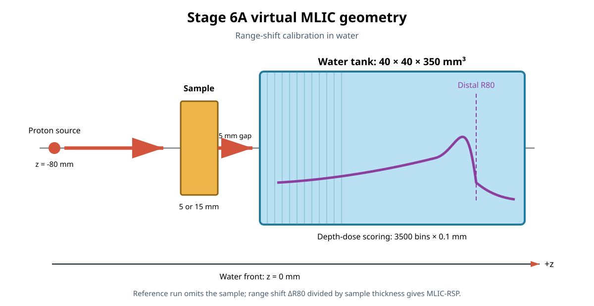

# 阶段6A：虚拟多层电离室RSP标定

本文件夹可以整体复制到Windows工作站的`D:\OpenGATE`。它建立一个虚拟多层
电离室（virtual MLIC）实验，用样品引起的水中射程移动定义材料RSP：

\[
RSP_{\mathrm{MLIC}}(E,m)=
\frac{R_{80,\mathrm{reference}}(E)-R_{80,\mathrm{sample}}(E,m)}
{t_m}.
\]

这套实验不是CT扫描，也不会输出入口/出口ROOT。它专门为results0716/S1的
25根铝柱、S4多材料模体和S5分辨率模体建立与pCT原型论文更接近的独立材料
参考值。

## 当前状态

24-case能量扫描与200 MeV高统计补充均已完成，Stage 6A验收通过。冻结的
200 MeV MLIC-RSP中，Water为`0.999746`、Aluminium为`2.094511`；它们与Lung、
A150和SpineBone一起作为S1/S4/S5材料评价真值。完整分析见
[`../../research_stages/stage6a_mlic_reference/qc/stage6a_summary.md`](../../research_stages/stage6a_mlic_reference/qc/stage6a_summary.md)。



## 1. 仿真场景

单能质子束从`z=-80 mm`沿`+z`传播。材料样品位于水箱前方5 mm，水箱从
`z=0 mm`延伸至`z=350 mm`。DoseActor在水箱内以0.1 mm间距记录一维积分
深度剂量曲线。无样品参考束与材料束除样品外使用完全相同的物理、束流和计分
设置。

| 参数 | 设置 |
|---|---|
| OpenGATE/核心 | 10.1.0 / 10.1.0 |
| 物理列表 | `QGSP_BIC_EMZ` |
| 入射能量 | 150、180、200、220 MeV |
| 每个能量的case | Reference、Water、Aluminium、Lung、A150、SpineBone |
| 总case数 | 24 |
| 每case质子数 | 100,000 |
| 独立重复 | 每case 10组，每组10,000质子；合计仍为100,000 |
| 样品厚度 | Water/Lung/A150/SpineBone 15 mm；Aluminium 5 mm |
| 样品横向尺寸 | 40×40 mm² |
| 水箱 | 40×40×350 mm³ |
| 深度计分 | 3500个bin，0.1 mm/bin |
| 最大步长 | 水与样品均为0.1 mm |
| 世界 | Vacuum，避免把空气射程混入材料参考 |
| 随机种子 | `20260728 + task_index` |

将每个case拆成10个独立重复，是为了能够对完整深度剂量曲线做非参数bootstrap：
每次有放回抽取10条重复曲线、相加并重新提取R80。它不是把单个剂量bin当作相互
独立的高斯噪声。

## 2. 24个case与用途

| 材料case | 目的 |
|---|---|
| Reference | 给出该能量下无样品水射程，是同能量其他五种材料的共同基准 |
| Water 15 mm | 阳性一致性对照；按定义应得到接近1的MLIC-RSP |
| Aluminium 5 mm | 重新评价25根铝柱、S4铝柱及S5铝线对 |
| Lung 15 mm | 重新评价S4肺材料 |
| A150 15 mm | 重新评价S4组织等效塑料 |
| SpineBone 15 mm | 重新评价S4骨材料及S5骨斜边 |

四个入射能量用于检查材料参考随质子能量的变化。200 MeV结果将作为论文比较的
主要MLIC口径；其他能量用于解释沿质子降能路径的有效RSP变化。

## 3. 输出位置

大型数据默认写到：

```text
D:\OpenGATE\data\simulation_data\results0728_stage6a_virtual_mlic\
  e200_aluminium\
    replica_00\
      depth_dose_edep.mhd
      depth_dose_edep.raw
```

运行日志、配置快照、完成标记、R80和MLIC-RSP表保留在代码文件夹：

```text
windows_virtual_mlic_stage6a_0728\qc\full\
  tasks\
  logs\
  summary\
    r80_summary.csv
    mlic_rsp_summary.csv
    depth_dose_curves.png
    mlic_rsp_vs_energy.png
    summary.json
```

仿真只产生小型MHD/RAW曲线，不保存逐质子ROOT，预计总输出明显小于1 GB。

## 4. 工作站运行命令

打开已激活`opengate_env`的PowerShell：

```powershell
cd D:\OpenGATE\windows_virtual_mlic_stage6a_0728
.\00_check_environment.bat
.\01_smoke_test.bat
.\02_run_full.bat 12
```

另开一个PowerShell查看总进度：

```powershell
cd D:\OpenGATE\windows_virtual_mlic_stage6a_0728
.\03_show_status.bat
```

如果正式运行中断或个别任务失败，重新执行同一条命令：

```powershell
.\02_run_full.bat 12
```

配置哈希、质子数和输出QC均一致的重复会自动跳过；不需要删除已完成结果。

## 5. 时间与验收

由于0.1 mm最大步长会显著增加Geant4 step数，预计12个并行进程约需1–4小时。
实际时间取决于Xeon频率、进程调度和OpenGATE初始化开销。状态脚本会在获得首批
完成任务后给出基于实测速度的ETA。

正式结果至少应满足：

- 240个独立任务全部完成，即24 case × 10重复；
- 所有深度剂量曲线有3500个有限且非负的bin；
- 每个能量都有唯一Reference及五个材料case；
- R80位于水箱内，并且对0/0.2/0.5 mm平滑及0.2 mm重分箱保持稳定；
- 四个Water对照的MLIC-RSP接近1，并报告bootstrap不确定度；
- 最终表格没有NaN或Inf。

smoke test只用200质子检查几何、DoseActor、MHD读写和QC接口，不用于判断R80
或RSP是否准确。

## 6. 200 MeV高统计补充

首次24-case结果可用于能量趋势，但200 MeV下Aluminium和Lung的相对bootstrap
标准不确定度仍分别约为0.35%和0.93%。为了冻结论文比较所用的主参考，文件夹中
另提供只计算200 MeV的高统计配置：

| 参数 | 高统计设置 |
|---|---|
| case | Reference、Water、Aluminium、Lung、A150、SpineBone |
| 每case质子数 | 1,000,000 |
| 独立重复 | 10组，每组100,000质子 |
| 总质子数 | 6,000,000 |
| bootstrap次数 | 5,000 |

它使用不同随机种子、独立数据目录和独立QC目录，不覆盖首次结果。运行：

```powershell
cd D:\OpenGATE\windows_virtual_mlic_stage6a_0728
.\04_run_highstat_200mev.bat 12
```

另开PowerShell查看进度：

```powershell
.\05_show_highstat_status.bat
```

中断后重新执行相同的`04_run_highstat_200mev.bat 12`即可断点续跑。高统计数据
默认写入：

```text
D:\OpenGATE\data\simulation_data\results0728_stage6a_virtual_mlic_200mev_highstat
```

对应QC和最终表格写入：

```text
windows_virtual_mlic_stage6a_0728\qc\highstat_200mev\
```
