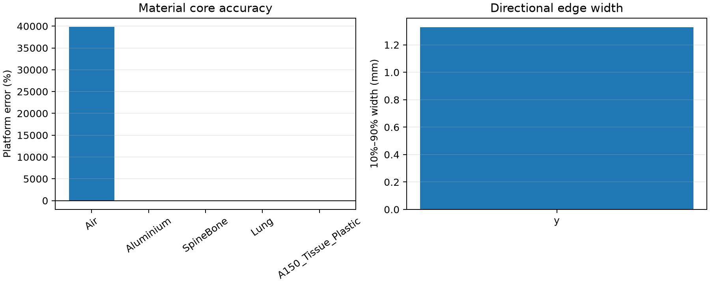
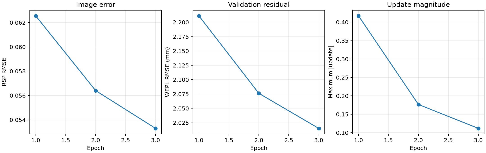

# Stage 8紧凑三维pCT结果

状态：**PASS（THREE_DIMENSIONAL_PIPELINE_COMPLETE）**。该状态表示三维数据链、
MLP算子、严格转置、划分和测试评价均完整，不代表所有性能目标自动通过。

## 冻结配置

- 360角度，每角度2,000,000个质子；
- `240×80×240 @ 0.5 mm`；
- Schulte水MLP、三线性8邻域GPU OS-SART；
- 18子集、3 epoch、均匀水圆柱初值；
- Huber-TV `beta=0.0`，选择epoch `3`。

## 独立测试和图像指标

- test WEPL RMSE：`2.014597 mm`；
- 水区均值/标准差：`0.998499` /
  `0.010996`；
- 模体RSP RMSE：`0.053297`；
- 非Air材料球MAPE：`35.2010%`；
- 10--14 mm大材料球MAPE：`37.0322%`；
- 三方向平均10%--90%边缘宽度：`1.3297 mm`。

