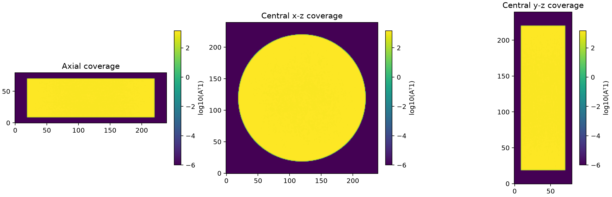
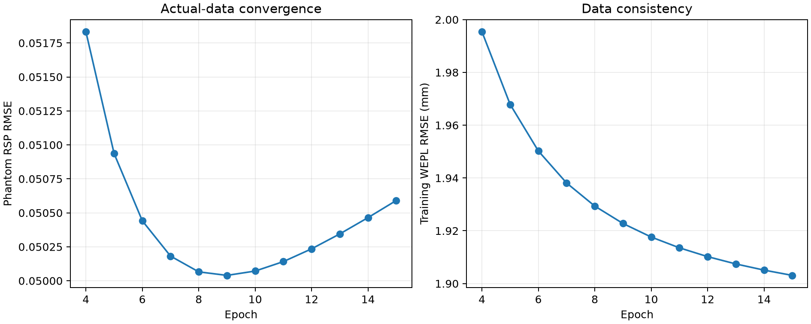
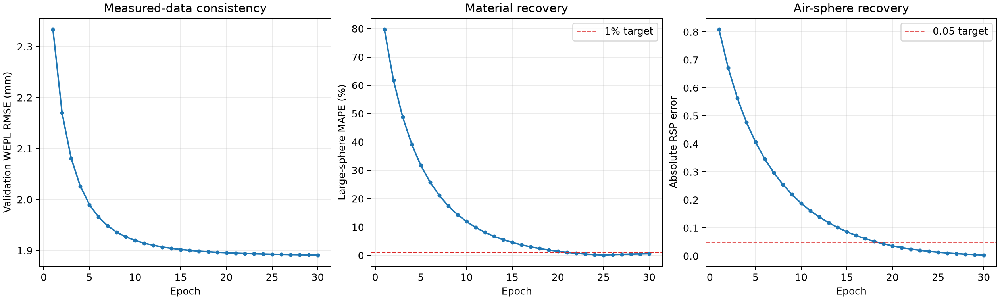
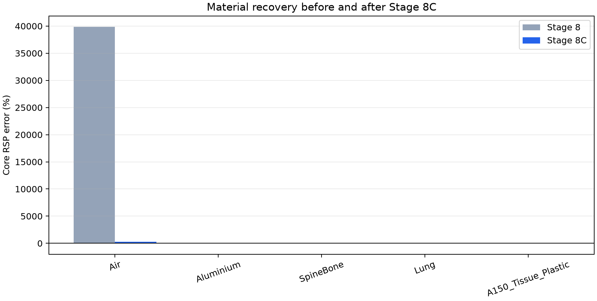

# Stage 8C三维系统诊断与重新计算

- 系统诊断：`PASS`；分类：`LIKELY_UNDERCONVERGED`；

- 匹配算子闭环：`FAIL`；分类：`OPERATOR_OR_CONVERGENCE_FAILURE`；

- 固定0.15全量重建与修正性测试：`PASS`；选择第`30`轮；
- 测试WEPL RMSE：`1.890864 mm`；
- 大材料球MAPE：`0.5969%`；
- 水区偏差/标准差：`0.0403%` / `0.6305%`。

Stage 8C测试集属于修正性复核：Stage 8历史运行已经打开过同一测试集。
